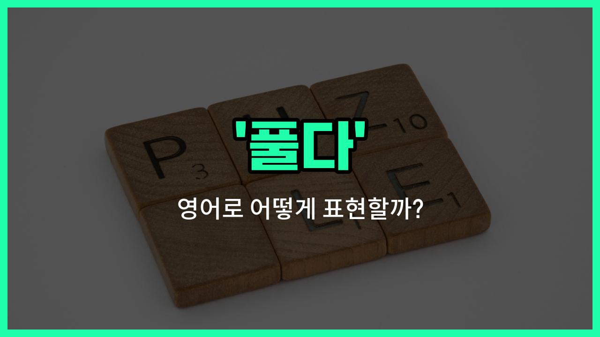

## 🌟 영어 표현 - puzzle out

안녕하세요 👋 오늘은 영어 표현 '**puzzle out**'에 대해 알아보려고 해요. 이 표현은 '**풀다**', '**이해하다**', '**해결하다**'라는 뜻을 가지고 있어요.

'**puzzle out**'는 어떤 복잡하거나 어려운 문제, 상황, 혹은 수수께끼를 **생각하고 고민해서 결국 답을 찾아내는 것**을 의미해요. 즉, 머리를 써서 문제의 해답을 찾는 상황에서 자주 쓰이는 표현이에요!

예를 들어, 수학 문제를 열심히 고민해서 답을 찾거나, 누군가의 행동을 이해하려고 애쓸 때 사용할 수 있어요. 일상 대화나 업무 상황에서도 자연스럽게 쓸 수 있는 표현이니 꼭 기억해 두세요.

## 📖 예문

1. "나는 그 복잡한 문제를 결국 풀었어요."

   "I [finally](/blog/in-english/182.finally/) puzzled out the complicated problem."

2. "그녀는 왜 화가 났는지 이해하려고 애썼어요."

   "She [tried to](/blog/in-english/117.try-to/) puzzle out why she was [upset](/blog/in-english/395.upset/)."

## 💬 연습해보기

<ul data-interactive-list>

  <li data-interactive-item>
    처음에는 설명을 잘 모르겠더니, 두 번 읽고 나니까 뭘 해야 할지 알겠더라구요.
    I couldn't understand the instructions <a href="/blog/in-english/184.at-first/">at first</a>, but I <a href="/blog/in-english/175.manage-to/">managed to</a> puzzle out what to do after <a href="/blog/in-english/436.read/">reading</a> them twice.
  </li>

  <li data-interactive-item>
    그 탐정은 다른 사람들이 알아채기 전에 그 미스터리를 풀려고 했어요.
    The detective tried to puzzle out the <a href="/blog/in-english/500.mystery/">mystery</a> before anyone else did.
  </li>

  <li data-interactive-item>
    기계가 어떻게 작동하는지 이해하는데 조금 시간이 걸렸지만, 이제는 알겠어요.
    It took me a while to puzzle out how the machine <a href="/blog/in-english/1064.work/">worked</a>, but now I get it.
  </li>

  <li data-interactive-item>
    그녀는 그의 이상한 행동 뒤에 숨겨진 의미를 알아냈어요.
    She was able to puzzle out the meaning behind his <a href="/blog/in-english/983.strange/">strange</a> behavior.
  </li>

  <li data-interactive-item>
    우리는 마감 전에 이 문제의 해결책을 찾아야 해요.
    We need to puzzle out the solution to this problem before the <a href="/blog/in-english/830.deadline/">deadline</a>.
  </li>

  <li data-interactive-item>
    오후 내내 왜 내 컴퓨터가 자꾸 고장 나는지 알아내려고 했어요.
    I <a href="/blog/in-english/258.spend/">spent</a> all afternoon trying to puzzle out why my computer kept crashing.
  </li>

  <li data-interactive-item>
    그는 교통을 피할 수 있는 가장 좋은 경로를 찾아냈어요.
    He puzzled out the <a href="/blog/in-english/1073.best/">best</a> <a href="/blog/in-english/519.route/">route</a> to take to <a href="/blog/in-english/924.avoid/">avoid</a> the <a href="/blog/in-english/384.traffic/">traffic</a>.
  </li>

  <li data-interactive-item>
    이 수학 문제를 좀 도와줄 수 있어요? 정말 헷갈려요.
    Can you <a href="/blog/in-english/1084.help/">help</a> me puzzle out this math problem? It's really confusing.
  </li>

  <li data-interactive-item>
    그들은 알려진 문자와 비교하면서 고대 언어를 해독했어요.
    They puzzled out the ancient language by comparing it to <a href="/blog/in-english/1058.know/">known</a> scripts.
  </li>

  <li data-interactive-item>
    지도를 한참 쳐다본 끝에 우리는 어디서 잘못됐는지 알아냈어요.
    After <a href="/blog/in-english/087.stare-at/">staring at</a> the <a href="/blog/in-english/535.map/">map</a>, I finally puzzled out where we had gone <a href="/blog/in-english/316.wrong/">wrong</a>.
  </li>

</ul>

## 🤝 함께 알아두면 좋은 표현들

### figure out

'[figure out](/blog/in-english/170.figure-out/)'은 "문제를 이해하거나 해결책을 찾아내다"라는 뜻이에요. 'puzzle out'과 비슷하게 어떤 어려운 문제나 상황을 논리적으로 생각해서 해결할 때 자주 사용해요.

- "She finally figured out how to [fix](/blog/in-english/524.fix/) the broken computer."
- "그녀는 마침내 고장 난 컴퓨터를 고치는 방법을 알아냈어요."

### make sense of

'[make sense](/blog/in-english/068.make-sense/) of'는 "무언가를 이해하다" 또는 "이해할 수 있게 만들다"라는 뜻이에요. 복잡하거나 혼란스러운 상황을 이해하려고 할 때 쓰는 표현이에요.

- "I can't make sense of these instructions; they are too confusing."
- "나는 이 지시사항들을 이해할 수가 없어요; 너무 혼란스러워요."

### be confused by

'be confused by'는 "~에 의해 혼란스러워하다"라는 뜻으로, 'puzzle out'의 반대 의미에요. 어떤 문제나 상황을 이해하지 못하고 헷갈릴 때 사용해요.

- "He was confused by the complicated rules of the [game](/blog/in-english/1087.game/)."
- "그는 그 게임의 복잡한 규칙 때문에 혼란스러워했어요."

---

오늘은 '**풀다**', '**이해하다**', '**해결하다**'라는 뜻을 가진 영어 표현 '**puzzle out**'에 대해 알아봤어요. 앞으로 어려운 문제나 상황을 만났을 때 이 표현을 떠올려 보세요 😊

오늘 배운 표현과 예문들을 꼭 소리 내서 여러 번 읽어보세요. 다음에도 더 유익한 영어 표현으로 찾아올게요! 감사합니다!

