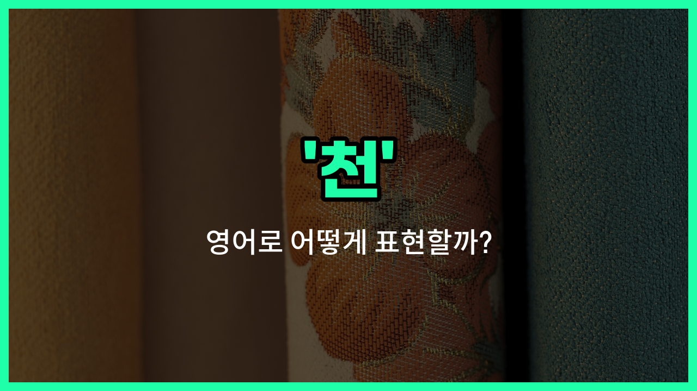

## 🌟 영어 표현 - cloth

안녕하세요 👋 오늘은 우리가 일상에서 자주 쓰는 단어인 '**천**'의 영어 표현에 대해 알아보려고 해요. 바로 '**cloth**'라는 단어인데요~

'**cloth**'는 주로 **옷이나 커튼, 테이블보 등 다양한 용도로 쓰이는 직물이나 천**을 의미해요. 우리가 옷을 만들 때 쓰는 원단, 혹은 청소할 때 쓰는 헝겊도 모두 'cloth'라고 부를 수 있어요~

이 단어는 명사로만 사용되고, 'a piece of cloth'처럼 '한 조각의 천'이라는 식으로도 자주 쓰여요. 참고로, 'clothes'는 '옷'이라는 뜻의 복수형 단어라서 'cloth'와는 구분해서 사용해야 해요~

## 📖 예문

1. "이 천은 너무 부드러워요."

   "This cloth is very soft."

2. "테이블을 닦으려면 깨끗한 천이 필요해요."

   "You need a [clean](/blog/in-english/523.clean/) cloth to wipe the table."

## 💬 연습해보기

<ul data-interactive-list>

  <li data-interactive-item>
    새 티셔츠 만들려고 부드러운 천을 샀어요. 여름에 입기 딱 좋아요.
    I bought some soft cloth to make a <a href="/blog/in-english/1056.new/">new</a> shirt. It's <a href="/blog/in-english/413.perfect/">perfect</a> for summer wear.
  </li>

  <li data-interactive-item>
    재단사가 저에게 맞춤 수트를 디자인하기 위해 화려한 천을 썼어요. 결과가 정말 기대돼요.
    The tailor <a href="/blog/in-english/171.used/">used</a> a colorful cloth to design my suit. I'm really excited to see how it <a href="/blog/vocab-1/038.turn-out/">turns out</a>.
  </li>

  <li data-interactive-item>
    천이 햇볕에 바래지 않게 세탁해야 해요. 그러면 색상이 더 오래 선명하게 유지될 거예요.
    We need to <a href="/blog/in-english/485.wash/">wash</a> the cloth before it fades in the sun. That should keep the colors bright longer.
  </li>

  <li data-interactive-item>
    천에 커피를 쏟아서 빨리 치워야 했어요. 다행히 얼룩이 남지 않았어요.
    I spilled coffee on the cloth, so I had to clean it up quickly. Luckily, it didn't <a href="/blog/in-english/402.leave/">leave</a> a stain.
  </li>

  <li data-interactive-item>
    그녀는 선물을 종이 대신 아름다운 천으로 포장했어요. 정말 우아하고 친환경적으로 보였어요.
    She wrapped the gift in beautiful cloth <a href="/blog/in-english/169.instead-of/">instead of</a> paper. It <a href="/blog/in-english/1078.look/">looked</a> so elegant and eco-friendly.
  </li>

  <li data-interactive-item>
    그 천은 피부에 닿으면 정말 부드러워요. 커튼 만들기에 쓰고 싶어요.
    The cloth <a href="/blog/in-english/1096.feel/">feels</a> really smooth against my skin. I'm <a href="/blog/in-english/1059.think/">thinking</a> of using it for curtains.
  </li>

  <li data-interactive-item>
    할머니가 천 조각으로 손바느질하는 법을 가르쳐 주셨어요. 아주 재미있게 배웠어요.
    My grandma taught me how to sew by hand using scraps of cloth. It was a fun <a href="/blog/in-english/1062.way/">way</a> to <a href="/blog/in-english/245.learn/">learn</a>.
  </li>

  <li data-interactive-item>
    그 오래된 천은 저에게 추억이 담겨 있어요. 제 첫 번째 콘서트 티셔츠에서 왔거든요.
    That <a href="/blog/in-english/1086.old/">old</a> cloth has sentimental value to me. It's from my first concert shirt.
  </li>

  <li data-interactive-item>
    야외 가구 덮개에는 방수 천을 써요. 비와 먼지로부터 보호하는 데 도움이 돼요.
    They <a href="/blog/in-english/1079.use/">use</a> waterproof cloth for outdoor furniture <a href="/blog/in-english/1145.cover/">covers</a>. It <a href="/blog/in-english/1084.help/">helps</a> protect against rain and dirt.
  </li>

  <li data-interactive-item>
    새 베개 커버 만들려고 천을 좀 사야 해요. 지금 있는 건 다 헤져가고 있어요.
    I need to buy some cloth to make new pillowcases. The ones I have are getting worn out.
  </li>

</ul>

## 🤝 함께 알아두면 좋은 표현들

### fabric

'fabric'은 '천'이나 '직물'을 의미하는 좀 더 일반적이고 포괄적인 단어예요. 옷을 만들거나 가구를 덮는 데 쓰이는 재료를 가리킬 때 많이 사용해요.

- "The dress was made from a soft, breathable fabric."
- "그 드레스는 부드럽고 통기성이 좋은 천으로 만들어졌어요."

### leather

'leather'는 '가죽'을 뜻하는 단어로, 천과는 다른 재료예요. 주로 동물의 가죽을 가공해서 만든 소재로, 튼튼하고 내구성이 좋아서 가방이나 신발 등에 많이 사용돼요.

- "He bought a new leather jacket for the winter."
- "그는 겨울을 위해 새 가죽 재킷을 샀어요."

### textile

'textile'은 '직물'이나 '섬유'를 의미하는 단어로, 천과 거의 같은 뜻이에요. 주로 산업이나 제조업에서 원단을 지칭할 때 사용되며, 다양한 종류의 천을 포함해요.

- "The [company](/blog/in-english/1111.company/) specializes in producing [high](/blog/in-english/1069.high/)-[quality](/blog/in-english/304.quality/) textiles for clothing manufacturers."
- "그 회사는 의류 제조업체를 위한 고품질 직물을 생산하는 데 전문화되어 있어요."

---

오늘은 '**천**', '**직물**', '**옷감**'이라는 뜻을 가진 영어 단어 '**cloth**'에 대해 알아봤어요. 일상에서 천이나 원단을 이야기할 때 이 표현을 꼭 떠올려 보세요~ 😊

오늘 배운 표현과 예문들을 소리 내서 여러 번 읽어보면 더 쉽게 기억할 수 있어요. 다음에도 더 유익한 영어 표현으로 찾아올게요! 감사합니다~

