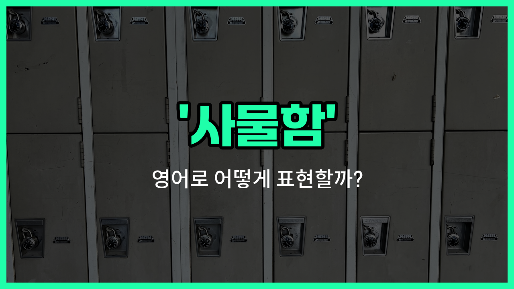

## 🌟 영어 표현 - locker

안녕하세요 👋 오늘은 학교나 헬스장, 도서관 등에서 자주 볼 수 있는 '사물함'을 영어로 어떻게 표현하는지 알아볼 거예요.

바로 '**locker**'라는 단어를 사용해요. 'locker'는 개인 물건을 안전하게 보관할 수 있도록 만든 작은 보관함을 의미해요. 주로 문이 달려 있고, 자물쇠나 번호키로 잠글 수 있는 형태가 많아요.

이 단어는 학교에서 학생들이 책이나 가방을 넣어두는 곳, 헬스장에서 운동복이나 소지품을 보관하는 곳, 수영장, 사무실 등 다양한 장소에서 쓰여요. 영어권 국가에서는 'locker'라는 단어만 들어도 바로 '사물함'을 떠올릴 수 있을 정도로 일상적인 표현이에요!

## 📖 예문

1. "저는 헬스장에 가면 항상 사물함을 사용해요."

   "I always [use](/blog/in-english/1079.use/) a locker when I go to the [gym](/blog/in-english/431.gym/)."

2. "학생들은 교실 옆에 있는 사물함에 책을 넣어둬요."

   "Students keep their books in the lockers next to the classroom."

## 💬 연습해보기

<ul data-interactive-list>

  <li data-interactive-item>
    헬스장 사물함에 자켓을 두고 조합 번호를 잊어버렸어요.
    I <a href="/blog/in-english/1106.left/">left</a> my jacket in the locker at the gym and <a href="/blog/in-english/023.forget/">forgot</a> the combination.
  </li>

  <li data-interactive-item>
    학교 사물함이 카페테리아 근처 복도에 쭉 늘어져 있어요.
    The <a href="/blog/in-english/1090.school/">school</a> lockers are all lined up in the hallway near the cafeteria.
  </li>

  <li data-interactive-item>
    사물함 열쇠를 어디서도 못 찾겠어요. 혹시 본 적 있어요?
    I can't <a href="/blog/in-english/1083.find/">find</a> my locker key anywhere. Have you seen it?
  </li>

  <li data-interactive-item>
    점심시간에 학생들이 주로 사물함 근처에서 모여서 이야기해요.
    During lunch, students usually <a href="/blog/in-english/127.hang-out/">hang out</a> near their lockers to chat.
  </li>

  <li data-interactive-item>
    사람들이 못 가져가게 사물함을 꼭 잠가 놓으세요.
    <a href="/blog/in-english/232.make-sure/">Make sure</a> to lock your locker so no one can take your stuff.
  </li>

  <li data-interactive-item>
    그녀는 사물함을 사진과 스티커로 꾸며서 더 개인적으로 느끼도록 했어요.
    She decorated her locker with photos and stickers to <a href="/blog/in-english/244.make-it/">make it</a> <a href="/blog/in-english/1096.feel/">feel</a> more personal.
  </li>

  <li data-interactive-item>
    체육 수업 전에 모두 가방을 사물함에 넣어서 안전하게 지켜요.
    Before gym class, we all put our bags in the locker room to keep them <a href="/blog/in-english/857.safe/">safe</a>.
  </li>

  <li data-interactive-item>
    사무실의 새로운 사물함에는 전화 충전 포트가 내장되어 있어요.
    The <a href="/blog/in-english/1056.new/">new</a> lockers in the office have built-in charging ports for phones.
  </li>

  <li data-interactive-item>
    수업 끝나고 나서야 사물함에 핸드폰을 둔 걸 깨달았어요.
    I <a href="/blog/in-english/314.accidentally/">accidentally</a> <a href="/blog/in-english/402.leave/">left</a> my phone in the locker and didn't <a href="/blog/in-english/166.realize/">realize</a> it until after class.
  </li>

  <li data-interactive-item>
    그는 사물함에서 배낭을 급하게 꺼내고 다음 수업으로 달려갔어요.
    He quickly grabbed his <a href="/blog/in-english/942.backpack/">backpack</a> from the locker and rushed to his next class.
  </li>

</ul>

## 🤝 함께 알아두면 좋은 표현들

### cubbyhole

'cubbyhole'은 작은 개인 공간이나 사물함을 의미해요. 주로 학교나 사무실에서 개인 물건을 보관하는 작은 칸을 가리킬 때 사용해요. 'locker'보다 좀 더 친근하고 작은 크기의 보관함을 뜻해요.

- "She put her books in the cubbyhole before class [started](/blog/in-english/1127.start/)."
- "그녀는 수업이 시작되기 전에 책을 사물함에 넣었어요."

### storage room

'storage room'은 물건을 보관하는 방이나 공간을 의미해요. 'locker'와 달리 개인용이 아니라 여러 사람이 함께 사용하는 큰 보관 공간을 뜻해요. 사물함과는 반대 개념으로 더 넓고 공동으로 사용하는 장소를 나타낼 때 써요.

- "The cleaning supplies are kept in the storage room down the hall."
- "청소 도구들은 복도 끝에 있는 보관실에 보관되어 있어요."

### open shelf

'open shelf'는 문이 없는 선반을 의미해요. 'locker'와 달리 잠글 수 없고 물건이 노출되어 있어 보안이나 개인 공간이 부족한 반대 개념이에요. 쉽게 접근할 수 있지만 개인 물건 보관에는 적합하지 않아요.

- "He placed his bag on the open shelf near the entrance."
- "그는 입구 근처에 있는 열린 선반 위에 가방을 올려놓았어요."

---

오늘은 '사물함', '보관함', '락커'라는 뜻을 가진 영어 표현 '**locker**'에 대해 알아봤어요. 앞으로 학교나 헬스장 등에서 사물함을 이용할 때 이 단어를 떠올려 보세요! 😊

오늘 배운 표현과 예문들을 꼭 소리 내서 여러 번 읽어보세요. 다음에도 더 유익한 영어 표현으로 찾아올게요! 감사합니다

