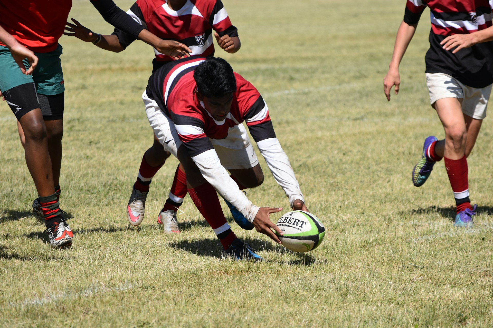

## 🌟 영어 표현 - try to

안녕하세요, 여러분! 👋 오늘은 영어로 **'노력하다', '하려하다'** 라는 의미를 나타내는 **"try to"** 표현에 대해 알아볼게요.

"try to"는 일상생활에서 정말 자주 사용되는 표현이에요. **주로 어떤 일을 하려고 노력하는 상황에서 사용하죠. 이 표현은 목표를 달성하려는 의지를 나타내는 상황**에서 특히 유용해요. 💪

예를 들어, 새로운 취미를 시작할 때 이렇게 말할 수 있어요. "I'm going to try to learn how to play the guitar." (기타 치는 법을 배워볼 거예요.) 꼭 큰 목표가 아니더라도, 일상적인 노력을 표현할 때도 자연스럽게 쓸 수 있답니다!

"try to"는 또 다른 뉘앙스로도 쓰여요. 예를 들면, "I'll try to finish the report by tomorrow." (내일까지 보고서를 끝내도록 노력할게요.) 이렇게 말하면 쉽지 않은 일이지만 최선을 다하겠다는 의미가 됩니다.

<!-- engple-horizontal-ad -->

<ins class="adsbygoogle"
     style="display:block"
     data-ad-client="ca-pub-1465612013356152"
     data-ad-slot="2106896038"
     data-ad-format="auto"
     data-full-width-responsive="true"></ins>

## 📖 예문

"더 건강한 식습관을 가지려고 노력 중이에요."

"I'm trying to develop healthier eating habits."

"영어 실력을 향상시키려고 노력하고 있어요."

"I'm trying to improve my English skills."

자, 이제 "try to"를 사용한 다양한 예문을 살펴볼까요? 꼭 소리내어 말하면서 연습해보세요! 🚀

## 💬 연습해보기

너의 파티에 가려고 하는데, 늦게까지 일할 수도 있어.

I'm gonna try to make it to your party, but I might be working late.

우리는 내년 휴가를 위해 돈을 모으고 있어.

We're trying to save money for a vacation next year.

그녀는 몇 달째 담배 끊으려고 하고 있어.

She's been trying to quit smoking for months now.

나는 스페인어 배우려고 하는데, 생각보다 어려워.

I'm trying to learn Spanish, but it's harder than I thought.

교통 체증을 피하려면, 일찍 가보자.

Let's try to get there early to avoid the traffic.

그들은 집을 팔려고 하는데, 지금 시장이 힘들어.

They're trying to sell their house, but the market's <a href="/blog/in-english/183.tough/">tough</a> right now.

나는 카페인을 줄이려고 하고 있어. 쉽지 않아!

I'm trying to <a href="/blog/in-english/059.cut-back-on/">cut back on</a> caffeine. It's not easy!

우리 곧 만나서 이야기하자. 정말 오랜만이야!

We should try to <a href="/blog/in-english/021.catch-up-on/">catch up</a> soon. It's been ages!

그들은 지역 보호소에서 개를 입양하려고 하고 있어.

They're trying to adopt a dog from the local shelter.

지금 힘든 상황이지만 긍정적으로 지내보자.

Let's try to <a href="/blog/in-english/119.stay/">stay positive</a>, even though things are tough right now.

## 🤝 함께 알아두면 좋은 표현들

### give it a shot

['give it a shot'](/blog/in-english/039.give-it-a-shot/)은 **"한번 시도해 보다"** 라는 뜻이에요. 어떤 일이나 활동을 해보려는 의지를 나타내며, 성공 여부에 관계없이 시도하는 것을 강조해요. 긍정적인 태도로 새로운 경험을 해보려 할 때 자주 사용돼요.

"Even though I’ve never played tennis before, I’m willing to give it a shot."

"나는 테니스를 한 번도 쳐본 적이 없지만, 한번 시도해 볼 의향이 있어."

### struggle to

'struggle to'는 **"~하려고 애쓰다"** 라는 의미예요. 어떤 일을 이루기 위해 힘든 과정을 겪거나 어려움을 겪는 상태를 나타내요. 대개 힘든 상황에서의 노력을 강조할 때 사용돼요.

"He is [struggling](/blog/잘-안돼-영어표현/) to balance work and studies."

"그는 일과 학업의 균형을 맞추려고 애쓰고 있습니다."

---

오늘은 **'노력하다', '하려하다'** 의 의미를 전달하는 **'try to'** 에 대해 배워봤어요. 정말 유용한 표현이죠? 일상 대화에서 자주 사용해보세요. **목표를 달성하려 할 때, 새로운 것을 시도할 때, 또는 어려운 상황에서 최선을 다하려 할 때** 이 표현을 쓰면 여러분의 영어가 한층 더 자연스러워질 거예요! 😉

여러분도 오늘 배운 "try to"를 사용해서 새로운 목표를 세워보는 건 어떨까요? 연습이 실력을 만든답니다! 화이팅! 💪
