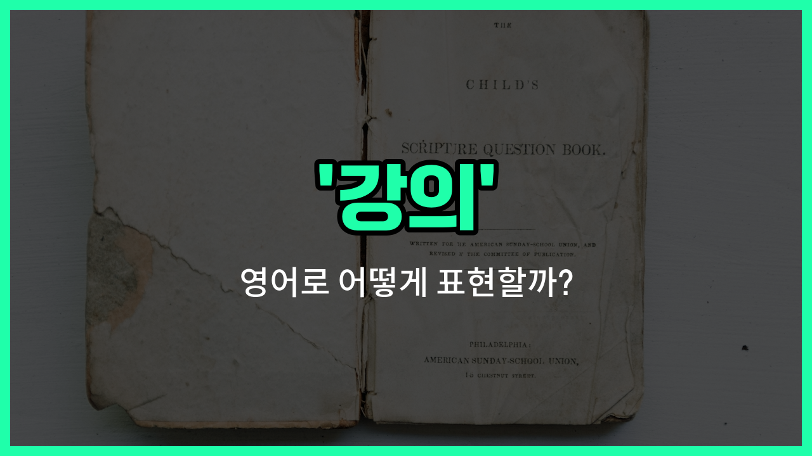

## 🌟 영어 표현 - cours

안녕하세요 👋 오늘은 영어로 '**강의**', '**수업**', '**강좌**'를 어떻게 표현하는지 알아보려고 해요. 바로 '**course**'라는 단어를 사용할 수 있어요.

'**course**'는 학교나 대학에서 배우는 한 과목, 또는 특정 주제에 대해 체계적으로 배우는 프로그램을 의미해요. 예를 들어, 영어 회화 수업, 컴퓨터 프로그래밍 강좌 등 다양한 분야에서 사용할 수 있답니다.

또한, 'course'는 온라인 강의, 오프라인 수업 등 다양한 형태의 교육에도 모두 쓸 수 있어서 정말 유용해요. 예를 들어, "온라인으로 수강하는 강의"도 'online course'라고 표현할 수 있어요.

## 📖 예문

1. "저는 이번 학기에 영어 강의를 듣고 있어요."

   "I'm taking an English course this semester."

2. "이 강좌는 초보자를 위한 수업이에요."

   "This course is for beginners."

## 💬 연습해보기

<ul data-interactive-list>

  <li data-interactive-item>
    교수님이 가르치는 미국 역사 수업이 정말 재미있고 참여도가 높아요.
    The professor's cours on American <a href="/blog/in-english/532.history/">history</a> is really engaging and interactive.
  </li>

  <li data-interactive-item>
    스페인어 말하기 실력을 늘리려고 온라인 수업에 등록했어요.
    I signed up for an online cours to <a href="/blog/in-english/394.improve/">improve</a> my Spanish speaking skills.
  </li>

  <li data-interactive-item>
    매 학기 전공 외에 최소 한 과목은 수강하려고 노력해요.
    Every semester, I <a href="/blog/in-english/117.try-to/">try to</a> take <a href="/blog/in-english/167.at-least/">at least</a> one cours <a href="/blog/in-english/974.outside/">outside</a> my major to broaden my <a href="/blog/in-english/860.knowledge/">knowledge</a>.
  </li>

  <li data-interactive-item>
    디지털 마케팅 수업은 SEO부터 소셜 미디어 전략까지 모든 걸 다뤄요.
    This cours on digital marketing <a href="/blog/in-english/1145.cover/">covers</a> everything from SEO to social media strategies.
  </li>

  <li data-interactive-item>
    그녀는 수업 첫 날을 놓쳐서 클래스메이트에게 노트를 부탁했어요.
    She <a href="/blog/in-english/339.miss/">missed</a> the first <a href="/blog/in-english/1067.day/">day</a> of the cours, so she asked a classmate to <a href="/blog/in-english/248.share/">share</a> the notes.
  </li>

  <li data-interactive-item>
    우리 대학에서는 모든 학생들이 수강할 수 있는 창작 글쓰기 수업을 제공해요.
    Our university offers a cours on creative writing that's open to all students.
  </li>

  <li data-interactive-item>
    수업 내용이 너무 흥미로워서 따라잡기 위해 추가 공부를 했어요.
    The cours was so interesting that I ended up studying <a href="/blog/in-english/265.extra/">extra</a> hours just to keep up.
  </li>

  <li data-interactive-item>
    더 좋은 성적을 받고 싶어서 다음 학기에 그 수업을 다시 들을 계획이에요.
    I'm planning to retake the cours next semester because I <a href="/blog/in-english/1060.want/">want</a> to get a <a href="/blog/in-english/1082.better/">better</a> <a href="/blog/in-english/1151.grade/">grade</a>.
  </li>

  <li data-interactive-item>
    강사님이 지난 수업 후에 어려운 숙제를 내주셨어요.
    The instructor gave us some challenging homework after the last cours.
  </li>

  <li data-interactive-item>
    수업 중에 주제 정리를 도와주는 그룹 토의가 있었어요.
    During the cours, we had a <a href="/blog/in-english/1120.group/">group</a> discussion that really <a href="/blog/in-english/1084.help/">helped</a> <a href="/blog/in-english/278.clarify/">clarify</a> the topic.
  </li>

</ul>

## 🤝 함께 알아두면 좋은 표현들

### lecture (강의)

'lecture'는 '강의'를 의미하며, 주로 대학이나 교육 기관에서 교수나 강사가 학생들에게 지식을 전달하는 공식적인 수업을 가리켜요. 'cours'와 비슷한 의미로 사용되지만, 영어권에서는 'lecture'가 좀 더 자주 쓰여요.

- "The professor gave an interesting lecture on modern art."
- "교수님이 현대 미술에 관한 흥미로운 강의를 하셨어요."

### seminar (세미나)

'seminar'는 '세미나'로, 보통 소규모 그룹이 모여 특정 주제에 대해 토론하거나 발표하는 수업 형태를 말해요. 'cours'와는 다르게 학생들의 참여와 상호작용이 더 강조되는 수업이에요.

- "We attended a seminar on climate [change](/blog/in-english/1133.change/) last [week](/blog/in-english/1129.week/)."
- "우리는 지난주에 기후 변화에 관한 세미나에 참석했어요."

### break (휴식)

'break'는 '휴식'을 의미하며, 강의나 수업 중간에 잠시 쉬는 시간을 말해요. 'cours'와는 반대되는 개념으로, 수업이 진행되지 않는 시간을 나타내요.

- "[Let](/blog/in-english/1112.let/)'s take a short break before the next class [starts](/blog/in-english/1127.start/)."
- "다음 수업이 시작되기 전에 잠깐 휴식을 취해요."

---

오늘은 '**강의**', '**수업**', '**강좌**'라는 뜻을 가진 영어 표현 '**course**'에 대해 알아봤어요. 앞으로 학교나 학원, 온라인에서 수업을 들을 때 이 표현을 떠올려 보세요 😊

오늘 배운 표현과 예문들을 꼭 소리 내서 여러 번 읽어보세요. 다음에도 더 유익한 영어 표현으로 찾아올게요! 감사합니다!

