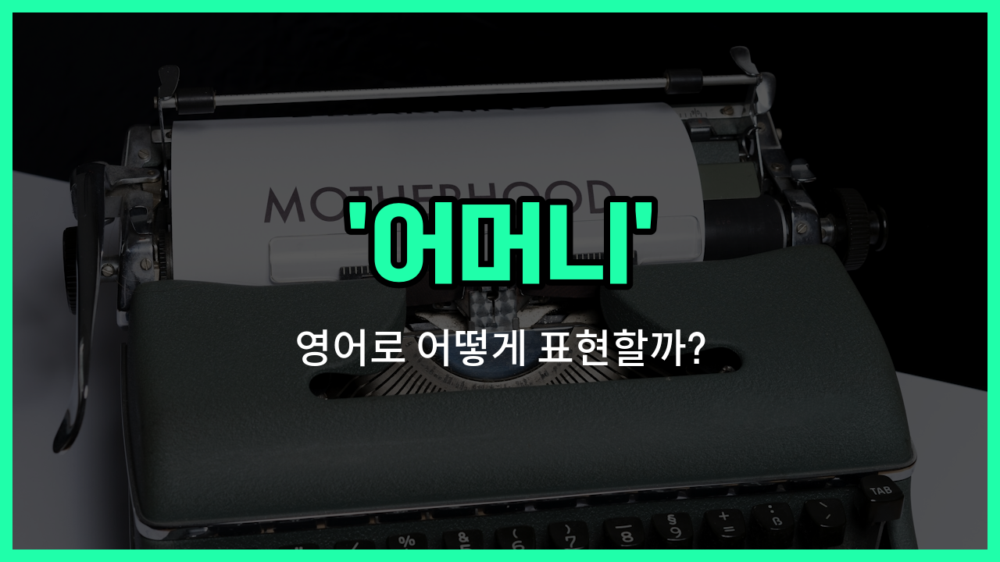

## 🌟 영어 표현 - mater

안녕하세요 👋 오늘은 '어머니'라는 뜻을 가진 영어 표현 '**mater**'에 대해 알아보려고 해요. 'mater'는 주로 문어체나 고전적인 문맥에서 '어머니'를 의미할 때 사용돼요. 일상 대화에서는 잘 쓰이지 않지만, 문학 작품이나 공식적인 글에서 종종 볼 수 있는 단어예요.

'**mater**'는 'mother'와 같은 의미지만, 조금 더 격식 있고 옛스러운 느낌을 줘요. 예를 들어, 영국식 영어에서는 학교나 군대 등에서 'my mater'라고 부르기도 했어요. 하지만 현대 영어에서는 거의 사용되지 않고, 주로 'mother', 'mom', 'mum'이 더 많이 쓰여요.

그래도 고전 소설이나 영화, 또는 공식적인 자리에서 이 단어를 접할 수 있으니 알아두면 도움이 될 거예요!

## 📖 예문

1. "그는 어머니를 'mater'라고 불렀어요."

   "He [called](/blog/in-english/1114.called/) his mother 'mater'."

2. "고전 소설에서 'mater'라는 단어를 자주 볼 수 있어요."

   "You can [often](/blog/in-english/326.often/) see the word 'mater' in classic novels."

## 💬 연습해보기

<ul data-interactive-list>

  <li data-interactive-item>
    어제, 새 직장에 대해 엄마한테 전화했어요. 엄마가 항상 걱정하시니까 연락하려고 해요.
    Yesterday, I called my mater to tell her about my <a href="/blog/in-english/1056.new/">new</a> <a href="/blog/in-english/1101.job/">job</a>. She always <a href="/blog/in-english/209.worry-about/">worries about</a> me, so I <a href="/blog/in-english/232.make-sure/">make sure</a> to keep in touch.
  </li>

  <li data-interactive-item>
    엄마는 명절에 사과 파이를 제일 잘 만들어요. 다들 엄마 밥을 기대한답니다.
    My mater makes the <a href="/blog/in-english/1073.best/">best</a> apple pie during the <a href="/blog/in-english/517.holiday/">holidays</a>. Everyone <a href="/blog/in-english/224.look-forward-to/">looks forward to</a> her <a href="/blog/in-english/461.cook/">cooking</a>.
  </li>

  <li data-interactive-item>
    지난주 아프게 됐을 때, 엄마가 저를 돌봐주셨어요. 몸이 나아질 때까지요.
    When I was sick last <a href="/blog/in-english/1129.week/">week</a>, my mater took <a href="/blog/in-english/1126.care/">care</a> of me until I <a href="/blog/in-english/1096.feel/">felt</a> <a href="/blog/in-english/1082.better/">better</a>.
  </li>

  <li data-interactive-item>
    어려운 상황을 어떻게 대처할까 엄마한테 조언을 구했어요. 정말 좋은 조언을 주셨어요.
    I asked my mater for <a href="/blog/in-english/379.advice/">advice</a> on how to <a href="/blog/in-english/1152.handle/">handle</a> a <a href="/blog/in-english/183.tough/">tough</a> situation at <a href="/blog/in-english/1064.work/">work</a>. She gave me really good guidance.
  </li>

  <li data-interactive-item>
    매주 일요일, 엄마 집에서 저녁을 먹으러 가요. 우리만의 작은 전통이에요.
    Every Sunday, I visit my mater for dinner. It's our <a href="/blog/in-english/1085.little/">little</a> tradition to <a href="/blog/in-english/021.catch-up-on/">catch up</a>.
  </li>

  <li data-interactive-item>
    대학교 다닐 때 멀리 떨어져 있었는데, 엄마가 care package를 보내주셨어요. 정말 기분이 좋았어요.
    My mater surprised me with a care package while I was away at college. It really brightened my <a href="/blog/in-english/1067.day/">day</a>.
  </li>

  <li data-interactive-item>
    엄마가 어떻게 자전거를 타는지 가르쳐주셨던 날이 기억나요. 잊을 수 없는 하루에요.
    I remember when my mater taught me how to ride a bike. It was a day I'll never <a href="/blog/in-english/023.forget/">forget</a>.
  </li>

  <li data-interactive-item>
    아직 멀리 살고 있지만, 엄마 생일에는 꼭 전화를 하려고 해요.
    Even though I <a href="/blog/in-english/1134.live/">live</a> far away, I always <a href="/blog/in-english/117.try-to/">try to</a> call my mater on her birthday.
  </li>

  <li data-interactive-item>
    엄마는 집에서 모든 사람들이 환영받는 느낌을 주는 특별한 방법이 있어요.
    My mater has this incredible <a href="/blog/in-english/1062.way/">way</a> of <a href="/blog/in-english/1135.making/">making</a> everyone feel welcomed in her <a href="/blog/in-english/1076.home/">home</a>.
  </li>

  <li data-interactive-item>
    기분이 안 좋을 때면 엄마와 이야기하면 기분이 좋아지고 안정이 돼요.
    Whenever I'm feeling down, <a href="/blog/in-english/359.talk-to/">talking to</a> my mater <a href="/blog/in-english/1084.help/">helps</a> me feel better and more grounded.
  </li>

</ul>

## 🤝 함께 알아두면 좋은 표현들

### mom

'mom'은 '어머니'를 뜻하는 가장 일반적이고 친근한 표현이에요. 가족이나 친구들 사이에서 일상적으로 많이 사용되며, 따뜻하고 편안한 느낌을 줘요.

- "My mom always [knows](/blog/in-english/1058.know/) how to make me feel better when I'm sad."
- "내 엄마는 내가 슬플 때 항상 기분을 좋게 해주는 방법을 알아요."

### mother figure

'mother figure'는 '어머니 같은 존재'를 의미해요. 실제 어머니가 아니더라도 보호자나 돌봐주는 사람을 가리킬 때 사용해요.

- "She became a mother figure to the children in the orphanage."
- "그녀는 고아원 아이들에게 어머니 같은 존재가 되었어요."

### father (아버지)

'father'는 '아버지'를 뜻하는 단어로, 'mother'의 반대말이에요. 가족 내에서 남성 부모를 가리킬 때 사용해요.

- "His father taught him how to ride a bike when he was young."
- "그의 아버지는 그가 어렸을 때 자전거 타는 법을 가르쳐 주셨어요."

---

오늘은 '어머니', '모친', '엄마'라는 뜻을 가진 영어 표현 '**mater**'에 대해 알아봤어요. 일상에서는 잘 쓰이지 않지만, 문학이나 공식적인 자리에서 만날 수 있으니 기억해두면 좋겠어요 😊

오늘 배운 표현과 예문들을 꼭 최소 3번씩 소리 내서 읽어보세요. 다음에도 더 재미있고 유익한 영어 표현으로 찾아올게요! 감사합니다!

