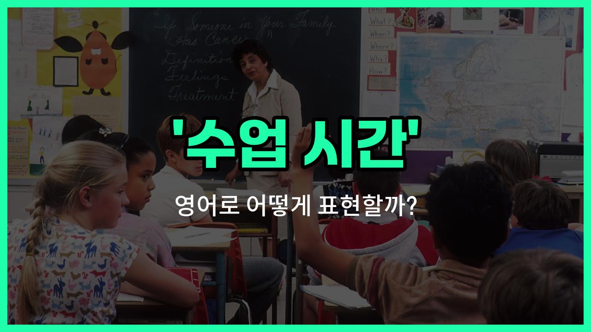

## 🌟 영어 표현 - schooltime

안녕하세요 👋 오늘은 영어로 '수업 시간'을 어떻게 표현하는지 알아보려고 해요. 바로 '**schooltime**'이라는 단어를 사용할 수 있어요. 이 표현은 학교에서 수업이 진행되는 시간, 즉 학생들이 학교에 머무르며 공부하는 시간을 의미해요.

'**schooltime**'은 '학교 시간', '등교 시간'과 같은 의미로도 쓰일 수 있어요. 그래서 학교에서 정해진 시간 동안 수업이 이루어질 때 자연스럽게 사용할 수 있는 표현이에요!

예를 들어, "수업 시간에는 휴대폰을 사용할 수 없어요."라고 말하고 싶을 때 "You can't [use](/blog/in-english/1079.use/) your phone during schooltime."이라고 표현할 수 있어요.

또한, "학교 시간은 오전 8시에 시작해요."라고 할 때는 "Schooltime [starts](/blog/in-english/1127.start/) at 8 a.m."이라고 말할 수 있어요.

## 📖 예문

1. "수업 시간에는 조용히 해야 해요."

   "You should be [quiet](/blog/in-english/958.quiet/) during schooltime."

2. "학교 시간은 오후 3시에 끝나요."

   "Schooltime [ends](/blog/in-english/1093.end/) at 3 p.m."

## 💬 연습해보기

<ul data-interactive-list>

  <li data-interactive-item>
    학교 시간에는 보통 수업 중에 휴대폰을 사용할 수 없어요. 학교 시간 동안 방해받지 않도록 휴대폰은 꺼두는 게 좋겠어요.
    During schooltime, phones are usually not allowed in class. Please <a href="/blog/in-english/232.make-sure/">make sure</a> to <a href="/blog/in-english/312.turn-off/">turn off</a> your phone during schooltime so you don't get distracted.
  </li>

  <li data-interactive-item>
    학교 시간 동안 수업이 연속적으로 있어서 자유시간이 많이 없어요. 선생님은 우리가 조용하고 집중하길 기대하세요.
    I don't get much <a href="/blog/in-english/1104.free/">free</a> <a href="/blog/in-english/1055.time/">time</a> during schooltime because we have classes back-to-back. Teachers expect us to be quiet and focused during schooltime.
  </li>

  <li data-interactive-item>
    점심 시간은 친구들과 함께 이야기를 나눌 수 있어서 학교 시간 중 가장 좋은 부분이에요. 어떤 학생들은 피곤하면 학교 시간 동안 집중하기 힘들어해요.
    Lunch breaks are the <a href="/blog/in-english/1073.best/">best</a> part of schooltime because you get to <a href="/blog/in-english/021.catch-up-on/">catch up</a> with your friends. Some students <a href="/blog/in-english/1083.find/">find</a> it hard to concentrate during schooltime if they're tired.
  </li>

  <li data-interactive-item>
    학교 시간의 시작과 끝에 딱 종이 울려요. 중요한 걸 놓치지 않으려면 학교 시간이 시작되기 전에 자리에 앉아 있어야 해요.
    The bell rings <a href="/blog/in-english/1063.right/">right</a> at the start and end of schooltime. Make <a href="/blog/in-english/1098.sure/">sure</a> you're seated before schooltime begins so you don't <a href="/blog/in-english/339.miss/">miss</a> anything <a href="/blog/in-english/318.important/">important</a>.
  </li>

  <li data-interactive-item>
    오늘 학교 시간에는 4교시가 있어요. 수업 내용이 흥미롭다면 학교 시간이 금방 가는 것 같아요.
    We have four periods during schooltime <a href="/blog/in-english/1132.today/">today</a>. <a href="/blog/한-것-같아-영어표현/">It feels like</a> schooltime goes by fast when you're <a href="/blog/in-english/979.interested-in/">interested in</a> the subject.
  </li>

  <li data-interactive-item>
    교장 선생님이 학교 시간 동안 제대로 행동하라고 다시 한 번 말씀해주셨어요. 가끔 오후에는 학교 시간 내내 집중하기가 힘들어요.
    The principal <a href="/blog/in-english/114.remind/">reminded</a> us to behave <a href="/blog/in-english/422.properly/">properly</a> during schooltime. <a href="/blog/in-english/270.sometimes/">Sometimes</a>, it's <a href="/blog/in-english/183.tough/">tough</a> to stay alert for the whole schooltime, especially in the afternoon.
  </li>

  <li data-interactive-item>
    학생들은 허락 없이 수업 중에 교실을 나갈 수 없어요. 학교 시간에는 우리는 필기를 하고 토론에 참여해요.
    Students are not allowed to <a href="/blog/in-english/402.leave/">leave</a> the classroom during schooltime without permission. During schooltime, we take notes and participate in discussions.
  </li>

  <li data-interactive-item>
    학교 시간 동안 힘이 나도록 간식을 항상 추가로 챙겨가요. 수업 끝날 즈음에 선생님이 퀴즈를 나눠주셔서 조금 긴장했어요.
    I always <a href="/blog/in-english/301.pack/">pack</a> <a href="/blog/in-english/265.extra/">extra</a> snacks to keep me <a href="/blog/in-english/1068.going/">going</a> through schooltime. The teacher handed out quizzes near the end of schooltime, so I was a <a href="/blog/in-english/1085.little/">little</a> <a href="/blog/in-english/115.nervous/">nervous</a>.
  </li>

  <li data-interactive-item>
    학교 시간 직후에 스피커로 공지가 나와요. 새로운 시간표는 다음 학교 시간부터 적용될 거라고 전해졌어요.
    There are announcements made over the loudspeaker right after schooltime. The <a href="/blog/in-english/1056.new/">new</a> schedule will take effect starting next schooltime, according to the bulletin.
  </li>

  <li data-interactive-item>
    학교 시간은 가끔 스트레스를 주지만, 쉬는 시간에 친구들과 함께하는 게 정말 재미있어요. 학교 시간 동안 숙제가 필요한지에 대해 토론하기도 했어요.
    Schooltime can be stressful sometimes, but <a href="/blog/in-english/127.hang-out/">hanging out</a> with friends during breaks really <a href="/blog/in-english/1084.help/">helps</a>. We got into a debate during schooltime about whether homework is necessary.
  </li>

</ul>

## 🤝 함께 알아두면 좋은 표현들

### class hours

'class hours'는 '수업 시간'을 의미하며, 학교에서 정해진 수업이 진행되는 시간을 가리켜요. 'schooltime'과 비슷한 의미로, 주로 공식적인 교육 시간에 사용돼요.

- "The students must [arrive](/blog/in-english/403.arrive/) before the class hours begin."
- "학생들은 수업 시간이 시작되기 전에 도착해야 해요."

### free period

'free period'는 '자유 시간' 또는 '비어 있는 시간'을 뜻해요. 수업이 없는 시간으로, 학생들이 휴식하거나 개인적인 일을 할 수 있는 시간을 나타내요. 'schooltime'의 반대 개념으로 볼 수 있어요.

- "During the free period, I [like](/blog/in-english/1053.like/) to [read](/blog/in-english/436.read/) books in the library."
- "자유 시간 동안 저는 도서관에서 책 읽는 것을 좋아해요."

### after school

'after [school](/blog/in-english/1090.school/)'은 '방과 후'를 의미해요. 수업이 모두 끝난 후의 시간을 가리키며, 학교 시간 이후에 일어나는 활동이나 시간을 나타낼 때 사용돼요. 'schooltime'과는 시간적으로 구분되는 표현이에요.

- "We usually [play](/blog/in-english/1081.play/) basketball after school."
- "우리는 보통 방과 후에 농구를 해요."

---

오늘은 '수업 시간', '학교 시간', '등교 시간'이라는 뜻을 가진 영어 표현 '**schooltime**'에 대해 알아봤어요. 학교와 관련된 상황에서 이 표현을 떠올리면 도움이 될 거예요 😊

오늘 배운 표현과 예문들을 꼭 소리 내서 여러 번 읽어보세요. 다음에도 더 유익한 영어 표현으로 찾아올게요! 감사합니다!

