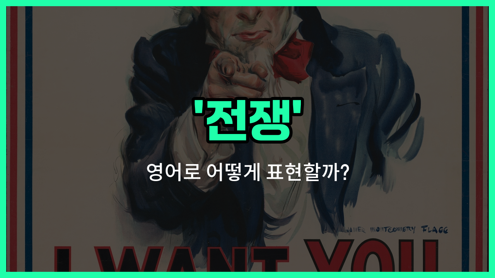

## 🌟 영어 표현 - war

안녕하세요 👋 오늘은 '전쟁'이라는 뜻을 가진 영어 표현에 대해 알아보려고 해요. 바로 '**war**'라는 단어인데요~

'**war**'는 국가나 집단 사이에 무력 충돌이 일어나서 큰 규모의 싸움이 벌어지는 상황을 의미해요. 즉, **나라와 나라, 혹은 집단 간의 분쟁이나 무력 충돌**을 표현할 때 자주 쓰이는 단어예요!

이 단어는 역사, 뉴스, 영화 등 다양한 상황에서 자연스럽게 사용돼요. 예를 들어, "전쟁이 발발했다"는 영어로 "War has broken out."이라고 할 수 있어요~

또는, "그들은 오랜 전쟁을 끝냈어요."라고 말하고 싶을 때는 "They ended a [long](/blog/in-english/1077.long/) war."라고 표현할 수 있어요.

'**war**'는 명사로 주로 쓰이며, '전쟁'이라는 의미 외에도 '분쟁', '무력 충돌'과 같은 상황을 포괄적으로 나타낼 수 있어요. 상황에 따라 다양한 문장에 활용해 보세요!

## 📖 예문

1. "전쟁은 많은 사람들에게 고통을 줘요."

   "War causes [pain](/blog/in-english/573.pain/) to many [people](/blog/in-english/1057.people/)."

2. "그 나라는 전쟁 중이에요."

   "The country is at war."

## 💬 연습해보기

<ul data-interactive-list>

  <li data-interactive-item>
    그 다큐멘터리 보고 나니까 전쟁이 정말 얼마나 참혹한지 믿기가 힘들어.
    After watching that documentary, I can't believe how devastating war really is.
  </li>

  <li data-interactive-item>
    그 나라는 몇 년째 전쟁 중이고, 사람들은 고통받고 있어.
    The country has been in a <a href="/blog/in-english/1080.state/">state</a> of war for <a href="/blog/in-english/1066.years/">years</a>, and the people are suffering.
  </li>

  <li data-interactive-item>
    할아버지께서 제2차 세계대전 때의 경험담을 많이 얘기해 주셨는데, 정말 잔인한 전쟁이었어.
    My grandpa <a href="/blog/in-english/143.used-to/">used to</a> tell <a href="/blog/in-english/537.story/">stories</a> about his <a href="/blog/in-english/415.experience/">experiences</a> during <a href="/blog/in-english/1071.world/">World</a> War II, which was a <a href="/blog/in-english/405.brutal/">brutal</a> war.
  </li>

  <li data-interactive-item>
    전쟁이 모든 걸 바꾼다고 하는데, 그 말이 맞는 것 같아. 이제는 예전과 같은 느낌이 없어.
    They say war <a href="/blog/in-english/1133.change/">changes</a> everything, and I guess they're <a href="/blog/in-english/1063.right/">right</a> because nothing <a href="/blog/in-english/1096.feel/">feels</a> the same anymore.
  </li>

  <li data-interactive-item>
    외교관들이 전쟁을 막으려고 열심히 노력하고 있는데, 매일 긴장이 고조되고 있어.
    Diplomats are trying hard to <a href="/blog/in-english/290.prevent/">prevent</a> war, but tensions keep rising every <a href="/blog/in-english/1067.day/">day</a>.
  </li>

  <li data-interactive-item>
    전쟁은 가족에게 끔찍한 영향을 미쳐서, 상상도 못 할 방식으로 그들을 갈라놓기도 해.
    War has a terrible impact on families, <a href="/blog/in-english/326.often/">often</a> tearing them apart in unimaginable <a href="/blog/in-english/1062.way/">ways</a>.
  </li>

  <li data-interactive-item>
    전쟁터에서 군인들이 보여주는 용기를 상상하기가 정말 어려워.
    <a href="/blog/in-english/111.hard-to/">It's hard to</a> imagine the kind of courage soldiers show during war zones.
  </li>

  <li data-interactive-item>
    일부 영화는 전쟁에서의 공포와 용기를 정말 잘 담고 있어.
    Some movies really capture the horrors and bravery <a href="/blog/in-english/1094.found/">found</a> in war.
  </li>

  <li data-interactive-item>
    역사 수업에서 전쟁의 원인에 대해 배웠는데, 이 갈등이 얼마나 복잡한지 깨닫게 됐어.
    We <a href="/blog/in-english/245.learn/">learned</a> about the causes of war in <a href="/blog/in-english/532.history/">history</a> class, and it opened my eyes to how complex these <a href="/blog/in-english/753.conflict/">conflicts</a> are.
  </li>

  <li data-interactive-item>
    평화 회담이 진행 중이어서 오랜 전쟁을 끝낼 수 있기를 바라고 있어.
    Peace talks are underway, hoping to <a href="/blog/in-english/1093.end/">end</a> the long-standing war indefinitely.
  </li>

</ul>

## 🤝 함께 알아두면 좋은 표현들

### conflict

'conflict'는 '갈등' 또는 '충돌'을 의미하며, 전쟁과 비슷하게 두 집단 간의 심각한 대립 상황을 나타내요. 하지만 전쟁보다는 규모가 작거나 무력 충돌이 반드시 포함되지 않을 수도 있어요.

- "The conflict between the two countries has lasted for decades."
- "두 나라 간의 갈등이 수십 년 동안 계속되어 왔어요."

### peace

'peace'는 '평화'를 뜻하며, 전쟁의 반대 개념이에요. 무력 충돌이 없고 안정과 조화가 유지되는 상태를 나타내요. 전쟁이 끝난 후에 사람들이 바라는 이상적인 상황이에요.

- "After [years](/blog/in-english/1065.year/) of war, the nations [finally](/blog/in-english/182.finally/) signed a peace [treaty](/blog/in-english/626.treaty/)."
- "수년간의 전쟁 끝에 그 나라들은 마침내 평화 조약을 체결했어요."

### armed struggle

'armed struggle'는 '무장 투쟁'을 의미하며, 전쟁과 유사하지만 보통 국가 간 전면전보다는 특정 집단이나 조직이 무기를 사용해 싸우는 상황을 가리켜요.

- "The armed struggle for independence lasted several years."
- "독립을 위한 무장 투쟁이 몇 년간 계속되었어요."

---

오늘은 '**전쟁**'이라는 뜻을 가진 영어 표현 '**war**'에 대해 알아봤어요. 역사나 뉴스를 볼 때 이 단어가 자주 등장하니 꼭 기억해 두면 좋겠어요~ 😊

오늘 배운 표현과 예문들을 꼭 최소 3번씩 소리 내서 읽어보세요. 다음에도 더 재미있고 유익한 영어 표현으로 찾아올게요! 감사합니다!

