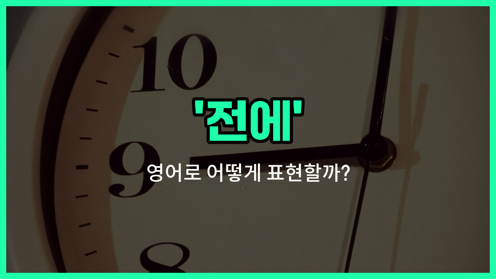

## 🌟 영어 표현 - ago

안녕하세요 👋 오늘은 영어에서 과거의 시간을 표현할 때 자주 쓰는 단어 '**ago**'에 대해 알아보려고 해요.

'**ago**'는 우리말로 '전에', '~전'이라는 뜻이에요. 즉, 지금으로부터 얼마만큼의 시간이 지났는지 말할 때 사용하는 표현이에요!

예를 들어, '5분 전에', '2년 전에'처럼 **과거의 특정 시점이 현재로부터 얼마나 떨어져 있는지**를 나타낼 때 아주 유용하게 쓰여요. 영어에서는 숫자와 시간 단위를 먼저 말하고, 그 뒤에 'ago'를 붙여서 표현해요.

예를 들어, '10분 전에'는 '10 minutes ago', '일주일 전에'는 'a [week](/blog/in-english/1129.week/) ago'라고 해요.

## 📖 예문

1. "나는 3년 전에 이 회사를 다니기 시작했어요."

   "I [started](/blog/in-english/1127.start/) [working](/blog/in-english/1064.work/) at this [company](/blog/in-english/1111.company/) three [years](/blog/in-english/1066.years/) ago."

2. "그 소식을 5분 전에 들었어요."

   "I heard the [news](/blog/in-english/536.news/) five minutes ago."

## 💬 연습해보기

<ul data-interactive-list>

  <li data-interactive-item>
    이 도시에 이사 온 지 벌써 5년 됐어요. 그동안 정말 많은 일이 있었어요.
    I moved to this <a href="/blog/in-english/1108.city/">city</a> five <a href="/blog/in-english/1065.year/">years</a> ago. It's been quite an adventure since then.
  </li>

  <li data-interactive-item>
    방금 전에 그녀가 전화했어요. 곧 전화해야 할 것 같아요.
    She <a href="/blog/in-english/1114.called/">called</a> me just two minutes ago. I need to return her call soon.
  </li>

  <li data-interactive-item>
    우리는 일주일 전에 그 프로젝트를 마쳤는데, 지금 피드백 기다리고 있어요.
    We finished the project a week ago, and now we're <a href="/blog/in-english/377.wait-for/">waiting for</a> <a href="/blog/in-english/897.feedback/">feedback</a>.
  </li>

  <li data-interactive-item>
    그는 한 시간 전에 사무실을 나갔고 아직 돌아오지 않았어요.
    He <a href="/blog/in-english/1106.left/">left</a> the office about an hour ago and hasn't come back yet.
  </li>

  <li data-interactive-item>
    그들은 10년 전에 결혼했는데, 지금도 서로의 관계가 더 강해지고 있어요.
    They <a href="/blog/in-english/828.get-married/">got married</a> ten years ago, and their partnership is stronger than ever.
  </li>

  <li data-interactive-item>
    그 영화는 예전에 봤는데, 여전히 기억에 남아요.
    I saw that movie a <a href="/blog/in-english/1077.long/">long</a> <a href="/blog/in-english/1055.time/">time</a> ago, but it <a href="/blog/in-english/254.still/">still</a> sticks with me.
  </li>

  <li data-interactive-item>
    3일 전에 소포가 도착했는데, 나가 있어서 아직 열어보지 못했어요.
    The package <a href="/blog/in-english/403.arrive/">arrived</a> three <a href="/blog/in-english/1067.day/">days</a> ago, but I was out so I haven't opened it yet.
  </li>

  <li data-interactive-item>
    한 달 전에 새로운 소프트웨어 업그레이드를 시작했는데, 지금은 잘 돌아가고 있어요.
    We started the <a href="/blog/in-english/1056.new/">new</a> software <a href="/blog/in-english/1020.upgrade/">upgrade</a> a month ago, and it's <a href="/blog/in-english/1102.run/">running</a> smoothly now.
  </li>

  <li data-interactive-item>
    6개월 전에 조부모님이 방문하셨어요. 그때 정말 즐거운 시간을 보냈어요.
    My grandparents visited us six months ago, and we had a great time <a href="/blog/in-english/374.together/">together</a>.
  </li>

  <li data-interactive-item>
    이 기타는 작년쯤에 샀는데, 그 이후로 매일 연습하고 있어요.
    I bought this guitar about a year ago, and I've been <a href="/blog/in-english/247.practice/">practicing</a> daily since then.
  </li>

</ul>

## 🤝 함께 알아두면 좋은 표현들

### in the past

'in [the past](/blog/in-english/801.the-past/)'는 '과거에' 또는 '예전에'라는 뜻으로, 어떤 일이 지금보다 이전에 일어났음을 나타내요. 'ago'와 비슷하게 과거 시점을 가리키지만, 좀 더 일반적이고 포괄적인 표현이에요.

- "She lived in New York in the past before moving to London."
- "그녀는 런던으로 이사 가기 전에 뉴욕에 살았었어요."

### recently

'recently'는 '최근에'라는 뜻으로, 과거의 아주 가까운 시점을 나타내요. 'ago'와는 반대로, 과거지만 아주 가까운 시점을 강조할 때 사용해요.

- "I saw him recently at the coffee shop."
- "나는 최근에 커피숍에서 그를 봤어요."

### since

'since'는 '~이래로'라는 뜻으로, 어떤 시점부터 지금까지 계속되는 상태를 나타내요. 'ago'가 과거의 특정 시점을 기준으로 시간을 말하는 반면, 'since'는 그 시점부터 현재까지의 기간을 강조해요.

- "She has been working here since 2010."
- "그녀는 2010년부터 여기서 일하고 있어요."

---

오늘은 '전에', '~전'이라는 뜻을 가진 영어 표현 '**ago**'에 대해 알아봤어요. 과거의 일을 말할 때 꼭 필요한 표현이니, 일상 대화에서 자주 활용해 보세요 😊

오늘 배운 표현과 예문들을 꼭 최소 3번씩 소리 내서 읽어보세요. 다음에도 더 재미있고 유익한 영어 표현으로 찾아올게요! 감사합니다!

