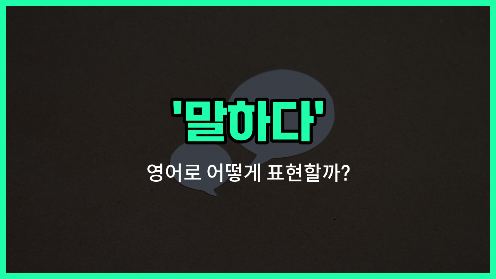

## 🌟 영어 표현 - says

안녕하세요 👋 오늘은 영어에서 자주 쓰이는 표현 '**says**'에 대해 알아보려고 해요. '말하다', '이야기하다', '전하다'와 같은 의미를 가진 단어예요.

'says'는 동사 'say'의 3인칭 단수 현재형이에요. 즉, 누군가가 어떤 말을 할 때 "그 사람이 말한다"라는 뜻으로 사용돼요. 예를 들어, "He says hello."라고 하면 "그가 안부를 전해요."라는 의미가 돼요.

이 표현은 일상 대화, 뉴스, 책 등 다양한 상황에서 정말 자주 등장해요. 누군가의 말을 전달하거나 인용할 때 꼭 필요한 단어예요!

## 📖 예문

1. "엄마가 저녁 먹으라고 말해요."

   "Mom says it's [time](/blog/in-english/1055.time/) for dinner."

2. "선생님이 숙제를 내주라고 이야기해요."

   "The teacher says to do the homework."

## 💬 연습해보기

<ul data-interactive-list>

  <li data-interactive-item>
    내 친구는 저녁 시간에 항상 정말 재미있는 얘기를 하거든. 그녀가 곁에 있을 때 웃지 않는 게 힘들어.
    My friend always says the funniest things during dinner. It's <a href="/blog/in-english/1219.hard/">hard</a> not to <a href="/blog/in-english/321.laugh/">laugh</a> when she's around.
  </li>

  <li data-interactive-item>
    그는 5시에 여기 올 거래, 근데 사람들은 시간 관리가 꽤 별로잖아.
    He says he'll be here by 5, but you <a href="/blog/in-english/1058.know/">know</a> how <a href="/blog/in-english/1057.people/">people</a> can be with time.
  </li>

  <li data-interactive-item>
    회의에서 그녀는 이번 분기에 고객 서비스에 더 집중해야 한다고 했어.
    In the meeting, she says we need to focus more on customer service this quarter.
  </li>

  <li data-interactive-item>
    아빠는 피자는 뜨겁고 갓 구운 게 제일 맛있다고 말씀하시더라구.
    Dad says that pizza tastes <a href="/blog/in-english/1082.better/">better</a> when you eat it hot and fresh from the oven.
  </li>

  <li data-interactive-item>
    그녀는 영화가 지루했다고 하지만, 나는 솔직히 꽤 좋았다고 생각했어.
    She says that the movie was <a href="/blog/vocab-1/040.boring/">boring</a>, but I actually <a href="/blog/in-english/1118.thought/">thought</a> it was pretty good.
  </li>

  <li data-interactive-item>
    그는 오늘 밤 외출할 생각이 없다고 하는데, 사실 그냥 피곤할 뿐인 것 같아.
    He says he's not <a href="/blog/in-english/979.interested-in/">interested in</a> <a href="/blog/in-english/1068.going/">going</a> out tonight, but I <a href="/blog/in-english/1059.think/">think</a> he's just tired.
  </li>

  <li data-interactive-item>
    엄마는 손님 오기 전에 집을 청소하자고 하셨어. 얼른 시작하자.
    Mom says we should <a href="/blog/in-english/523.clean/">clean</a> the <a href="/blog/in-english/1088.house/">house</a> before the guests <a href="/blog/in-english/403.arrive/">arrive</a>. <a href="/blog/in-english/1112.let/">Let</a>'s get <a href="/blog/in-english/1127.start/">started</a> early.
  </li>

  <li data-interactive-item>
    프로젝트에 대해 물어봤을 때, 상사는 우리가 일정보다 앞서가고 있다고 해서, 정말 좋은 소식이야.
    When asked about the project, the boss says we're <a href="/blog/in-english/305.ahead-of-schedule/">ahead of schedule</a>, which is great <a href="/blog/in-english/536.news/">news</a>.
  </li>

  <li data-interactive-item>
    선생님은 연습이 중요하다고 하니까, 수학 문제 계속 풀어보라고 하셨어.
    My teacher says <a href="/blog/in-english/247.practice/">practice</a> <a href="/blog/in-english/1209.makes/">makes</a> <a href="/blog/in-english/413.perfect/">perfect</a>, so keep <a href="/blog/in-english/1064.work/">working</a> on those math problems.
  </li>

  <li data-interactive-item>
    그는 차를 고칠 수 있다고 하지만, 아마 새로운 부품을 사야 할 수도 있어.
    He says he can <a href="/blog/in-english/524.fix/">fix</a> the car, but we might need to buy some <a href="/blog/in-english/1056.new/">new</a> parts first.
  </li>

</ul>

## 🤝 함께 알아두면 좋은 표현들

### states

'[states](/blog/in-english/1080.state/)'는 '말하다'와 비슷하게 어떤 사실이나 의견을 공식적이고 명확하게 표현할 때 쓰는 표현이에요. 주로 공식적인 문서나 발표에서 많이 사용돼요.

- "The spokesperson states that the [company](/blog/in-english/1111.company/) will launch a new product next month."
- "대변인이 회사가 다음 달에 신제품을 출시할 것이라고 말했어요."

### whispers

'whispers'는 '속삭이다'라는 뜻으로, 아주 작고 조용하게 말하는 것을 의미해요. 보통 비밀스럽거나 조용히 이야기할 때 사용해요.

- "She whispers a secret to her friend during the meeting."
- "그녀는 회의 중에 친구에게 비밀을 속삭였어요."

### denies

'denies'는 '부인하다'라는 뜻으로, 어떤 사실이나 주장을 말하지 않거나 인정하지 않는 반대의 의미를 가지고 있어요. 주로 누군가의 주장이나 혐의를 부정할 때 사용돼요.

- "He denies any involvement in the scandal."
- "그는 그 스캔들에 어떤 연루도 없다고 부인했어요."

---

오늘은 '말하다', '이야기하다', '전하다'라는 뜻을 가진 영어 표현 '**says**'에 대해 알아봤어요. 누군가의 말을 전달할 때 이 표현을 자연스럽게 써보세요 😊

오늘 배운 표현과 예문들을 꼭 최소 3번씩 소리 내서 읽어보세요. 다음에도 더 재미있고 유익한 영어 표현으로 찾아올게요! 감사합니다!

