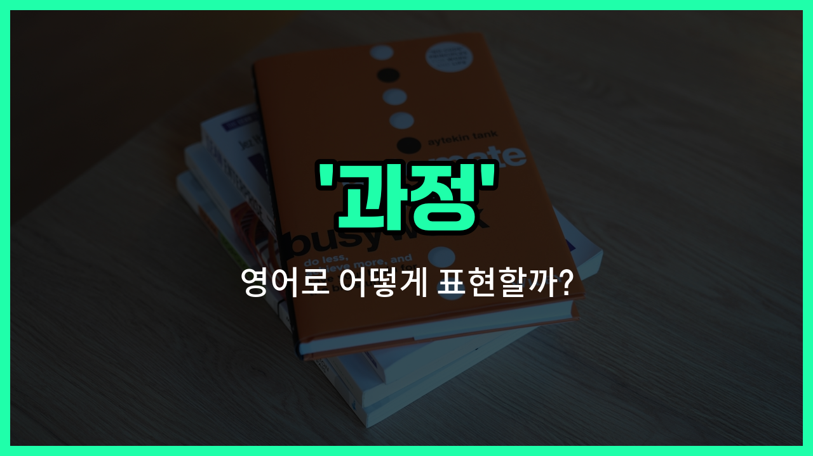

## 🌟 영어 표현 - course

안녕하세요 👋 오늘은 영어 단어 '**course**'에 대해 알아보려고 해요. '과정', '강좌', '진로'와 같은 뜻을 가진 단어인데요, 일상생활이나 학교, 직장에서 자주 쓰이는 표현이에요.

'**course**'는 크게 두 가지 의미로 많이 사용돼요. 첫 번째는 학교나 온라인에서 듣는 '강좌'나 '수업'을 의미해요. 예를 들어, "영어 회화 과정을 듣고 있어요."라고 할 때 "I'm taking an English conversation course."라고 표현할 수 있어요.

두 번째로는 어떤 일이 진행되는 '과정'이나 '진로'를 나타낼 때도 사용돼요. 예를 들어, "그 프로젝트는 순조롭게 진행되고 있어요."는 "The project is [going](/blog/in-english/1068.going/) smoothly over the course of [time](/blog/in-english/1055.time/)."처럼 쓸 수 있어요.

## 📖 예문

1. "저는 이번 학기에 수학 과정을 듣고 있어요."

   "I'm taking a math course this semester."

2. "그는 자신의 진로를 바꾸기로 결정했어요."

   "He [decided to](/blog/in-english/062.decide-to/) [change](/blog/in-english/1133.change/) his course of career."

## 💬 연습해보기

<ul data-interactive-list>

  <li data-interactive-item>
    온라인 코스를 듣고 있는데 코딩 실력이 많이 늘어나고 있어요. 정말 유용해요.
    I'm taking an online course to <a href="/blog/in-english/394.improve/">improve</a> my coding skills. It's really helpful <a href="/blog/in-english/283.so-far/">so far</a>.
  </li>

  <li data-interactive-item>
    대학교에서 환경 과학 관련 수업을 제공하는데 흥미롭고 좋아 보이네요.
    The university offers a course on environmental science that sounds interesting.
  </li>

  <li data-interactive-item>
    그녀는 지난 학기에 수업을 마치고 인증서를 받았어요.
    She completed the course last semester and got a certificate.
  </li>

  <li data-interactive-item>
    우리 회사는 신입사원들을 위해 첫 주에 교육 과정을 제공해요.
    Our <a href="/blog/in-english/1111.company/">company</a> <a href="/blog/in-english/743.provide/">provides</a> a <a href="/blog/in-english/1147.train/">training</a> course for <a href="/blog/in-english/1056.new/">new</a> <a href="/blog/in-english/700.employee/">employees</a> during their first <a href="/blog/in-english/1129.week/">week</a>.
  </li>

  <li data-interactive-item>
    그는 직업을 바꾸기 위해 그래픽 디자인 수업에 등록했어요.
    He signed up for a course in graphic design to switch careers.
  </li>

  <li data-interactive-item>
    이 수업은 초급부터 고급까지 모든 내용을 다루고 있어요.
    The course <a href="/blog/in-english/1145.cover/">covers</a> everything from beginner to <a href="/blog/in-english/429.advance/">advanced</a> <a href="/blog/in-english/1124.level/">levels</a>.
  </li>

  <li data-interactive-item>
    7월에 시작하는 다음 수업에 등록해야 해요.
    I need to register for the next course <a href="/blog/in-english/1127.start/">starting</a> in July.
  </li>

  <li data-interactive-item>
    이 언어 수업 덕분에 말하기 실력이 많이 늘었어요.
    This language course really improved my speaking abilities.
  </li>

  <li data-interactive-item>
    디지털 마케팅 배우기 좋은 수업 좀 추천해줄 수 있어요?
    Can you <a href="/blog/in-english/308.recommend/">recommend</a> a good course for <a href="/blog/in-english/245.learn/">learning</a> digital marketing?
  </li>

  <li data-interactive-item>
    그들은 클라이언트 피드백을 받고 프로젝트 방향을 바꿨어요.
    They changed the course of the project after receiving client <a href="/blog/in-english/897.feedback/">feedback</a>.
  </li>

</ul>

## 🤝 함께 알아두면 좋은 표현들

### curriculum

'curriculum'은 학교나 교육 기관에서 제공하는 전체 학습 계획이나 과목 목록을 의미해요. 'course'가 개별 수업이나 과정을 뜻한다면, 'curriculum'은 여러 과목이나 과정을 포함하는 더 큰 틀을 나타내요.

- "The university updated its curriculum to [include](/blog/in-english/522.include/) more technology-related [courses](/blog/in-english/1163.courses/)."
- "그 대학교는 더 많은 기술 관련 과목을 포함하도록 교육 과정을 업데이트했어요."

### program

'program'은 특정 목표를 위해 조직된 일련의 활동이나 과정을 의미해요. 'course'가 개별 수업을 뜻한다면, 'program'은 여러 과정을 묶어 하나의 체계적인 학습 경로를 나타내요.

- "She enrolled in a language program that includes several courses over six months."
- "그녀는 6개월 동안 여러 과정을 포함하는 어학 프로그램에 등록했어요."

### free time

'[free](/blog/in-english/1104.free/) time'은 'course'와는 반대되는 개념으로, 정해진 학습이나 활동 과정이 아닌 자유롭게 쓸 수 있는 시간을 의미해요. 즉, 계획된 과정이 없는 휴식이나 여가 시간을 뜻해요.

- "During his free time, he [prefers](/blog/in-english/191.prefer/) to [read](/blog/in-english/436.read/) books rather than attend courses."
- "그는 자유 시간 동안 수업에 참석하기보다는 책 읽는 것을 더 좋아해요."

---

오늘은 '과정', '강좌', '진로'라는 뜻을 가진 영어 표현 '**course**'에 대해 알아봤어요. 학교나 직장에서 새로운 수업이나 경로를 이야기할 때 이 표현을 떠올려 보세요 😊

오늘 배운 표현과 예문들을 꼭 최소 3번씩 소리 내서 읽어보세요. 다음에도 더 재미있고 유익한 영어 표현으로 찾아올게요! 감사합니다!

