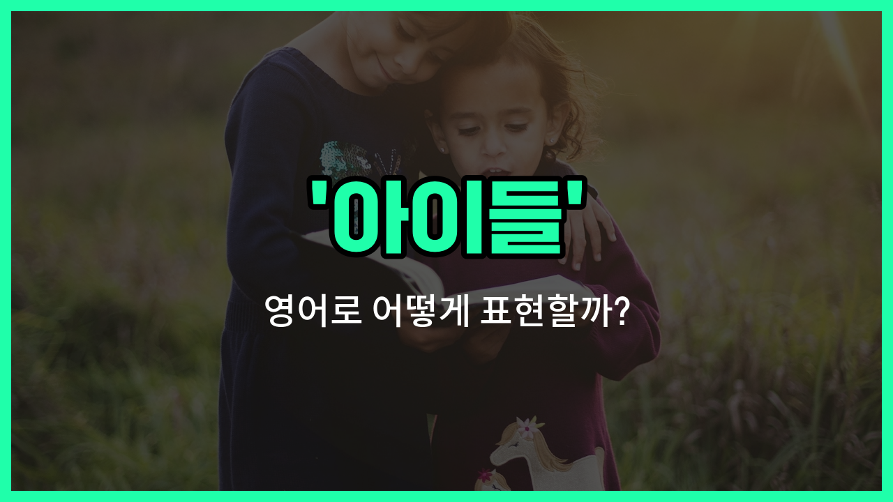

## 🌟 영어 표현 - children

안녕하세요 👋 오늘은 우리가 일상에서 자주 쓰는 단어인 '**아이들**'의 영어 표현에 대해 알아보려고 해요. 바로 '**children**'이라는 단어인데요~

'children'은 'child(아이, 어린이)'의 복수형이에요. 즉, 한 명이 아니라 여러 명의 아이들을 말할 때 사용해요. 우리말로는 '아이들', '어린이들', 또는 '자녀들'이라는 뜻으로 해석할 수 있어요~

이 단어는 가족, 학교, 놀이 등 다양한 상황에서 아주 자연스럽게 쓰여요. 예를 들어, "아이들이 놀이터에서 놀고 있어요."라고 말하고 싶을 때 "The children are playing in the playground."라고 표현할 수 있어요~

또한, 부모님이 "저는 세 명의 자녀가 있어요."라고 말할 때도 "I have three children."이라고 할 수 있답니다~

## 📖 예문

1. "아이들이 학교에 가고 있어요."

   "The children are going to school."

2. "그 공원에는 많은 아이들이 있어요."

   "There are many children in the park."

## 💬 연습해보기

<ul data-interactive-list>

  <li data-interactive-item>
    아이들이 어두워질 때까지 밖에서 놀고 있었어요. 공원에서 뛰어다니면서 정말 행복해 보였어요.
    The children were playing outside until it got dark. They seemed so happy running around in the park.
  </li>

  <li data-interactive-item>
    영화 볼 때 아이들이 너무 시끄러워져서 조용히 해 달라고 했어요.
    I asked the children to be quiet during the movie because it was getting too loud.
  </li>

  <li data-interactive-item>
    생일 파티에서 아이들이 선물을 열어보는 게 너무 신나 보였어요.
    At the birthday party, the children were excited to <a href="/blog/in-english/1235.open/">open</a> their presents.
  </li>

  <li data-interactive-item>
    오늘 학교에서 열린 발표회에서 아이들이 얼마나 잘 behaved했는지 봐야 해요.
    You should see how well the children behaved at the school assembly today.
  </li>

  <li data-interactive-item>
    덥고 더운 날, 아이들이 분수대에서 뛰어놀며 웃고 소리 지르고 있었어요.
    The children were laughing and screaming as they ran through the sprinklers on a hot day.
  </li>

  <li data-interactive-item>
    아이들이 TV 보기 전에 숙제를 꼭 다 끝내야 해요.
    We need to make sure the children finish their homework before they watch TV.
  </li>

  <li data-interactive-item>
    아이들이 정원에 꽃을 심는 걸 도와주면서 손이 더러워지는 걸 정말 좋아했어요.
    The children helped plant the flowers in the garden, and they loved getting their <a href="/blog/in-english/1239.hand/">hands</a> dirty.
  </li>

  <li data-interactive-item>
    이야기 시간에는 아이들이 선생님이 하는 말을 하나하나 잘 듣고 있었어요.
    During story time, the children listened carefully to every word the teacher said.
  </li>

  <li data-interactive-item>
    아이들이 해변에서 조수로 들어오는 시간 전에 거대한 모래성을 만들었어요.
    The children built a huge sandcastle at the beach before the tide came in.
  </li>

  <li data-interactive-item>
    아이들이 행사에 참가했을 때, 그 날을 기억하기 위해 많은 사진을 찍었어요.
    When the children went on the field trip, they <a href="/blog/in-english/1237.took/">took</a> lots of pictures to remember the day.
  </li>

</ul>

## 🤝 함께 알아두면 좋은 표현들

### kids

'kids'는 'children'의 비격식적이고 친근한 표현이에요. 일상 대화에서 아이들을 가리킬 때 자주 사용하며, 좀 더 편안하고 자연스러운 느낌을 줘요.

- "The kids are playing outside in the garden."
- "아이들이 정원 밖에서 놀고 있어요."

### adults

'adults'는 '어른들'을 의미하는 단어로, 'children'의 반대말이에요. 아이들과 구분되는 성인들을 가리킬 때 사용해요.

- "Adults must accompany children under the age of 12 at the museum."
- "12세 미만 아이들은 어른이 동반해야 해요."

### youth

'youth'는 '젊은이들' 또는 '청소년'을 의미하며, 'children'보다 나이가 조금 더 많은 연령대를 가리켜요. 주로 10대 후반에서 20대 초반까지를 포함해요.

- "The youth of today are very tech-savvy."
- "오늘날 젊은이들은 기술에 매우 능숙해요."

---

오늘은 '아이들', '어린이', '자녀'라는 뜻을 가진 영어 표현 '**children**'에 대해 알아봤어요. 여러 명의 아이를 말할 때 꼭 'children'을 사용해 보세요~ 😊

오늘 배운 표현과 예문들을 소리 내서 여러 번 읽어보면 더 쉽게 기억할 수 있어요. 다음에도 더 유익한 영어 표현으로 찾아올게요! 감사합니다~

