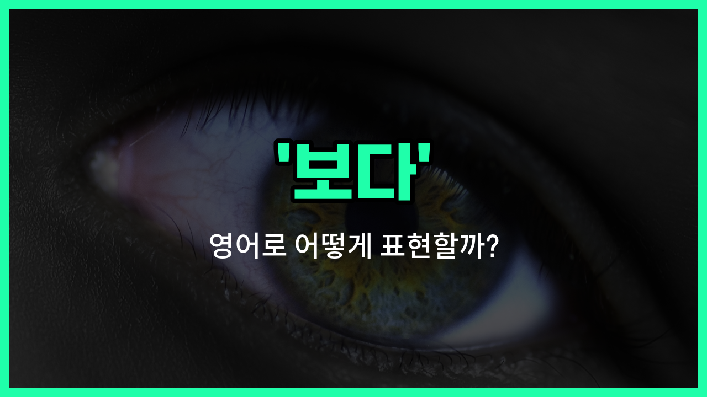

## 🌟 영어 표현 - seen

안녕하세요 👋 오늘은 영어 표현 '**seen**'에 대해 이야기해보려고 해요. '보다', '목격하다', '알아보다'와 같은 의미를 가진 단어인데요~

'**seen**'은 동사 'see'의 과거분사형이에요. 그래서 주로 완료 시제에서 사용돼요. 예를 들어, '[I've seen](/blog/일주일-내내-비가온적도-있어-영어표현/) that movie.'라고 하면 '나 그 영화 본 적 있어요.'라는 뜻이에요~

또한, '누군가를 본 적 있다'거나 '어떤 장면을 목격했다'고 말할 때도 자연스럽게 쓸 수 있어요. 예를 들어, 'Have you seen my keys?'라고 하면 '내 열쇠 본 적 있어요?'라는 의미가 돼요~

'**seen**'은 단독으로 쓰이지 않고, 'have/has'와 함께 현재완료 시제에서 자주 사용된다는 점도 기억해두면 좋아요!

## 📖 예문

1. "나는 그 영화를 본 적 있어요."

   "I've seen that movie."

2. "너 내 핸드폰 본 적 있어요?"

   "Have you seen my phone?"

3. "그는 사고를 목격했어요."

   "He has seen the accident."

## 💬 연습해보기

<ul data-interactive-list>

  <li data-interactive-item>
    그 새 영화 봤어? 진짜 좋대.
    Have you seen that <a href="/blog/in-english/1056.new/">new</a> movie yet? It's supposed to be really good.
  </li>

  <li data-interactive-item>
    이번 주에 캠퍼스에서 그 사람을 못 봤어. 아마 휴가 간 것 같아.
    I haven't seen him around campus this <a href="/blog/in-english/1129.week/">week</a>. Maybe he's on <a href="/blog/in-english/516.vacation/">vacation</a>.
  </li>

  <li data-interactive-item>
    그 동네는 세월이 지나면서 많은 변화가 있었던 것 같아.
    She's seen a lot of <a href="/blog/in-english/1133.change/">changes</a> in this neighborhood over the <a href="/blog/in-english/1066.years/">years</a>.
  </li>

  <li data-interactive-item>
    그 에피소드는 전에 봤는데, 진짜 질리지 않아.
    I've seen that episode before, but it never gets <a href="/blog/in-english/1086.old/">old</a>.
  </li>

  <li data-interactive-item>
    어제 경기 봤어? 정말 대단했어.
    Did you see the <a href="/blog/in-english/1087.game/">game</a> last <a href="/blog/in-english/1110.night/">night</a>? It was amazing.
  </li>

  <li data-interactive-item>
    그는 좋은 시절을 겪었지만, 여전히 힘내고 있어.
    He's seen <a href="/blog/in-english/1082.better/">better</a> <a href="/blog/in-english/1109.days/">days</a>, but he's <a href="/blog/in-english/254.still/">still</a> <a href="/blog/in-english/1068.going/">going</a> strong.
  </li>

  <li data-interactive-item>
    방금 그 행사에 대한 공지를 온라인에서 봤어.
    I just saw the announcement online about the event.
  </li>

  <li data-interactive-item>
    이 프로젝트가 시작된 이후로 많은 발전이 있었어.
    We've seen a lot of <a href="/blog/in-english/859.progress/">progress</a> since the project <a href="/blog/in-english/1127.start/">started</a>.
  </li>

  <li data-interactive-item>
    그 시리즈의 모든 에피소드를 최소 두 번은 봤어.
    She's seen all the episodes of that series <a href="/blog/in-english/167.at-least/">at least</a> twice.
  </li>

  <li data-interactive-item>
    너의 메시지 봤고, 곧 답장할게.
    I've seen your message, and I'll <a href="/blog/in-english/043.get-back-to/">get back to</a> you soon.
  </li>

</ul>

## 🤝 함께 알아두면 좋은 표현들

### observed (관찰된)

'[observed](/blog/in-english/872.observe/)'는 '관찰된'이라는 뜻으로, 어떤 현상이나 행동을 주의 깊게 보고 인지했을 때 사용해요. 'seen'과 비슷하게 무언가를 눈으로 확인했다는 의미를 갖고 있지만, 좀 더 의도적이고 체계적인 관찰을 강조할 때 쓰여요.

- "The scientist observed the behavior of the animals in their natural habitat."
- "과학자는 자연 서식지에서 동물들의 행동을 관찰했어요."

### unnoticed (눈에 띄지 않은)

'unnoticed'는 '눈에 띄지 않은'이라는 뜻으로, 어떤 것이 다른 사람들에게 보이지 않거나 인지되지 않았을 때 사용해요. 'seen'의 반대말로, 존재하거나 일어난 일이 아무도 보지 못했음을 나타내요.

- "The small error in the report went unnoticed by the editor."
- "보고서의 작은 실수가 편집자에게 눈에 띄지 않았어요."

### overlooked (간과된)

'[overlooked](/blog/in-english/168.overlook/)'는 '간과된'이라는 뜻으로, 어떤 중요한 점이나 사실이 주의 깊게 보지 않아서 놓쳐졌을 때 사용해요. 'seen'과 반대되는 의미로, 보았어야 할 것을 보지 못했거나 무시했음을 의미해요.

- "Several key details were overlooked during the investigation."
- "조사 과정에서 몇 가지 중요한 세부 사항들이 간과되었어요."

---

오늘은 '보다', '목격하다', '알아보다'라는 뜻을 가진 영어 표현 '**seen**'에 대해 알아봤어요. 일상 대화에서 경험을 말할 때 자주 쓰이니 꼭 기억해두세요~ 😊

오늘 배운 표현과 예문들을 소리 내서 여러 번 읽어보면 더 쉽게 익힐 수 있어요. 다음에도 더 유익한 영어 표현으로 찾아올게요! 감사합니다~

