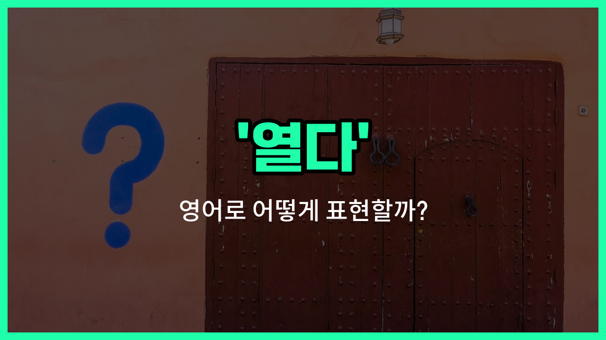

## 🌟 영어 표현 - open

안녕하세요 👋 오늘은 일상에서 정말 자주 쓰이는 영어 표현 '**open**'에 대해 이야기해보려고 해요. '열다', '개방하다', '공개하다'와 같은 뜻을 가진 단어인데요, 다양한 상황에서 아주 유용하게 사용할 수 있어요.

'**open**'은 문, 창문, 상자처럼 물리적으로 무언가를 여는 상황뿐만 아니라, 마음이나 기회, 행사 등을 '개방하다', '공개하다'라는 의미로도 자주 쓰여요. 예를 들어, 문을 열 때는 물론이고, 새로운 기회를 열다, 마음을 열다, 정보를 공개하다 등 여러 상황에서 자연스럽게 활용할 수 있답니다!

예를 들어, "Can you open the window?"라고 하면 "창문 좀 열어줄래요?"라는 뜻이에요. 또, "The museum opens at 10 a.m."이라고 하면 "박물관은 오전 10시에 문을 열어요."라는 의미가 돼요.

## 📖 예문

1. "문 좀 열어줄 수 있어요?"

   "Can you open the door?"

2. "그 회사가 올해 채용을 공개했어요."

   "The [company](/blog/in-english/1111.company/) opened recruitment this [year](/blog/in-english/1065.year/)."

## 💬 연습해보기

<ul data-interactive-list>

  <li data-interactive-item>
    창이 너무 꽉 막혀 있어서 못 열었어요.
    I couldn't open the window because it was <a href="/blog/in-english/389.stuck/">stuck</a> shut.
  </li>

  <li data-interactive-item>
    문 좀 열어줄 수 있어요? 손이 좀 무거워서요.
    Could you please open the door for me? My hands are full.
  </li>

  <li data-interactive-item>
    그녀가 병을 열어보려고 했지만 너무 꽉 막혀 있었어요.
    She <a href="/blog/in-english/117.try-to/">tried to</a> open the jar, but it was sealed too tight.
  </li>

  <li data-interactive-item>
    그는 공룡에 관한 페이지로 책을 펼쳤어요.
    He opened the <a href="/blog/in-english/447.book/">book</a> to the page about dinosaurs.
  </li>

  <li data-interactive-item>
    업데이트 확인하려면 이메일 열어보는 거 잊지 마세요.
    Don't <a href="/blog/in-english/023.forget/">forget</a> to open your email to check the updates.
  </li>

  <li data-interactive-item>
    선물의 내용이 궁금해서 조심스럽게 열어봤어요.
    I opened the gift carefully, <a href="/blog/in-english/327.curious/">curious</a> about what was <a href="/blog/in-english/973.inside/">inside</a>.
  </li>

  <li data-interactive-item>
    앱 좀 열어줄 수 있어요? 메시지 보내야 하거든요.
    Can you open the app for me? I need to <a href="/blog/in-english/292.send/">send</a> a message.
  </li>

  <li data-interactive-item>
    그들은 오늘 아침 특별 세일을 위해 가게를 일찍 열었어요.
    They opened the store early this morning for a special sale.
  </li>

  <li data-interactive-item>
    그녀는 대화 중에 자신의 감정에 대해 털어놨어요.
    She opened up about her feelings during the conversation.
  </li>

  <li data-interactive-item>
    냉장고를 열 때 빠르게 닫아서 찬 공기가 새 나가지 않게 해요.
    When you open the fridge, <a href="/blog/in-english/232.make-sure/">make sure</a> to close it quickly so the cold air doesn't escape.
  </li>

</ul>

## 🤝 함께 알아두면 좋은 표현들

### close (닫다)

'close'는 '열다'의 반대말로, 문이나 상자 등을 닫는 행위를 의미해요. 어떤 것을 닫아서 더 이상 열리지 않도록 할 때 사용해요.

- "Please close the door when you [leave](/blog/in-english/402.leave/) the room."
- "방을 나갈 때 문을 닫아 주세요."

### unlock (잠금 해제하다)

'unlock'은 잠긴 문이나 자물쇠를 열어서 접근할 수 있게 만드는 것을 의미해요. 'open'과 비슷하지만, 잠긴 상태를 해제하는 데 초점을 둬요.

- "She unlocked the door with her key and went inside."
- "그녀는 열쇠로 문을 잠금 해제하고 안으로 들어갔어요."

### uncover (덮개를 벗기다)

'uncover'는 무엇인가를 덮고 있던 것을 벗겨내어 드러내는 것을 의미해요. 'open'과 비슷하게 무언가를 열거나 드러내는 상황에서 사용할 수 있어요.

- "They uncovered the statue after [years](/blog/in-english/1066.years/) of being hidden."
- "그들은 수년간 숨겨져 있던 동상을 덮개를 벗겨내고 드러냈어요."

---

오늘은 '열다', '개방하다', '공개하다'라는 뜻을 가진 영어 표현 '**open**'에 대해 알아봤어요. 일상에서 정말 자주 쓰이는 단어이니 꼭 기억해두면 좋겠어요 😊

오늘 배운 표현과 예문들을 소리 내서 여러 번 읽어보세요. 다음에도 더 유익한 영어 표현으로 찾아올게요! 감사합니다!

