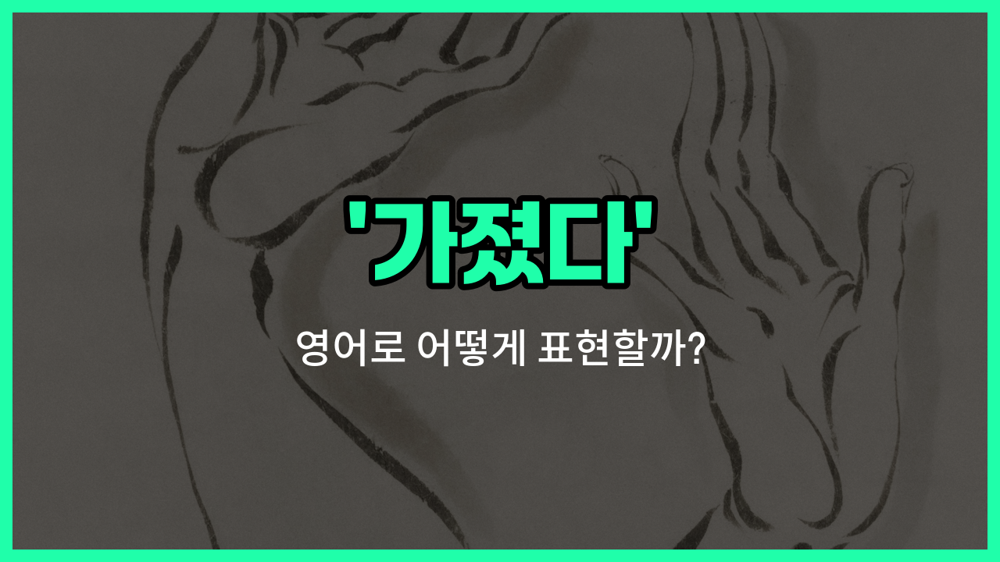

## 🌟 영어 표현 - took

안녕하세요 👋 오늘은 영어에서 '가졌다'라는 뜻을 가진 표현 '**took**'에 대해 알아보려고 해요.

'**took**'는 동사 'take'의 과거형이에요. 무언가를 '가졌다', '취했다', '얻었다'는 의미로 자주 사용돼요. 예를 들어, 누군가가 어떤 물건을 손에 넣었거나, 기회를 잡았을 때 쓸 수 있어요.

일상 대화에서 'took'는 정말 다양하게 쓰여요. 예를 들어, "나는 사진을 찍었다"라고 말하고 싶을 때 "I [took a picture](/blog/in-english/412.take-a-picture/)."라고 해요. 또, "나는 그 기회를 가졌다"는 "I took the opportunity."라고 표현할 수 있어요.

이처럼 'took'는 단순히 물건을 손에 넣는 것뿐만 아니라, 기회, 시간, 책임 등 다양한 상황에서 쓸 수 있는 아주 유용한 단어예요!

## 📖 예문

1. "나는 어제 우산을 가져갔어요."

   "I took an umbrella yesterday."

2. "그는 내 조언을 취했어요."

   "He took my [advice](/blog/in-english/379.advice/)."

## 💬 연습해보기

<ul data-interactive-list>

  <li data-interactive-item>
    나는 다른 사람들이 오기 전에 마지막 피자 조각을 먹었어요.
    I took the last slice of pizza before anyone else could get to it.
  </li>

  <li data-interactive-item>
    그녀는 내 조언을 듣고 시험을 더 열심히 공부했어요.
    She took my advice and studied harder for the exam.
  </li>

  <li data-interactive-item>
    그는 테이블에서 열쇠를 가져가고 집을 나갔어요.
    He took the keys from the table and <a href="/blog/in-english/1106.left/">left</a> the <a href="/blog/in-english/1088.house/">house</a>.
  </li>

  <li data-interactive-item>
    우리는 회의 중 잠깐 쉬면서 커피를 마셨어요.
    We took a <a href="/blog/in-english/439.quick/">quick</a> break during the meeting to grab some coffee.
  </li>

  <li data-interactive-item>
    그들은 오늘 아침에 공원에 강아지를 산책시켰어요.
    They took their dog for a walk in the <a href="/blog/in-english/463.park/">park</a> this morning.
  </li>

  <li data-interactive-item>
    나는 전에 네 전화 받았는데, 네가 메시지를 남기지 않았어.
    I took your call <a href="/blog/in-english/397.earlier/">earlier</a>, but you didn't <a href="/blog/in-english/402.leave/">leave</a> a message.
  </li>

  <li data-interactive-item>
    그녀는 집에서 가까운 곳이라서 그 일자리 제안을 받기로 했어요.
    She took the <a href="/blog/in-english/1101.job/">job</a> offer because it was closer to <a href="/blog/in-english/1076.home/">home</a>.
  </li>

  <li data-interactive-item>
    그는 무대에 나가기 전에 깊게 숨을 쉬었어요.
    He took a <a href="/blog/in-english/428.deep/">deep</a> breath before <a href="/blog/in-english/1068.going/">going</a> on <a href="/blog/in-english/1144.stage/">stage</a>.
  </li>

  <li data-interactive-item>
    우리는 작년 여름 휴가 동안 많은 사진을 찍었어요.
    We took a lot of photos during our <a href="/blog/in-english/516.vacation/">vacation</a> last summer.
  </li>

  <li data-interactive-item>
    그들은 원격 근무하는 동안 새로운 기술을 배울 좋은 기회를 잡았어요.
    They took the opportunity to <a href="/blog/in-english/245.learn/">learn</a> a <a href="/blog/in-english/1056.new/">new</a> skill while <a href="/blog/in-english/1064.work/">working</a> remotely.
  </li>

</ul>

## 🤝 함께 알아두면 좋은 표현들

### had

'had'는 '가지다'의 과거형으로, 어떤 것을 소유하거나 경험했음을 나타내요. 'took'과 비슷하게 과거에 어떤 것을 가졌거나 얻었을 때 사용할 수 있어요.

- "She had a great [time](/blog/in-english/1055.time/) at the [party](/blog/in-english/1212.party/) last [night](/blog/in-english/1110.night/)."
- "그녀는 어젯밤 파티에서 정말 즐거운 시간을 보냈어요."

### gave up

'[gave up](/blog/vocab-1/046.give-up/)'은 '포기하다'라는 뜻으로, 'took'의 반대 의미를 가지고 있어요. 어떤 것을 더 이상 가지지 않거나 시도하지 않는 상황을 표현할 때 사용해요.

- "He gave up his seat for the elderly woman on the bus."
- "그는 버스에서 노인 여성에게 자리를 양보했어요."

### received

'received'는 '받았다'라는 뜻으로, 누군가로부터 무언가를 받았을 때 사용해요. 'took'과 비슷하지만 좀 더 공식적이고 수동적인 느낌을 줘요.

- "She received a gift from her friend on her birthday."
- "그녀는 생일에 친구로부터 선물을 받았어요."

---

오늘은 '가졌다', '취했다', '얻었다'라는 뜻을 가진 영어 표현 '**took**'에 대해 알아봤어요. 일상에서 무언가를 손에 넣거나, 기회를 잡았을 때 이 표현을 떠올려 보세요 😊

오늘 배운 표현과 예문들을 꼭 최소 3번씩 소리 내서 읽어보세요. 다음에도 더 재미있고 유익한 영어 표현으로 찾아올게요! 감사합니다!

