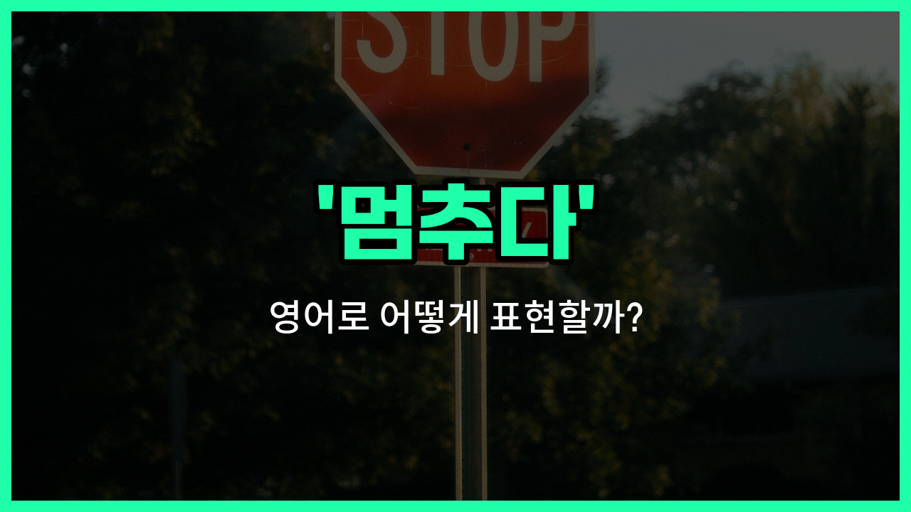

## 🌟 영어 표현 - stop

안녕하세요 👋 오늘은 일상에서 정말 자주 쓰이는 영어 표현인 '**stop**'에 대해 알아보려고 해요. '멈추다', '중단하다', '정지하다'와 같은 상황에서 쓸 수 있는 단어예요.

'**stop**'은 어떤 동작이나 움직임, 상황을 **더 이상 진행하지 않게 할 때** 사용하는 표현이에요. 예를 들어, 길을 걷다가 갑자기 멈추거나, 누군가에게 어떤 행동을 그만하라고 말할 때 쓸 수 있어요.

이 단어는 동사로 가장 많이 쓰이지만, 명사로도 '정지'라는 뜻으로 사용돼요. 그래서 상황에 따라 다양하게 활용할 수 있어 정말 유용한 표현이에요!

## 📖 예문

1. "차가 갑자기 멈췄어요."

   "The car stopped suddenly."

2. "그만 이야기해 주세요."

   "Please stop talking."

3. "비가 곧 멈출 거예요."

   "The rain will stop soon."

## 💬 연습해보기

<ul data-interactive-list>

  <li data-interactive-item>
    영화 보면서 말 좀 그만해 줘. 진짜 집중이 안 돼.
    Please stop talking during the movie. It's really distracting.
  </li>

  <li data-interactive-item>
    운전하고 있을 때 문자 그만 하라고 했는데, 안 듣더라구.
    I told him to stop texting while driving, but he didn't listen.
  </li>

  <li data-interactive-item>
    집에 가는 길에 가게 잠깐 들렀다 우유 좀 사오면 좋겠어.
    You should stop by the store on your <a href="/blog/in-english/1062.way/">way</a> <a href="/blog/in-english/1076.home/">home</a> to grab some milk.
  </li>

  <li data-interactive-item>
    음악 잠깐만 꺼줄래? 집중 좀 해야 돼.
    Can you stop the <a href="/blog/in-english/1232.music/">music</a> for a <a href="/blog/in-english/1105.second/">second</a>? I need to concentrate.
  </li>

  <li data-interactive-item>
    차가 개를 치기 싫어서 갑자기 멈췄어.
    The car stopped suddenly to <a href="/blog/in-english/924.avoid/">avoid</a> hitting the dog.
  </li>

  <li data-interactive-item>
    그 체육관이 너무 비싸서 그만 다니기로 했어.
    She <a href="/blog/in-english/062.decide-to/">decided to</a> stop <a href="/blog/in-english/1068.going/">going</a> to that <a href="/blog/in-english/431.gym/">gym</a> because it was too <a href="/blog/in-english/317.expensive/">expensive</a>.
  </li>

  <li data-interactive-item>
    거기서 멈춰! 물어볼 게 있어.
    Stop <a href="/blog/in-english/1063.right/">right</a> there! I need to ask you something.
  </li>

  <li data-interactive-item>
    매일 이렇게 많은 음식을 낭비하지 말아야 해.
    We need to stop wasting so much food every <a href="/blog/in-english/1067.day/">day</a>.
  </li>

  <li data-interactive-item>
    그 사람, 몇 년 동안 노력한 끝에 드디어 담배를 끊었대.
    He <a href="/blog/in-english/182.finally/">finally</a> stopped <a href="/blog/in-english/482.smoke/">smoking</a> after trying for <a href="/blog/in-english/1066.years/">years</a>.
  </li>

  <li data-interactive-item>
    하고 있는 일 멈추고 이거 도와줘.
    Stop what you're doing and come <a href="/blog/in-english/1084.help/">help</a> me with this.
  </li>

</ul>

## 🤝 함께 알아두면 좋은 표현들

### pause

'pause'는 '잠시 멈추다'라는 뜻으로, 완전히 멈추는 것보다는 잠깐 쉬거나 중단하는 느낌을 줘요. 주로 행동이나 말을 잠시 중단할 때 사용해요.

- "She paused her [work](/blog/in-english/1064.work/) to answer the phone."
- "그녀는 전화를 받기 위해 잠시 일을 멈췄어요."

### continue

'continue'는 '계속하다'라는 뜻으로, 'stop'의 반대말이에요. 어떤 행동이나 상태를 멈추지 않고 이어가는 것을 의미해요.

- "[Despite](/blog/in-english/341.despite/) the rain, they continued their hike."
- "비가 오는데도 그들은 하이킹을 계속했어요."

### halt

'halt'는 '멈추다' 또는 '정지하다'라는 뜻으로, 'stop'과 비슷하지만 좀 더 공식적이고 강한 느낌을 줘요. 주로 군사나 교통 상황에서 많이 사용돼요.

- "The soldiers were ordered to halt [immediately](/blog/in-english/712.immediately/)."
- "군인들은 즉시 멈추라는 명령을 받았어요."

---

오늘은 '멈추다', '중단하다', '정지하다'라는 뜻을 가진 영어 표현 '**stop**'에 대해 알아봤어요. 일상에서 누군가에게 멈추라고 하거나, 어떤 상황이 끝났을 때 이 표현을 떠올려 보세요 😊

오늘 배운 표현과 예문들을 꼭 소리 내서 여러 번 읽어보세요. 다음에도 더 유익한 영어 표현으로 찾아올게요! 감사합니다!

