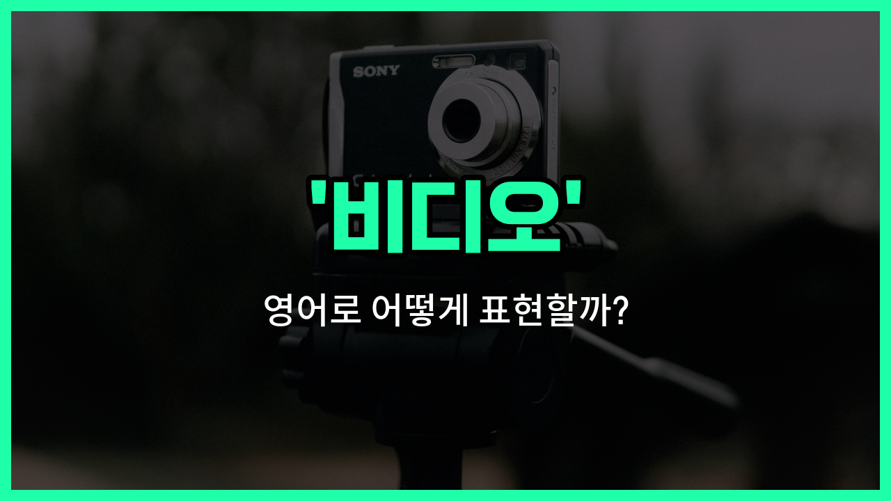

## 🌟 영어 표현 - video

안녕하세요 👋 오늘은 우리가 일상에서 자주 사용하는 단어인 '**비디오**'의 영어 표현에 대해 알아보려고 해요. 바로 '**video**'라는 단어인데요. 이 단어는 '영상', '동영상'이라는 뜻도 함께 가지고 있어요.

'**video**'는 스마트폰, 컴퓨터, TV 등 다양한 기기에서 볼 수 있는 **움직이는 영상**을 의미해요. 예를 들어, 유튜브에서 보는 동영상, 친구에게 보내는 짧은 영상 메시지, 영화 예고편 등 모두 'video'라고 부를 수 있어요.

또한, 'video'는 명사로 '비디오', '영상'이라는 뜻으로 쓰이고, 때로는 동사로 '영상을 촬영하다'라는 의미로도 사용돼요. 그래서 상황에 따라 다양하게 활용할 수 있는 단어예요!

## 📖 예문

1. "나는 재미있는 동영상을 봤어요."

   "I watched a funny video."

2. "이 영상을 친구에게 보내줄 수 있어요?"

   "Can you [send](/blog/in-english/292.send/) this video to your friend?"

## 💬 연습해보기

<ul data-interactive-list>

  <li data-interactive-item>
    오늘 진짜 웃긴 영상 하나 봤는데, 하루가 완전 웃겼어.
    I just watched a hilarious video online that totally made my <a href="/blog/in-english/1067.day/">day</a>.
  </li>

  <li data-interactive-item>
    어젯밤에 보낸 영상 봤어? 진짜 재밌었지!
    Did you see that video I sent you last <a href="/blog/in-english/1110.night/">night</a>? So funny!
  </li>

  <li data-interactive-item>
    우리 프로젝트에 대한 설명 영상을 하나 만들어야겠다.
    We should make a video for our project to <a href="/blog/in-english/909.explain/">explain</a> everything clearly.
  </li>

  <li data-interactive-item>
    지금 영상 편집하고 있는데, 소프트웨어가 자꾸 다운돼.
    I'm <a href="/blog/in-english/117.try-to/">trying to</a> edit this video, but the software keeps crashing on me.
  </li>

  <li data-interactive-item>
    케이크 굽는 법에 대한 새 영상 튜토리얼 올라왔어, 한번 볼래?
    They uploaded a <a href="/blog/in-english/1056.new/">new</a> video tutorial on how to <a href="/blog/in-english/462.bake/">bake</a> a cake, <a href="/blog/in-english/1060.want/">want</a> to check it out?
  </li>

  <li data-interactive-item>
    영상이 너무 많아서 내 폰 메모리가 거의 꽉 찼어.
    My phone's memory is <a href="/blog/in-english/854.almost/">almost</a> full because I have so many videos <a href="/blog/in-english/293.save/">saved</a>.
  </li>

  <li data-interactive-item>
    파티에서 찍은 그 영상 보내줄 수 있어? 재밌는 순간들을 보고 싶어.
    Can you send me that video from the <a href="/blog/in-english/1212.party/">party</a>? I want to see all the fun <a href="/blog/in-english/490.moment/">moments</a>.
  </li>

  <li data-interactive-item>
    일 끝난 후 유튜브 영상 보는 게 내 제일 좋아하는 힐링 방법이야.
    Watching a video on YouTube is my favorite <a href="/blog/in-english/1062.way/">way</a> to relax after <a href="/blog/in-english/1064.work/">work</a>.
  </li>

  <li data-interactive-item>
    친구 생일 파티에 못 가니까 영상 메시지를 찍으려고 해.
    I'm <a href="/blog/in-english/1068.going/">going</a> to record a video message for my friend's birthday since I can't <a href="/blog/in-english/244.make-it/">make it</a> to the party.
  </li>

  <li data-interactive-item>
    그녀가 자기 고양이가 진짜 웃긴 재주 부리는 영상을 공유했어. 진짜 한 번 봐봐야 해.
    She shared a video of her cat doing the funniest tricks you've ever <a href="/blog/in-english/1231.seen/">seen</a>.
  </li>

</ul>

## 🤝 함께 알아두면 좋은 표현들

### film (영화)

'film'은 '비디오'와 비슷하게 영상 매체를 의미하지만, 보통 극장용 영화나 예술적 목적의 영상물을 가리킬 때 많이 사용해요. '비디오'보다 좀 더 공식적이고 긴 형식의 영상에 쓰이는 경우가 많아요.

- "We watched a classic film at the cinema last night."
- "우리는 어젯밤 영화관에서 고전 영화를 봤어요."

### live stream (라이브 스트림)

'[live](/blog/in-english/1134.live/) stream'은 실시간으로 인터넷을 통해 방송되는 영상을 뜻해요. '비디오'가 녹화된 영상을 의미하는 반면, '라이브 스트림'은 현재 진행 중인 영상을 보여줄 때 사용해요.

- "The concert was broadcasted via live stream for fans who couldn't attend."
- "콘서트는 참석하지 못한 팬들을 위해 라이브 스트림으로 방송되었어요."

### audio (오디오)

'audio'는 '비디오'와 반대되는 개념으로, 영상 없이 소리만을 의미해요. 영상이 포함되지 않은 음성이나 음악 파일을 가리킬 때 주로 사용해요.

- "I [prefer](/blog/in-english/191.prefer/) [listening to](/blog/in-english/407.listen-to/) audio books rather than watching videos."
- "저는 비디오를 보는 것보다 오디오북을 듣는 것을 더 좋아해요."

---

오늘은 '**비디오**', '**영상**', '**동영상**'이라는 뜻을 가진 영어 표현 '**video**'에 대해 알아봤어요. 앞으로 영상이나 동영상을 이야기할 때 이 단어를 자연스럽게 사용해 보세요 😊

오늘 배운 표현과 예문들을 꼭 소리 내서 여러 번 읽어보세요. 다음에도 더 유익한 영어 표현으로 찾아올게요! 감사합니다!

