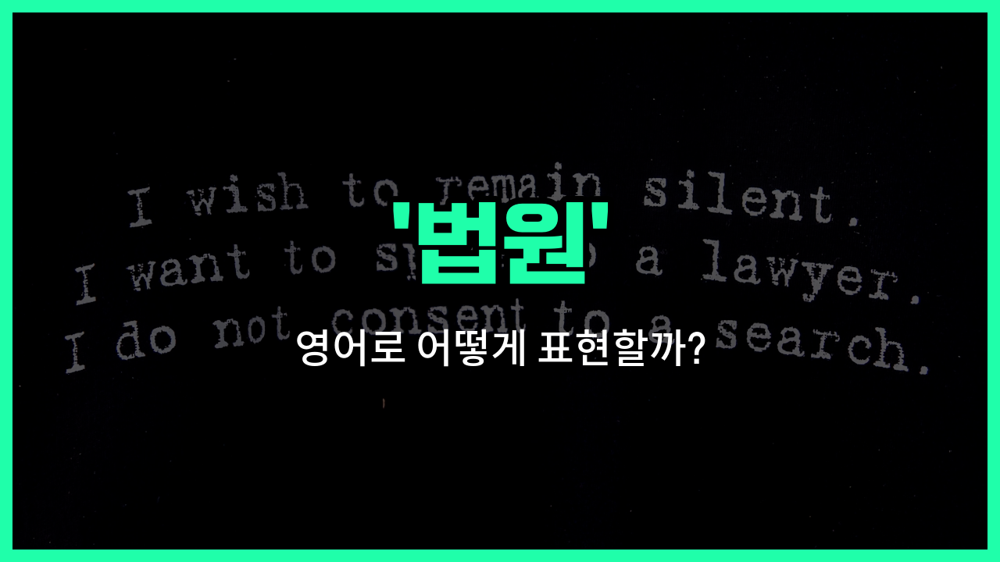

## 🌟 영어 표현 - court

안녕하세요 👋 오늘은 영어로 '**법원**'을 어떻게 표현하는지 알아보려고 해요. 바로 '**court**'라는 단어를 사용해요. 이 단어는 우리가 흔히 생각하는 재판이 이루어지는 장소, 즉 **재판소**나 **법정**을 의미해요.

'court'는 법적인 분쟁을 해결하거나 판결을 내리는 공식적인 장소를 말해요. 예를 들어, 누군가 소송을 제기하거나 판사가 판결을 내리는 곳이 바로 'court'예요.

일상 대화나 뉴스, 드라마 등에서 자주 등장하는 단어이니 꼭 기억해두면 좋아요!

## 📖 예문

1. "그는 법원에 출석해야 해요."

   "He has to appear in court."

2. "법원은 그 사건에 대해 판결을 내렸어요."

   "The court [made a decision](/blog/vocab-1/010.make-a-decision/) on the [case](/blog/in-english/1130.case/)."

## 💬 연습해보기

<ul data-interactive-list>

  <li data-interactive-item>
    법원에서 재판을 다음 달로 미루기로 결정했대요. 피고에게는 준비할 시간이 더 생겨서 정말 다행이었어요.
    The court <a href="/blog/in-english/062.decide-to/">decided to</a> <a href="/blog/in-english/790.postpone/">postpone</a> the trial until next month. It was a <a href="/blog/in-english/1095.big/">big</a> relief for the defendant to have more <a href="/blog/in-english/1055.time/">time</a> to <a href="/blog/in-english/371.prepare/">prepare</a>.
  </li>

  <li data-interactive-item>
    증거를 검토한 후, 법원은 원고의 손을 들어주기로 했대요. 법정 안은 모두 그 결정을 듣고 싶어 했어요.
    After <a href="/blog/in-english/251.review/">reviewing</a> the evidence, the court ruled in favor of the plaintiff. Everyone in the courtroom was eager to hear the decision.
  </li>

  <li data-interactive-item>
    그녀는 증인으로 출석해야 해서 법원에 가야 했어요. 법정에 들어가는 건 처음이었답니다.
    She had to appear in court to testify as a witness. It was her first time stepping into a courtroom.
  </li>

  <li data-interactive-item>
    판사가 다른 사건에 가야 해서 법원이 일찍 재판을 마쳤어요. 변호사들은 서류를 정리하며 떠났대요.
    The court adjourned early because the judge had <a href="/blog/in-english/513.another/">another</a> case to attend. Lawyers <a href="/blog/in-english/301.pack/">packed</a> up their papers and <a href="/blog/in-english/1106.left/">left</a>.
  </li>

  <li data-interactive-item>
    주말 동안 법원 건물은 닫혀 있었고, 어떤 재판도 예정되어 있지 않았어요. 월요일까지 기다려야 소식을 들을 수 있어요.
    During the weekend, the court building was closed and no hearings were scheduled. You need to wait until Monday to get updates.
  </li>

  <li data-interactive-item>
    그들은 양육권 사건을 처리하느라 하루 종일 법원에서 보냈어요. 모두에게 감정적으로 힘든 시간이었답니다.
    They <a href="/blog/in-english/258.spend/">spent</a> the whole <a href="/blog/in-english/1067.day/">day</a> at court dealing with the custody case. It was emotionally exhausting for everyone <a href="/blog/in-english/274.involve/">involved</a>.
  </li>

  <li data-interactive-item>
    법원 직원이 다음 사건을 부르는 동안 판사는 문서를 검토하고 있었어요. 법원은 정말 바쁜 날이었어요.
    The court clerk <a href="/blog/in-english/1114.called/">called</a> the next case while the judge reviewed some <a href="/blog/in-english/824.document/">documents</a>. It was a <a href="/blog/in-english/372.busy/">busy</a> day at the courthouse.
  </li>

  <li data-interactive-item>
    법원에서는 존중해야 하고 판사의 지시에 주의 깊게 따라야 해요. 방해가 되면 처벌 받을 수 있어요.
    In court, you must <a href="/blog/in-english/1026.remain/">remain</a> respectful and <a href="/blog/in-english/1143.follow/">follow</a> the judge's instructions carefully. Disruptions could <a href="/blog/vocab-1/004.lead-to/">lead to</a> penalties.
  </li>

  <li data-interactive-item>
    법원에서 건설 중단 명령을 내렸대요. 이 결정은 회사의 계획에 큰 영향을 미칠 거예요.
    The court granted the injunction to <a href="/blog/in-english/1240.stop/">stop</a> the <a href="/blog/in-english/858.construction/">construction</a> temporarily. This decision will impact the <a href="/blog/in-english/1111.company/">company</a>'s plans significantly.
  </li>

  <li data-interactive-item>
    양쪽 당사자 모두 긴 법적 싸움을 피하기 위해 법원 밖에서 합의하기로 결정했어요. 가끔은 협상이 소송보다 나을 때도 있죠.
    Both <a href="/blog/in-english/1212.party/">parties</a> <a href="/blog/in-english/342.agree/">agreed</a> to settle out of court to <a href="/blog/in-english/924.avoid/">avoid</a> a lengthy legal battle. <a href="/blog/in-english/270.sometimes/">Sometimes</a> negotiation is <a href="/blog/in-english/1082.better/">better</a> than litigation.
  </li>

</ul>

## 🤝 함께 알아두면 좋은 표현들

### tribunal

'tribunal'은 '법원'과 비슷한 의미로, 특히 특정한 문제나 분쟁을 다루는 공식적인 재판 기관을 가리켜요. 일반 법원보다 더 전문적이거나 제한된 권한을 가진 경우가 많아요.

- "The [labor](/blog/in-english/648.labor/) dispute was settled by an industrial tribunal."
- "노동 분쟁은 산업 재판소에서 해결되었어요."

### justice system

'justice [system](/blog/in-english/432.system/)'은 '법원'뿐만 아니라 경찰, 검사, 교도소 등 법과 질서를 유지하는 전체 체계를 의미해요. 법원의 역할을 포함하지만 더 넓은 개념이에요.

- "Reforming the justice system is [essential](/blog/in-english/446.essential/) to [ensure](/blog/in-english/356.ensure/) fairness for all [citizens](/blog/in-english/762.citizen/)."
- "모든 시민에게 공정함을 보장하기 위해 사법 제도를 개혁하는 것이 중요해요."

### out of court

'out of court'는 '법원 밖에서'라는 뜻으로, 법적 절차를 거치지 않고 분쟁을 해결하는 경우를 말해요. 법원에서 판결을 받는 것과는 반대되는 개념이에요.

- "They decided to settle the dispute out of court to avoid a lengthy trial."
- "그들은 긴 재판을 피하기 위해 법원 밖에서 분쟁을 해결하기로 결정했어요."

---

오늘은 '**법원**', '**재판소**', '**법정**'이라는 뜻을 가진 영어 표현 '**court**'에 대해 알아봤어요. 앞으로 법과 관련된 이야기를 할 때 이 표현을 떠올려보면 좋겠어요 😊

오늘 배운 표현과 예문들을 꼭 최소 3번씩 소리 내서 읽어보세요. 다음에도 더 재미있고 유익한 영어 표현으로 찾아올게요! 감사합니다!

