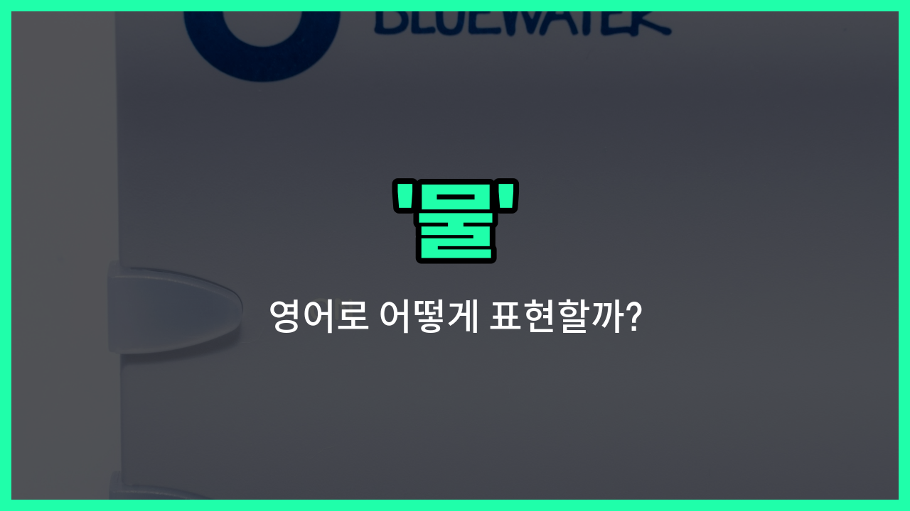

## 🌟 영어 표현 - water

안녕하세요 👋 오늘은 우리가 매일 마시고, 생활 속에서 자주 사용하는 단어인 '**물**'의 영어 표현에 대해 알아보려고 해요. 바로 '**water**'라는 단어인데요~

'**water**'는 가장 기본적으로 '물'을 의미해요. 우리가 마시는 식수, 요리할 때 쓰는 물, 그리고 자연에 존재하는 강, 호수, 바다의 물까지 모두 'water'로 표현할 수 있어요~

또한, 'water'는 '음료수'나 '수분'이라는 뜻으로도 자주 사용돼요. 예를 들어, "수분을 충분히 섭취하세요"라는 말을 영어로 할 때도 'water'를 활용할 수 있답니다~

## 📖 예문

1. "물 한 잔 주세요."

   "Can I have a glass of water, please?"

2. "운동 후에는 물을 많이 마셔야 해요."

   "You should drink plenty of water after exercising."

## 💬 연습해보기

<ul data-interactive-list>

  <li data-interactive-item>
    하이킹 끝나고 너무 목이 말라서 물 한 병을 금방 다 마셨어요.
    I was so <a href="/blog/in-english/472.thirsty/">thirsty</a> after the hike, I drank a whole bottle of water <a href="/blog/in-english/236.in-no-time/">in no time</a>.
  </li>

  <li data-interactive-item>
    물 좀 건네줄래요? 조금 탈수된 것 같아요.
    Can you pass me the water? I'm <a href="/blog/in-english/1096.feel/">feeling</a> a bit dehydrated.
  </li>

  <li data-interactive-item>
    운동할 때 충분한 물을 마시는 거 잊지 마세요, 그래야 수분 유지할 수 있어요.
    Remember to drink plenty of water during your workout to stay hydrated.
  </li>

  <li data-interactive-item>
    식물들이 매일 물을 받아야 시들지 않아요.
    The plants need water every <a href="/blog/in-english/1067.day/">day</a> or they'll <a href="/blog/in-english/1127.start/">start</a> to wilt.
  </li>

  <li data-interactive-item>
    그가 수도꼭지에서 찬물로 잔을 채웠어요.
    He filled his glass with cold water from the tap.
  </li>

  <li data-interactive-item>
    여름에는 어디를 가든 물을 챙기는 게 중요해요.
    During the summer, it's <a href="/blog/in-english/318.important/">important</a> to <a href="/blog/in-english/464.carry/">carry</a> water with you wherever you go.
  </li>

  <li data-interactive-item>
    계곡에서 흐르는 물 소리가 정말 편안했어요.
    The sound of water flowing in the creek was really relaxing.
  </li>

  <li data-interactive-item>
    그녀가 음료를 따르다가 테이블에 물을 쏟았어요.
    She spilled water all over the table while <a href="/blog/in-english/497.pour/">pouring</a> her drink.
  </li>

  <li data-interactive-item>
    여기 물 마시는 거 괜찮을까요, 아니면 생수 사야 하나요?
    Is the water <a href="/blog/in-english/857.safe/">safe</a> to drink here, or should we buy bottled water?
  </li>

  <li data-interactive-item>
    나는 탄산수 보다 소다를 더 좋아해요. 가벼운 느낌이랑 덜 달아서요.
    I <a href="/blog/in-english/191.prefer/">prefer</a> sparkling water over soda because it feels lighter and less sweet.
  </li>

</ul>

## 🤝 함께 알아두면 좋은 표현들

### drink water

'drink water'는 "물을 마시다"라는 뜻이에요. 건강을 유지하거나 갈증을 해소하기 위해 물을 섭취하는 행위를 나타내요. 일상생활에서 가장 기본적이고 자주 쓰이는 표현이에요.

- "You should drink water [regularly](/blog/in-english/252.regularly/) to stay hydrated."
- "수분을 유지하려면 정기적으로 물을 마셔야 해요."

### dry

'dry'는 "건조한" 또는 "마른"이라는 뜻이에요. 물이 없거나 물기가 없는 상태를 나타내는 반대말이에요. 예를 들어, 젖은 상태에서 물기가 다 증발한 상태를 말할 때 쓰여요.

- "The clothes are dry after hanging [outside](/blog/in-english/974.outside/) all day."
- "옷이 하루 종일 밖에 걸려 있어서 말랐어요."

### flood

'flood'는 "홍수"라는 뜻으로, 많은 양의 물이 갑자기 넘쳐나는 상황을 의미해요. 물이 너무 많아서 문제가 생기는 반대 개념으로, 물이 부족한 상태와는 반대되는 상황이에요.

- "The heavy rain caused a flood in the [city](/blog/in-english/1108.city/)."
- "폭우로 인해 도시에 홍수가 났어요."

---

오늘은 '물', '음료수', '수분'이라는 뜻을 가진 영어 표현 '**water**'에 대해 알아봤어요. 일상에서 정말 자주 쓰이는 단어이니 꼭 기억해두면 좋겠죠? 😊

오늘 배운 표현과 예문들을 꼭 최소 3번씩 소리 내서 읽어보세요. 다음에도 더 재미있고 유익한 영어 표현으로 찾아올게요! 감사합니다!

