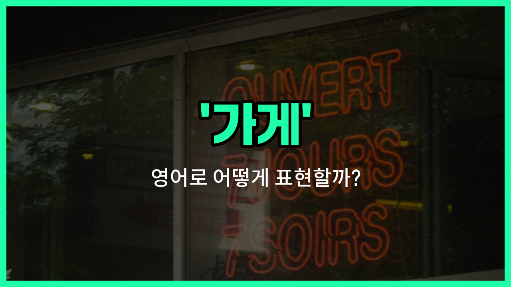

## 🌟 영어 표현 - store

안녕하세요 👋 오늘은 일상에서 자주 쓰이는 단어인 '**가게**'의 영어 표현에 대해 알아보려고 해요. 바로 '**store**'라는 단어인데요~

'**store**'는 우리가 물건을 사고파는 장소, 즉 **상점**이나 **매장**을 의미해요. 슈퍼마켓, 옷가게, 문구점 등 다양한 종류의 가게를 모두 'store'라고 부를 수 있어요~

예를 들어, 동네에 새로 생긴 빵집도 'a [new](/blog/in-english/1056.new/) bakery store'라고 할 수 있고, 휴대폰을 파는 곳은 'a phone store'라고 표현해요. 미국에서는 'shop'보다 'store'라는 단어를 더 자주 사용한답니다~

## 📖 예문

1. "나는 가게에서 우유를 샀어요."

   "I bought milk at the store."

2. "이 근처에 큰 상점이 있어요?"

   "Is there a [big](/blog/in-english/1095.big/) store near here?"

## 💬 연습해보기

<ul data-interactive-list>

  <li data-interactive-item>
    집에 가는 길에 빵집에 들러서 우유 좀 사야 해요.
    I need to <a href="/blog/in-english/1240.stop/">stop</a> by the store to grab some milk on my <a href="/blog/in-english/1062.way/">way</a> <a href="/blog/in-english/1076.home/">home</a>.
  </li>

  <li data-interactive-item>
    시내에 빈티지 물건을 파는 새 가게가 열렸어요.
    There's a new store opening downtown that sells all kinds of vintage stuff.
  </li>

  <li data-interactive-item>
    내가 제일 좋아하는 가게에서 이번 주말에 대세일을 하니까 꼭 갈 거예요.
    My favorite store has a big sale this weekend, so I'm definitely <a href="/blog/in-english/1068.going/">going</a>.
  </li>

  <li data-interactive-item>
    그녀는 내가 보통 간식 사는 모퉁이 가게 근처의 서점에서 일해요.
    She <a href="/blog/in-english/1064.work/">works</a> at the bookstore near the corner store where I usually buy snacks.
  </li>

  <li data-interactive-item>
    외출할 때 가게에서 빵 좀 사다 줄 수 있어요?
    Can you <a href="/blog/in-english/178.pick-up/">pick up</a> some bread from the store when you go out?
  </li>

  <li data-interactive-item>
    우리는 매주 일요일에 신선한 채소를 사러 농산물 가게에 가요.
    Every Sunday, we go to the farmers' store to get fresh vegetables.
  </li>

  <li data-interactive-item>
    그 가게는 항상 전자제품 할인폭이 제일 커요.
    That store always has the <a href="/blog/in-english/1073.best/">best</a> discounts on electronics.
  </li>

  <li data-interactive-item>
    우리는 아까 가게에서 친구 몇 명을 만났어요.
    We <a href="/blog/in-english/1102.run/">ran</a> into some friends while we were at the store <a href="/blog/in-english/397.earlier/">earlier</a>.
  </li>

  <li data-interactive-item>
    내가 방금 수제 악세서리를 파는 귀여운 가게를 찾았어요.
    I just <a href="/blog/in-english/1094.found/">found</a> a cute <a href="/blog/in-english/1085.little/">little</a> store that sells handmade jewelry.
  </li>

  <li data-interactive-item>
    3시에 가게에서 만나서 커피 한잔 하자요.
    <a href="/blog/in-english/1112.let/">Let</a>'s meet at the store around 3 and then grab coffee afterward.
  </li>

</ul>

## 🤝 함께 알아두면 좋은 표현들

### shop

'shop'은 '가게'를 뜻하는 가장 일반적인 단어 중 하나로, 주로 소규모 상점이나 특정 상품을 파는 곳을 의미해요. 'store'와 거의 같은 의미로 일상 대화에서 자주 사용돼요.

- "I bought a new dress at the clothing shop downtown."
- "나는 시내에 있는 옷가게에서 새 드레스를 샀어요."

### market

'[market](/blog/in-english/641.market/)'은 '시장'이라는 뜻으로, 여러 상인이 모여 다양한 상품을 파는 장소를 의미해요. 'store'와 달리 여러 가게가 모여 있는 큰 공간을 뜻할 때 쓰여요.

- "We [went](/blog/in-english/1245.went/) to the local market to buy fresh vegetables."
- "우리는 신선한 채소를 사기 위해 지역 시장에 갔어요."

### online store

'online store'는 '온라인 가게'라는 뜻으로, 인터넷을 통해 상품을 판매하는 가게를 의미해요. 전통적인 오프라인 가게(store)와는 반대 개념으로 볼 수 있어요.

- "She [prefers](/blog/in-english/191.prefer/) shopping at an online store because it's more [convenient](/blog/in-english/323.convenient/)."
- "그녀는 더 편리해서 온라인 가게에서 쇼핑하는 것을 선호해요."

---

오늘은 '**가게**', '**상점**', '**매장**'이라는 뜻을 가진 영어 단어 '**store**'에 대해 알아봤어요. 앞으로 쇼핑하거나 길을 물어볼 때 이 표현을 활용해 보세요~ 😊

오늘 배운 표현과 예문들을 꼭 소리 내서 여러 번 읽어보세요. 다음에도 더 유익한 영어 표현으로 찾아올게요! 감사합니다~

