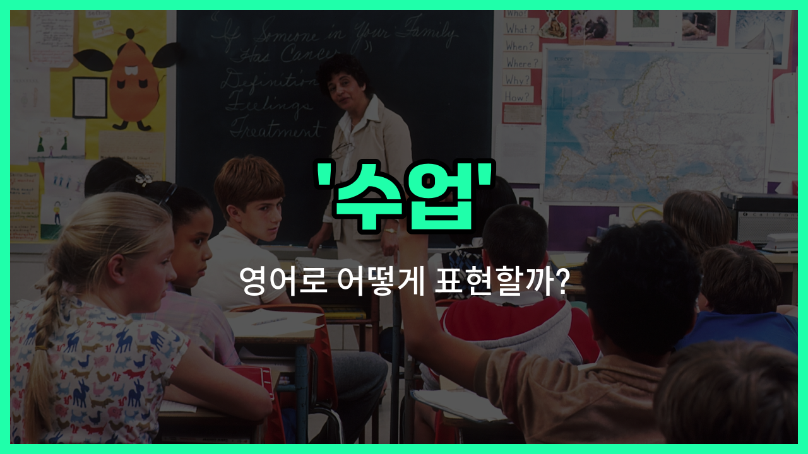

## 🌟 영어 표현 - class

안녕하세요 👋 오늘은 영어로 '수업'을 어떻게 표현하는지 알아보려고 해요. 바로 '**class**'라는 단어를 사용해요. 이 단어는 학교나 학원 등에서 배우는 '수업', '강의', 그리고 '교실'이라는 뜻도 가지고 있어요.

'**class**'는 학생들이 모여서 선생님과 함께 공부하는 시간이나 모임을 의미해요. 예를 들어, 학교에서 영어 수업이 있을 때 "I have an English class [today](/blog/in-english/1132.today/)."라고 말할 수 있어요.

또한, 'class'는 '강의'라는 의미로도 쓰이고, 실제로 수업이 이루어지는 '교실'을 가리키기도 해요. 상황에 따라 다양하게 활용할 수 있는 단어라서 정말 유용해요!

## 📖 예문

1. "나는 오늘 수학 수업이 있어요."

   "I have a math class today."

2. "수업이 10시에 시작해요."

   "The class [starts](/blog/in-english/1127.start/) at 10 o'clock."

3. "우리 교실은 2층에 있어요."

   "Our class is on the [second](/blog/in-english/1105.second/) floor."

## 💬 연습해보기

<ul data-interactive-list>

  <li data-interactive-item>
    매주 월요일과 수요일 오전 10시에 수학 수업이 있어요.
    I have a math class at 10 a.m. every Monday and Wednesday.
  </li>

  <li data-interactive-item>
    역사 수업 숙제를 다 끝냈나요?
    Did you <a href="/blog/in-english/295.finish/">finish</a> all the homework for your <a href="/blog/in-english/532.history/">history</a> class?
  </li>

  <li data-interactive-item>
    우리 과학 수업에서 어제 재미진 실험을 했어요.
    Our science class did a cool experiment yesterday.
  </li>

  <li data-interactive-item>
    오늘 선생님이 결석하셔서 영어 수업이 취소됐어요.
    The teacher was <a href="/blog/in-english/984.absent/">absent</a> today, so our English class was canceled.
  </li>

  <li data-interactive-item>
    이번 학기에 재미로 사진 수업 듣고 있어요.
    I'm taking a photography class this semester just <a href="/blog/in-english/879.for-fun/">for fun</a>.
  </li>

  <li data-interactive-item>
    우리 생물 수업에 퀴즈가 곧 있어요.
    We have a pop quiz coming up in our biology class.
  </li>

  <li data-interactive-item>
    미술 수업은 주 2회 오후에 열려요.
    My art class meets twice a <a href="/blog/in-english/1129.week/">week</a> in the afternoon.
  </li>

  <li data-interactive-item>
    기차가 지연돼서 수업에 늦었어요.
    I was <a href="/blog/in-english/391.late/">late</a> to class because the <a href="/blog/in-english/1147.train/">train</a> was delayed.
  </li>

  <li data-interactive-item>
    어제 교수님이 수업 중에 추가 점수를 주셨어요.
    The professor gave us <a href="/blog/in-english/265.extra/">extra</a> credit during class yesterday.
  </li>

  <li data-interactive-item>
    이 수업이 이렇게 빨리 진행되는 거 믿을 수 있어요? 막 시작한 것 같은데.
    Can you believe how fast this class is <a href="/blog/in-english/1068.going/">going</a>? <a href="/blog/한-것-같아-영어표현/">It feels like</a> we just started.
  </li>

</ul>

## 🤝 함께 알아두면 좋은 표현들

### lecture

'lecture'는 주로 대학이나 전문적인 교육 환경에서 교수나 강사가 학생들에게 지식을 전달하는 '강의'를 의미해요. 일반적인 수업보다 좀 더 공식적이고 일방적인 전달 방식이 강조될 때 사용해요.

- "The professor gave a fascinating lecture on modern art history."
- "교수님이 현대 미술사에 관한 흥미로운 강의를 해주셨어요."

### workshop

'workshop'은 참여자들이 직접 활동하고 실습하는 '워크숍'을 뜻해요. 단순히 듣기만 하는 수업과 달리, 실질적인 경험과 기술 습득에 초점을 맞춘 수업 형태예요.

- "We attended a workshop to [learn](/blog/in-english/245.learn/) how to [use](/blog/in-english/1079.use/) the [new](/blog/in-english/1056.new/) software effectively."
- "우리는 새로운 소프트웨어를 효과적으로 사용하는 법을 배우기 위해 워크숍에 참석했어요."

### free time

'[free](/blog/in-english/1104.free/) [time](/blog/in-english/1055.time/)'은 '자유 시간'이라는 뜻으로, 수업이나 공부와 반대되는 개념이에요. 수업이 없는 개인의 휴식이나 여가 시간을 나타낼 때 사용해요.

- "After class, I [like](/blog/in-english/1053.like/) to [spend](/blog/in-english/258.spend/) my free time [reading](/blog/in-english/436.read/) books or going for a walk."
- "수업이 끝난 후에는 자유 시간에 책을 읽거나 산책하는 것을 좋아해요."

---

오늘은 '수업', '강의', '교실'이라는 뜻을 가진 영어 표현 '**class**'에 대해 알아봤어요. 학교나 학원에서 자주 쓰이는 단어이니 꼭 기억해두면 좋겠어요 😊

오늘 배운 표현과 예문들을 소리 내서 여러 번 읽어보세요. 다음에도 더 유익한 영어 표현으로 찾아올게요! 감사합니다!

