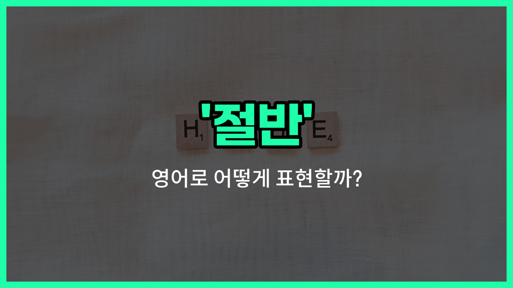

## 🌟 영어 표현 - half

안녕하세요 👋 오늘은 일상에서 자주 쓰이는 단어인 '**절반**'을 영어로 어떻게 표현하는지 알아보려고 해요. 바로 '**half**'라는 단어인데요. 이 단어는 무언가를 두 부분으로 나누었을 때 그 중 하나, 즉 **2분의 1**을 의미해요.

'half'는 음식, 시간, 돈, 거리 등 다양한 상황에서 자연스럽게 사용할 수 있어요. 예를 들어, 피자를 친구와 나눠 먹을 때 "[Let](/blog/in-english/1112.let/)'s split the pizza in half."라고 말할 수 있어요. 또는, "I only slept for half the [night](/blog/in-english/1110.night/)."라고 하면 "나는 밤의 절반만 잤어."라는 뜻이에요.

또한, 'half'는 '반', '중간'이라는 의미로도 자주 쓰여요. 예를 들어, "Meet me halfway."라고 하면 "중간에서 만나자."라는 뜻이 돼요.

## 📖 예문

1. "나는 케이크의 절반을 먹었어요."

   "I ate half of the cake."

2. "우리는 비용을 반씩 나눴어요."

   "We split the [cost](/blog/in-english/664.cost/) in half."

3. "그는 중간쯤에 도착했어요."

   "He [arrived](/blog/in-english/403.arrive/) about halfway."

## 💬 연습해보기

<ul data-interactive-list>

  <li data-interactive-item>
    피자가 너무 많이 느껴서 배가 안 고팠거든. 그래서 반밖에 못 먹었어.
    I ate half of the pizza because I wasn't that <a href="/blog/in-english/437.hungry/">hungry</a>. It was <a href="/blog/in-english/1062.way/">way</a> too much for me to <a href="/blog/in-english/295.finish/">finish</a> all by myself.
  </li>

  <li data-interactive-item>
    어젯밤 소파에서 자고 말았는데, 영화 반도 못 봤어. 별로 재미없었거든.
    She only finished half the movie before falling asleep on the couch last night. It wasn't very interesting to her.
  </li>

  <li data-interactive-item>
    탱크를 반만 채우면 되니까, 반 갤런이면 충분해. 너무 넘치지 않게 해줘.
    You only need to fill the tank halfway, so half a gallon should do it. Don't overfill it though.
  </li>

  <li data-interactive-item>
    팀원의 반은 오늘 연습에 안 와서 스크림을 취소해야 했어. 다음에는 더 많은 사람이 오길 바래.
    Half of the <a href="/blog/in-english/1099.team/">team</a> didn't <a href="/blog/in-english/381.show-up/">show up</a> for <a href="/blog/in-english/247.practice/">practice</a> <a href="/blog/in-english/1132.today/">today</a>, so we had to cancel the scrimmage. Hopefully more <a href="/blog/in-english/1057.people/">people</a> come next <a href="/blog/in-english/1055.time/">time</a>.
  </li>

  <li data-interactive-item>
    내 하루의 반은 집 청소하는 데 썼고, 나머지는 그냥 쉬었어. 꽤 괜찮은 균형이었어.
    I <a href="/blog/in-english/258.spend/">spent</a> half of my <a href="/blog/in-english/1067.day/">day</a> cleaning the <a href="/blog/in-english/1088.house/">house</a> and the rest just relaxing. It <a href="/blog/in-english/1096.feel/">felt</a> <a href="/blog/in-english/1053.like/">like</a> a good balance.
  </li>

  <li data-interactive-item>
    샌드위치를 반으로 잘라서 쉽게 나눠 먹을 수 있었어. 그때는 진짜 배고팠거든.
    They cut the sandwich in half, so we could <a href="/blog/in-english/248.share/">share</a> it easily. I was pretty hungry by then.
  </li>

  <li data-interactive-item>
    파티에 온 사람들 중 대략 반은 자정 전에 일 때문에 간다고 떠났어. 나머지는 늦게까지 춤추고 이야기했어.
    About half the people at the <a href="/blog/in-english/1212.party/">party</a> <a href="/blog/in-english/1106.left/">left</a> before midnight because they had <a href="/blog/in-english/1064.work/">work</a> the next day. The rest stayed <a href="/blog/in-english/391.late/">late</a> dancing and chatting.
  </li>

  <li data-interactive-item>
    도서관에 반납해야 해서 책 반 밖에 못 읽었어. 다음 주에 끝내야겠어.
    I only <a href="/blog/in-english/175.manage-to/">managed to</a> <a href="/blog/in-english/436.read/">read</a> half the <a href="/blog/in-english/447.book/">book</a> before it was due back at the library. I'll have to finish it next <a href="/blog/in-english/1129.week/">week</a>.
  </li>

  <li data-interactive-item>
    내가 감자튀김을 주문하는 걸 깜빡해서 그녀가 반을 나눠줬어. 정말 고마웠어.
    She gave me half her fries because I <a href="/blog/in-english/023.forget/">forgot</a> to <a href="/blog/in-english/1263.order/">order</a> any. That was really nice of her.
  </li>

  <li data-interactive-item>
    수업에서 반은 과제를 이해했는데, 나머지는 추가 도움이 필요했어. 선생님이 다시 설명해 주셨어.
    Half the kids in the <a href="/blog/in-english/1262.class/">class</a> understood the assignment, but the rest needed <a href="/blog/in-english/265.extra/">extra</a> <a href="/blog/in-english/1084.help/">help</a>. The teacher stayed after to <a href="/blog/in-english/909.explain/">explain</a> it again.
  </li>

</ul>

## 🤝 함께 알아두면 좋은 표현들

### partially (부분적으로)

'partially'는 '부분적으로'라는 뜻으로, 전체 중 일부만 해당하는 상태를 나타내요. 'half'와 비슷하게 전체의 일부를 의미하지만, 꼭 절반일 필요는 없고 어느 정도의 부분을 가리킬 때 사용해요.

- "The project was only partially completed by the [deadline](/blog/in-english/830.deadline/)."
- "그 프로젝트는 마감일까지 부분적으로만 완료되었어요."

### whole (전체)

'whole'은 '전체'라는 뜻으로, 'half'의 반대 개념이에요. 전체를 모두 포함하거나 완전한 상태를 나타낼 때 사용해요.

- "She ate the whole cake by herself."
- "그녀는 혼자서 케이크를 통째로 다 먹었어요."

### quarter (4분의 1)

'quarter'는 '4분의 1'이라는 뜻으로, 'half'보다 더 작은 부분을 나타내요. 전체를 네 등분했을 때 그 중 하나를 의미해요.

- "He donated a quarter of his [salary](/blog/in-english/650.salary/) to charity."
- "그는 자신의 월급의 4분의 1을 자선단체에 기부했어요."

---

오늘은 '**절반**', '**반**', '**중간**'이라는 뜻을 가진 영어 표현 '**half**'에 대해 알아봤어요. 일상에서 무언가를 나누거나 중간을 이야기할 때 이 표현을 떠올려 보세요 😊

오늘 배운 표현과 예문들을 꼭 소리 내서 여러 번 읽어보세요. 다음에도 더 유익한 영어 표현으로 찾아올게요! 감사합니다!

