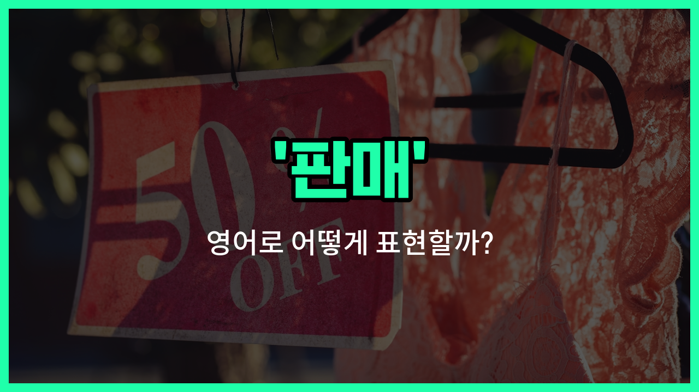

## 🌟 영어 표현 - sale

안녕하세요 👋 오늘은 일상에서 자주 쓰이는 단어인 '**판매**'의 영어 표현 '**sale**'에 대해 알아보려고 해요.

'**sale**'는 기본적으로 '물건이나 서비스를 파는 행위'를 의미해요. 즉, 누군가가 어떤 상품을 다른 사람에게 돈을 받고 넘기는 상황을 말할 때 사용할 수 있어요.

또한, '**sale**'은 '세일', '할인'이라는 뜻으로도 많이 쓰여요. 상점에서 가격을 낮춰서 파는 특별한 기간이나 이벤트를 말할 때도 '**sale**'이라는 단어를 사용해요. 예를 들어, '여름 세일', '할인 행사' 등 다양한 상황에서 자연스럽게 쓸 수 있답니다!

## 📖 예문

1. "이 가게는 신발을 판매하고 있어요."

   "This [store](/blog/in-english/1253.store/) has shoes for sale."

2. "이번 주말에 대형 세일이 있어요."

   "There is a [big](/blog/in-english/1095.big/) sale this weekend."

3. "모든 상품이 20% 할인 판매 중이에요."

   "All items are [on sale](/blog/in-english/449.on-sale/) for 20% off."

## 💬 연습해보기

<ul data-interactive-list>

  <li data-interactive-item>
    이번 주말에는 가게에서 대박 세일 한다고 해요. 그래서 저도 할인 상품을 한번 보러 가볼까 해요.
    The store is <a href="/blog/in-english/1116.having/">having</a> a huge sale this weekend, so I plan to <a href="/blog/in-english/104check-out/">check out</a> the <a href="/blog/in-english/1137.deal/">deals</a>.
  </li>

  <li data-interactive-item>
    지난주에 세일하는 그 신발을 샀는데, 50% 할인 받았어요.
    I grabbed those shoes on sale last <a href="/blog/in-english/1129.week/">week</a>—they were fifty percent off.
  </li>

  <li data-interactive-item>
    요즘 전자제품 세일 중이래요. 우리 그 새 TV 사도 좋을 것 같아요.
    There's a sale on electronics <a href="/blog/in-english/525.right-now/">right now</a>. Maybe we should buy that <a href="/blog/in-english/1056.new/">new</a> TV.
  </li>

  <li data-interactive-item>
    겨울 코트 세일이 있다는 걸 몰랐어요. 내 것을 사는 데 조금 더 기다릴 걸 그랬네요.
    I didn't <a href="/blog/in-english/1058.know/">know</a> they had a sale on winter coats. I <a href="/blog/in-english/257.should've/">should've</a> waited to buy mine.
  </li>

  <li data-interactive-item>
    세일이 내일까지니까, 필요한 거 있으면 지금 사는 게 좋을 것 같아요.
    The sale <a href="/blog/in-english/1093.end/">ends</a> tomorrow, so if you <a href="/blog/in-english/1060.want/">want</a> anything, now's the <a href="/blog/in-english/1055.time/">time</a> to get it.
  </li>

  <li data-interactive-item>
    그녀는 세일 쪽에서 일하는데, 이번 분기 사업이 잘 되고 있다고 해요.
    She <a href="/blog/in-english/1064.work/">works</a> in sales and <a href="/blog/in-english/1221.says/">says</a> <a href="/blog/in-english/1125.business/">business</a> is booming this quarter.
  </li>

  <li data-interactive-item>
    학교 갈 배낭 좋은 세일 찾고 있어요.
    I'm <a href="/blog/in-english/1121.looking/">looking</a> for a good sale on backpacks for <a href="/blog/in-english/1090.school/">school</a>.
  </li>

  <li data-interactive-item>
    연말 연휴 때는 거의 모든 가게에서 세일을 해요.
    During the <a href="/blog/in-english/517.holiday/">holiday</a> <a href="/blog/in-english/1248.season/">season</a>, <a href="/blog/in-english/854.almost/">almost</a> every store has a sale happening.
  </li>

  <li data-interactive-item>
    손님들을 끌기 위해 밖에 '세일'이라고 큰 간판을 붙였어요.
    They put a big sign <a href="/blog/in-english/974.outside/">outside</a> saying 'Sale' to attract customers.
  </li>

  <li data-interactive-item>
    몰에 갔을 때 모든 게 세일 중이라서 정말 좋은 거래를 했어요.
    We got a great deal because everything was on sale when we visited the mall.
  </li>

</ul>

## 🤝 함께 알아두면 좋은 표현들

### purchase (구매)

'purchase'는 '구매하다' 또는 '사다'라는 뜻으로, 'sale'의 반대 개념이에요. 판매자가 물건을 파는 행위라면, 구매자는 그 물건을 사는 행위를 의미해요.

- "She [decided to](/blog/in-english/062.decide-to/) purchase a new laptop for her work."
- "그녀는 일을 위해 새 노트북을 구매하기로 결정했어요."

### discount (할인)

'discount'는 '할인'이라는 뜻으로, 판매 시 가격을 낮추어 소비자가 더 저렴하게 물건을 살 수 있도록 하는 것을 말해요. 판매와 관련된 긍정적인 표현이에요.

- "The store is offering a 20% discount on all shoes this weekend."
- "그 가게는 이번 주말에 모든 신발을 20% 할인해 판매하고 있어요."

### return (반품)

'return'은 '반품하다'라는 뜻으로, 구매한 물건을 다시 판매자에게 돌려보내는 행위를 말해요. 판매와는 반대되는 개념으로, 구매 후 물건을 되돌려 보내는 상황에서 사용돼요.

- "If the product is defective, you can return it within 30 [days](/blog/in-english/1067.day/)."
- "제품에 결함이 있으면 30일 이내에 반품할 수 있어요."

---

오늘은 '판매', '세일', '할인'이라는 뜻을 가진 영어 표현 '**sale**'에 대해 알아봤어요. 쇼핑이나 비즈니스 상황에서 자주 쓰이는 단어이니 꼭 기억해두면 좋겠어요 😊

오늘 배운 표현과 예문들을 소리 내서 여러 번 읽어보세요. 다음에도 더 유익한 영어 표현으로 찾아올게요! 감사합니다!

