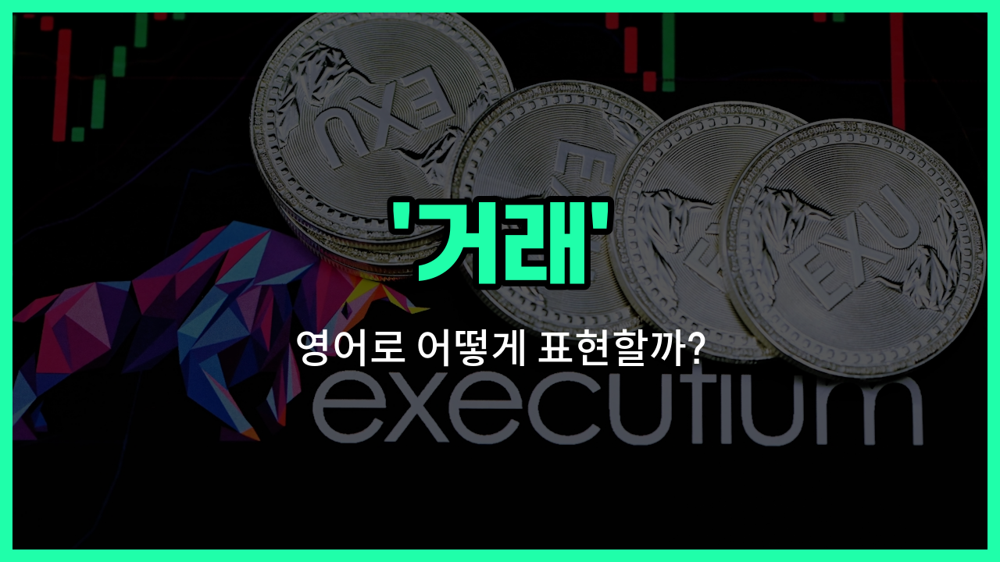

## 🌟 영어 표현 - trading

안녕하세요 👋 오늘은 영어로 '거래'를 어떻게 표현하는지 알아보려고 해요. 바로 '**trading**'이라는 단어인데요~

'**trading**'은 물건이나 서비스, 혹은 주식, 화폐 등 다양한 것들을 **서로 사고파는 행위**를 의미해요. 즉, '무역'이나 '매매'와 같은 뜻으로도 자주 쓰여요~

이 단어는 일상생활뿐만 아니라 경제, 금융, 비즈니스 등 여러 분야에서 폭넓게 사용돼요. 예를 들어, 주식 시장에서 주식을 사고파는 것도 'trading'이라고 하고, 나라와 나라 사이에 물건을 주고받는 것도 'trading'이라고 해요~

예를 들어, "He is [interested in](/blog/in-english/979.interested-in/) trading [stocks](/blog/in-english/671.stock/)."라고 하면 "그는 주식 거래에 관심이 있어요."라는 뜻이에요~

또는, "International trading is [important](/blog/in-english/318.important/) for the [economy](/blog/in-english/637.economy/)."라고 하면 "국제 무역은 경제에 중요해요."라는 의미가 돼요~

## 📖 예문

1. "그는 암호화폐 거래를 시작했어요."

   "He [started](/blog/in-english/1127.start/) trading cryptocurrencies."

2. "이 회사는 해외와 거래를 하고 있어요."

   "This [company](/blog/in-english/1111.company/) is trading with overseas partners."

## 💬 연습해보기

<ul data-interactive-list>

  <li data-interactive-item>
    이번 주말에 오래된 자전거를 새 모델로 바꾸려고 해요.
    I'm <a href="/blog/in-english/1059.think/">thinking</a> about trading my <a href="/blog/in-english/1086.old/">old</a> bike for a newer model this weekend.
  </li>

  <li data-interactive-item>
    학교에서 친구들과 카드 교환해본 적 있어요?
    Have you ever <a href="/blog/in-english/1265.try/">tried</a> trading cards with your <a href="/blog/in-english/1261.friend/">friends</a> at <a href="/blog/in-english/1090.school/">school</a>?
  </li>

  <li data-interactive-item>
    그녀는 약속이 있어서 다른 사람과 교대하려고 생각하고 있어요.
    She's thinking of trading her shift with someone else because she has an appointment.
  </li>

  <li data-interactive-item>
    어렸을 때 우리는 쉬는 시간에 야구카드 교환하느라 시간을 많이 보냈어요.
    When we were kids, we <a href="/blog/in-english/258.spend/">spent</a> hours trading baseball cards during recess.
  </li>

  <li data-interactive-item>
    온라인 주식 거래하고 있었는데, 시장이 떨어지니까 좀 긴장됐어요.
    I was trading stocks online, but I got a bit <a href="/blog/in-english/115.nervous/">nervous</a> when the <a href="/blog/in-english/641.market/">market</a> dipped.
  </li>

  <li data-interactive-item>
    그들은 두 나라 사이에서 물건을 교환해서 경제를 활성화하려고 해요.
    They're trading <a href="/blog/in-english/644.goods/">goods</a> between the two <a href="/blog/in-english/1218.country/">countries</a> to boost their economies.
  </li>

  <li data-interactive-item>
    우리는 주중 저녁을 더 신나게 만들려고 요리법을 교환하기로 했어요.
    We <a href="/blog/in-english/062.decide-to/">decided to</a> start trading recipes to make our weeknight dinners more exciting.
  </li>

  <li data-interactive-item>
    그는 여행 이야기를 듣고 싶어하는 사람과 언제나 이야기를 나누고 있어요.
    He's always trading <a href="/blog/in-english/537.story/">stories</a> about his travels with anyone who will listen.
  </li>

  <li data-interactive-item>
    다음 달 공연 티켓을 교환할 생각 있어요?
    Are you interested in trading your concert tickets for a show next month?
  </li>

  <li data-interactive-item>
    회사는 자본금을 모으기 위해 주식을 거래하고 있어요.
    The company is trading <a href="/blog/in-english/248.share/">shares</a> on the stock market to raise <a href="/blog/in-english/647.capital/">capital</a>.
  </li>

</ul>

## 🤝 함께 알아두면 좋은 표현들

### bartering

'bartering'은 물물교환을 의미해요. 돈 대신에 물건이나 서비스를 직접 교환하는 거래 방식으로, 'trading'과 비슷하지만 화폐를 사용하지 않는 점에서 차이가 있어요.

- "In some rural [areas](/blog/in-english/1259.area/), [people](/blog/in-english/1057.people/) [still](/blog/in-english/254.still/) [practice](/blog/in-english/247.practice/) bartering to get the goods they need."
- "일부 농촌 지역에서는 사람들이 필요한 물건을 얻기 위해 여전히 물물교환을 해요."

### selling

'selling'은 물건이나 서비스를 돈을 받고 파는 행위를 뜻해요. 'trading'이 거래 전반을 의미하는 반면, 'selling'은 주로 한쪽이 파는 행위에 초점을 맞춰요.

- "She is selling her old books online to make some [extra](/blog/in-english/265.extra/) [money](/blog/in-english/1103.money/)."
- "그녀는 추가 수입을 위해 온라인에서 헌 책을 팔고 있어요."

### buying

'[buying](/blog/in-english/1273.buying/)'은 물건이나 서비스를 돈을 주고 사는 행위를 의미해요. 'trading'과는 반대되는 개념으로, 거래에서 구매자의 입장을 나타내요.

- "He is buying fresh vegetables from the [local](/blog/in-english/1260.local/) market every weekend."
- "그는 매주 주말마다 지역 시장에서 신선한 채소를 사요."

---

오늘은 '거래', '무역', '매매'라는 뜻을 가진 영어 표현 '**trading**'에 대해 알아봤어요. 앞으로 경제나 비즈니스 관련 대화를 할 때 이 표현을 떠올려보면 좋겠어요~ 😊

오늘 배운 표현과 예문들을 꼭 소리 내서 여러 번 읽어보세요. 다음에도 더 유익한 영어 표현으로 찾아올게요! 감사합니다~

