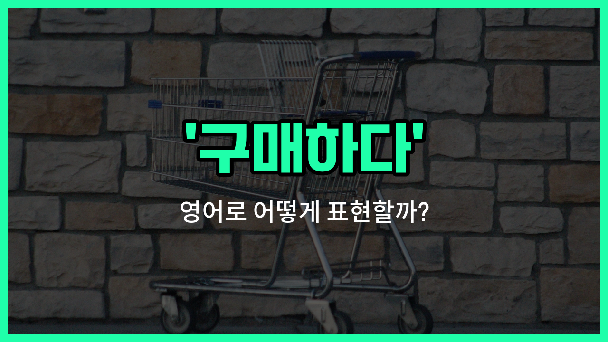

## 🌟 영어 표현 - buying

안녕하세요 👋 오늘은 일상에서 정말 자주 쓰이는 영어 표현인 '**buying**'에 대해 알아보려고 해요. '구매하다', '구입', '사다'와 같은 뜻을 가진 단어인데요, 우리가 물건을 살 때 꼭 필요한 표현이에요!

'**buying**'은 어떤 물건이나 서비스를 돈을 주고 사는 행위를 말해요. 예를 들어, 온라인 쇼핑을 하거나 마트에서 장을 볼 때 모두 'buying'이라는 단어를 쓸 수 있어요.

이 단어는 명사형으로 '구매', 동사형으로 '사다'라는 의미로 다양하게 활용돼요. 예를 들어, 'I'm buying a [new](/blog/in-english/1056.new/) phone.'이라고 하면 '나는 새 휴대폰을 사고 있어요.'라는 뜻이에요.

또한, 'buying'은 단순히 물건을 사는 것뿐만 아니라, 티켓, 서비스, 심지어는 시간이나 기회까지도 'buy'라는 동사를 써서 표현할 수 있어요. 정말 유용하죠?

## 📖 예문

1. "나는 새로운 신발을 구매하고 있어요."

   "I'm buying new shoes."

2. "온라인으로 책을 구매했어요."

   "I bought a [book](/blog/in-english/447.book/) online."

## 💬 연습해보기

<ul data-interactive-list>

  <li data-interactive-item>
    요즘 제 노트북이 너무 느려서 새걸로 바꿀까 생각中이에요.
    I'm <a href="/blog/in-english/1059.think/">thinking</a> about buying a new laptop since mine is really slow now.
  </li>

  <li data-interactive-item>
    콘서트 예매 한번 생각해봤어요? 매진되기 전에 서둘러야해요!
    Have you considered buying tickets for the concert before they sell out?
  </li>

  <li data-interactive-item>
    장보고 있을 때 오랜 친구를 만났어요.
    I was out buying groceries when I <a href="/blog/in-english/1102.run/">ran</a> into an <a href="/blog/in-english/1086.old/">old</a> <a href="/blog/in-english/1261.friend/">friend</a>.
  </li>

  <li data-interactive-item>
    그녀는 연휴에 가족 선물 사려고 몇 달 동안 저축하고 있어요.
    She's been <a href="/blog/in-english/293.save/">saving</a> up for months buying gifts for her <a href="/blog/in-english/1100.family/">family</a> during the <a href="/blog/in-english/517.holiday/">holidays</a>.
  </li>

  <li data-interactive-item>
    집 사는 건 큰 투자니까 먼저 잘 알아보는 게 중요해요.
    Buying a <a href="/blog/in-english/1088.house/">house</a> is a <a href="/blog/in-english/1095.big/">big</a> <a href="/blog/in-english/414.investment/">investment</a>, so <a href="/blog/in-english/232.make-sure/">make sure</a> you do your <a href="/blog/in-english/1233.research/">research</a> first.
  </li>

  <li data-interactive-item>
    그 비싼 재킷 산 걸 후회하고 있어요. 안 입거든요.
    He regrets buying that <a href="/blog/in-english/317.expensive/">expensive</a> jacket because he never wears it.
  </li>

  <li data-interactive-item>
    올해 생일에 특별한 거 사는 거 있어요?
    Are you buying anything special for your birthday this <a href="/blog/in-english/1065.year/">year</a>?
  </li>

  <li data-interactive-item>
    다음 주 캠핑 갈 준비물 사느라 오후를 보냈어요.
    We <a href="/blog/in-english/258.spend/">spent</a> the afternoon buying supplies for our camping <a href="/blog/in-english/1150.trip/">trip</a> next weekend.
  </li>

  <li data-interactive-item>
    대량 구매하면 보통 더 저렴해져요, 특히 상하지 않는 물건들은요.
    Buying in bulk usually saves more <a href="/blog/in-english/1103.money/">money</a>, especially for non-perishable items.
  </li>

  <li data-interactive-item>
    예상치도 못한 책 몇 권 샀어요. 세일이 너무 좋았거든요.
    I ended up buying <a href="/blog/in-english/911.a-few/">a few</a> books I didn't plan on getting; the <a href="/blog/in-english/1267.sale/">sale</a> was just too good.
  </li>

</ul>

## 🤝 함께 알아두면 좋은 표현들

### purchasing

'purchasing'은 '구매하다'와 같은 의미로, 주로 공식적이거나 비즈니스 상황에서 많이 사용돼요. 'buying'보다 좀 더 격식 있는 표현이에요.

- "The [company](/blog/in-english/1111.company/) is purchasing new equipment for the office."
- "회사가 사무실을 위해 새 장비를 구매하고 있어요."

### selling

'selling'은 '판매하다'라는 뜻으로, 'buying'의 반대 개념이에요. 물건이나 서비스를 다른 사람에게 파는 행위를 나타내요.

- "She is selling her old car to buy a new one."
- "그녀는 새 차를 사기 위해 오래된 차를 팔고 있어요."

### acquiring

'acquiring'은 '획득하다' 또는 '취득하다'라는 뜻으로, 'buying'과 비슷하지만 꼭 돈을 주고 사는 것뿐만 아니라 다양한 방법으로 얻는 것을 포함해요.

- "They are acquiring a small startup to [expand](/blog/in-english/837.expand/) their [business](/blog/in-english/1125.business/)."
- "그들은 사업 확장을 위해 작은 스타트업을 인수하고 있어요."

---

오늘은 '구매하다', '구입', '사다'라는 뜻을 가진 영어 표현 '**buying**'에 대해 알아봤어요. 쇼핑할 때나 일상 대화에서 이 표현을 자주 떠올려 보세요 😊

오늘 배운 표현과 예문들을 꼭 최소 3번씩 소리 내서 읽어보세요. 다음에도 더 재미있고 유익한 영어 표현으로 찾아올게요! 감사합니다!

