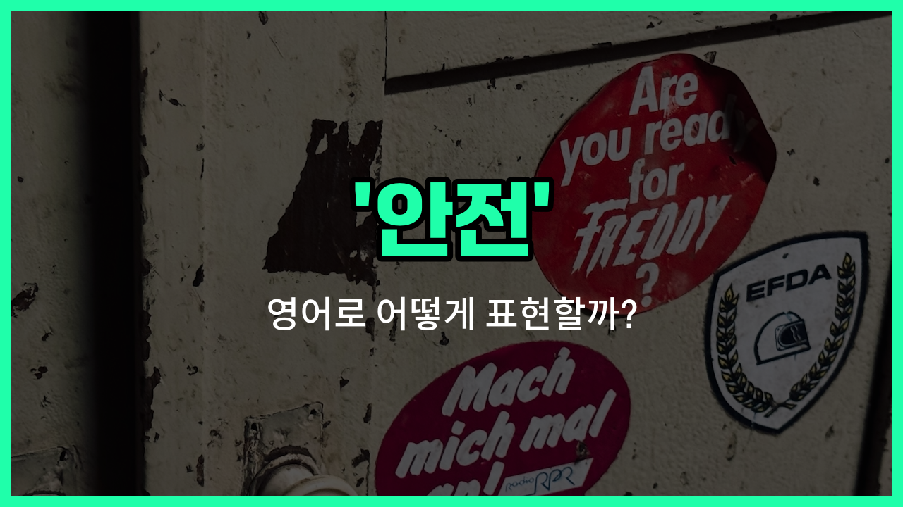

## 🌟 영어 표현 - safety

안녕하세요 👋 오늘은 일상에서 정말 자주 쓰이는 단어인 '**안전**'의 영어 표현 '**safety**'에 대해 알아보려고 해요.

'**safety**'는 위험이나 사고로부터 벗어나 **무사하고 보호받는 상태**를 의미해요. 즉, 다치거나 해를 입지 않도록 지키는 것, 또는 그런 상태를 말할 때 사용해요!

이 단어는 학교, 직장, 공사 현장, 집 등 다양한 장소에서 자주 들을 수 있어요. 예를 들어, "안전이 최우선이에요."라고 말하고 싶을 때 "Safety comes first."라고 표현할 수 있어요.

또한, "안전벨트를 매세요."는 "Please fasten your safety belt."라고 할 수 있어요. 이처럼 '**safety**'는 우리 생활 곳곳에서 꼭 필요한 단어예요.

## 📖 예문

1. "아이들의 안전이 가장 중요해요."

   "The safety of [children](/blog/in-english/1226.children/) is the most [important](/blog/in-english/318.important/)."

2. "이 장비는 사용자의 안전을 위해 설계되었어요."

   "This equipment is designed for the user's safety."

## 💬 연습해보기

<ul data-interactive-list>

  <li data-interactive-item>
    자전거 탈 때 헬멧 쓰는 건 안전을 위한 거예요.
    Wearing a helmet is all about safety when you ride a bike around town.
  </li>

  <li data-interactive-item>
    우리가 기계 시작하기 전에 모든 안전 기능을 점검해야 해요.
    We need to check all the safety features before we <a href="/blog/in-english/1127.start/">start</a> the machine.
  </li>

  <li data-interactive-item>
    안전은 모두의 책임이니까, 규칙을 꼭 지켜주세요.
    Safety is everyone's <a href="/blog/in-english/932.responsibility/">responsibility</a>, so please <a href="/blog/in-english/1143.follow/">follow</a> the rules.
  </li>

  <li data-interactive-item>
    회사는 비상시에 대비하기 위해 정기적인 안전 훈련을 해요.
    The <a href="/blog/in-english/1111.company/">company</a> <a href="/blog/in-english/388.hold/">holds</a> regular safety drills to keep everyone <a href="/blog/in-english/371.prepare/">prepared</a> in <a href="/blog/in-english/1130.case/">case</a> of emergency.
  </li>

  <li data-interactive-item>
    아이들이 있어서 안전 평점 높은 차를 샀어요.
    I bought a car with <a href="/blog/in-english/1069.high/">high</a> safety ratings because I have kids.
  </li>

  <li data-interactive-item>
    안전이 제일 중요하니까, 차 탈 때 반드시 안전벨트를 매세요.
    Safety first, so <a href="/blog/in-english/232.make-sure/">make sure</a> you wear your seatbelt in the car.
  </li>

  <li data-interactive-item>
    놀이터에 아이들이 놀 때 안전을 위해 새로운 안전망이 설치되었어요.
    The playground has <a href="/blog/in-english/1056.new/">new</a> safety nets to protect the kids while they <a href="/blog/in-english/1081.play/">play</a>.
  </li>

  <li data-interactive-item>
    공사장 투어 중에 안전을 강조해서 아무도 다치지 않았어요.
    They emphasized safety during the <a href="/blog/in-english/551.tour/">tour</a> of the <a href="/blog/in-english/858.construction/">construction</a> site, so no one got hurt.
  </li>

  <li data-interactive-item>
    사고에 대비해서 항상 응급처치 키트는 준비해 두세요.
    Always keep a first aid kit handy for safety <a href="/blog/in-english/253.in-case/">in case</a> of accidents.
  </li>

  <li data-interactive-item>
    항공사는 안전한 비행 경험을 위해 엄격한 안전 프로토콜을 갖추고 있어요.
    The airline has <a href="/blog/in-english/275.strict/">strict</a> safety protocols to <a href="/blog/in-english/356.ensure/">ensure</a> a smooth flight <a href="/blog/in-english/415.experience/">experience</a>.
  </li>

</ul>

## 🤝 함께 알아두면 좋은 표현들

### security

'[security](/blog/in-english/554.security/)'는 '안전'과 비슷한 의미로, 특히 위험이나 위협으로부터 보호받는 상태를 의미해요. 보안이나 방어 측면에서 안전을 강조할 때 자주 사용돼요.

- "The company invested heavily in security [measures](/blog/in-english/634.measure/) to protect its data."
- "그 회사는 데이터를 보호하기 위해 보안 조치에 많은 투자를 했어요."

### danger

'danger'는 '위험'이라는 뜻으로, '안전'의 반대말이에요. 위험한 상황이나 상태를 나타내며, 주로 조심해야 할 상황을 말할 때 사용해요.

- "[Ignoring](/blog/in-english/348.ignore/) the warning signs can put you in danger."
- "경고 표지판을 무시하면 위험에 처할 수 있어요."

### risk

'[risk](/blog/in-english/676.risk/)'는 '위험' 또는 '위험 요소'를 뜻해요. 안전하지 않은 상태나 가능성을 나타내며, 어떤 행동이나 상황이 안전하지 않을 수 있음을 강조할 때 쓰여요.

- "There is a risk of [injury](/blog/in-english/777.injury/) if you don't wear protective gear."
- "보호 장비를 착용하지 않으면 부상의 위험이 있어요."

---

오늘은 '**안전**'이라는 뜻을 가진 영어 표현 '**safety**'에 대해 알아봤어요. 앞으로 위험한 상황이나 보호가 필요할 때 이 단어를 떠올려 보세요 😊

오늘 배운 표현과 예문들을 꼭 최소 3번씩 소리 내서 읽어보세요. 다음에도 더 유익한 영어 표현으로 찾아올게요! 감사합니다!

