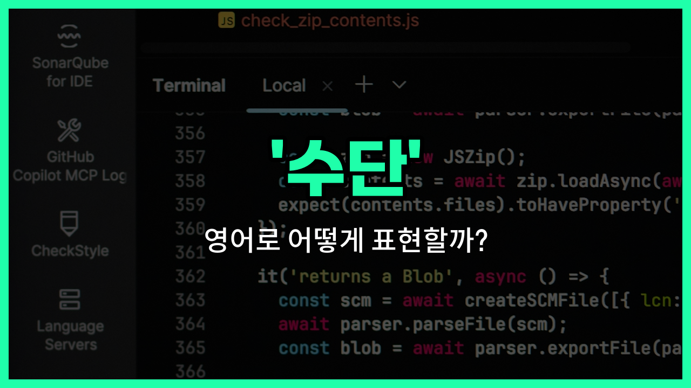

## 🌟 영어 표현 - means

안녕하세요 👋 오늘은 영어에서 '수단', '방법', '방식'을 어떻게 표현하는지 알아보려고 해요. 바로 '**[means](/blog/in-english/1214.mean/)**'라는 단어를 사용할 수 있어요.

'**means**'는 어떤 목적을 이루기 위해 사용하는 '방법'이나 '수단'을 의미해요. 예를 들어, 목표를 달성하기 위한 여러 가지 방법이나, 문제를 해결하기 위한 수단을 말할 때 자주 쓰여요.

이 단어는 항상 복수형 형태로 쓰이는 것이 특징이에요. 그래서 'a means'처럼 쓸 수도 있지만, 보통 'means' 자체가 단수와 복수 모두로 사용된다는 점도 기억해두면 좋아요!

예를 들어, "by all means"는 '어떤 수단을 써서라도', "by any means"는 '어떤 방법으로든'이라는 뜻이에요.

## 📖 예문

1. "그는 성공을 위해 모든 수단을 사용했어요."

   "He [used](/blog/in-english/171.used/) every means to achieve success."

2. "이 문제를 해결할 다른 방법이 있나요?"

   "Is there any other means to [solve](/blog/in-english/455.solve/) this problem?"

## 💬 연습해보기

<ul data-interactive-list>

  <li data-interactive-item>
    "차"라고 하면, 빠르게 도시를 돌아다닐 수 있는 방법을 말해요.
    When I say "car," it means a <a href="/blog/in-english/1062.way/">way</a> to get around town quickly.
  </li>

  <li data-interactive-item>
    이메일을 사용하면, 일반 우편 대신 인터넷을 통해 메시지를 보내는 거예요.
    Using email means <a href="/blog/in-english/292.send/">sending</a> messages through the internet <a href="/blog/in-english/169.instead-of/">instead of</a> regular mail.
  </li>

  <li data-interactive-item>
    저에게 운동은 건강을 유지하고 스트레스를 덜어내는 방법이에요.
    For me, <a href="/blog/in-english/1155.exercise/">exercise</a> means a way to stay healthy and relieve stress.
  </li>

  <li data-interactive-item>
    비행기를 타면 멀리 있는 곳에 더 빨리 갈 수 있죠.
    Traveling by plane means you can get to faraway <a href="/blog/in-english/1089.place/">places</a> faster.
  </li>

  <li data-interactive-item>
    집에서 요리하는 건 외식하는 것보다 돈을 절약하는 거예요.
    <a href="/blog/in-english/461.cook/">Cooking</a> at <a href="/blog/in-english/1076.home/">home</a> means <a href="/blog/in-english/726.save-money/">saving money</a> compared to <a href="/blog/in-english/1257.eating/">eating</a> out.
  </li>

  <li data-interactive-item>
    이 앱은 매일 스케줄을 간단하게 정리할 수 있게 도와줘요.
    This app means a simple means to <a href="/blog/in-english/355.organize/">organize</a> your schedule every <a href="/blog/in-english/1067.day/">day</a>.
  </li>

  <li data-interactive-item>
    야근은 보통 근무 시간 외에 추가로 시간을 더 일하는 걸 의미해요.
    <a href="/blog/in-english/1243.working/">Working</a> overtime means putting in <a href="/blog/in-english/265.extra/">extra</a> hours beyond your usual <a href="/blog/in-english/1064.work/">work</a> <a href="/blog/in-english/1055.time/">time</a>.
  </li>

  <li data-interactive-item>
    버스를 타는 건 도심에서 통근하는 사람들에게 편리한 교통수단이에요.
    Taking the bus means a <a href="/blog/in-english/323.convenient/">convenient</a> means of transportation for <a href="/blog/in-english/1108.city/">city</a> commuters.
  </li>

  <li data-interactive-item>
    지도를 사용하면 낯선 곳에서도 길을 찾을 수 있죠.
    Using a <a href="/blog/in-english/535.map/">map</a> means <a href="/blog/in-english/1083.find/">finding</a> your way when you're in an <a href="/blog/in-english/337.unfamiliar/">unfamiliar</a> place.
  </li>

  <li data-interactive-item>
    온라인 튜토리얼을 보는 건 수업 대신 비디오를 통해 새로운 기술을 배우는 거예요.
    Watching tutorials online means <a href="/blog/in-english/245.learn/">learning</a> <a href="/blog/in-english/1056.new/">new</a> skills through <a href="/blog/in-english/1244.video/">videos</a> instead of <a href="/blog/in-english/1262.class/">classes</a>.
  </li>

</ul>

## 🤝 함께 알아두면 좋은 표현들

### method

'method'는 어떤 목적을 달성하기 위해 체계적이고 계획된 절차나 방식을 의미해요. 'means'와 비슷하게 어떤 일을 하는 수단이나 방법을 나타내지만, 좀 더 조직적이고 공식적인 느낌이 있어요.

- "She used a new method to solve the complex problem."
- "그녀는 복잡한 문제를 해결하기 위해 새로운 방법을 사용했어요."

### way

'way'는 어떤 일을 하는 방식이나 수단을 뜻해요. 'means'와 비슷하지만 좀 더 일상적이고 포괄적인 의미로, 다양한 상황에서 널리 쓰여요.

- "There are many ways to learn a language effectively."
- "언어를 효과적으로 배우는 방법은 여러 가지가 있어요."

### end

'[end](/blog/in-english/1093.end/)'는 'means'의 반대 개념으로, 어떤 행동이나 수단이 도달하려는 목표나 목적을 의미해요. 즉, 'means'가 수단이라면 'end'는 그 수단이 이루려는 결과나 목적이에요.

- "The means [justify](/blog/in-english/322.justify/) the end in this project."
- "이 프로젝트에서는 수단이 목적을 정당화해요."

---

오늘은 '수단', '방법', '방식'이라는 뜻을 가진 영어 표현 '**means**'에 대해 알아봤어요. 일상 대화나 글쓰기에서 다양한 방법이나 수단을 말할 때 이 표현을 활용해 보세요 😊

오늘 배운 표현과 예문들을 꼭 최소 3번씩 소리 내서 읽어보세요. 다음에도 더 재미있고 유익한 영어 표현으로 찾아올게요! 감사합니다!

