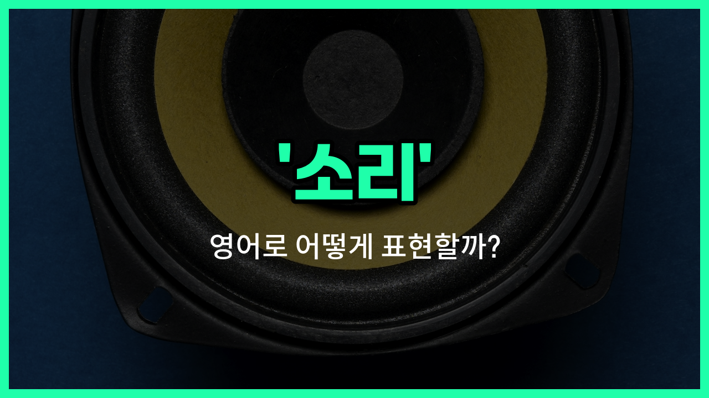

## 🌟 영어 표현 - sound

안녕하세요 👋 오늘은 일상에서 자주 쓰이는 단어인 '**소리**'의 영어 표현 '**sound**'에 대해 알아보려고 해요.

'**sound**'는 우리가 귀로 들을 수 있는 모든 종류의 소리를 의미해요. 예를 들어, 음악 소리, 자동차 소리, 새가 지저귀는 소리 등 다양한 상황에서 사용할 수 있어요.

또한, '**sound**'는 '음향'이나 '음'이라는 뜻으로도 쓰여서, 영화관이나 콘서트장 등에서 음향 시스템을 말할 때도 자주 사용돼요.

예를 들어, "The sound of rain is relaxing."이라고 하면 "비 소리가 마음을 편안하게 해줘요."라는 뜻이에요.

## 📖 예문

1. "저는 파도 소리를 듣는 걸 좋아해요."

   "I [like](/blog/in-english/1053.like/) [listening to](/blog/in-english/407.listen-to/) the sound of waves."

2. "이 방은 소리가 잘 울려요."

   "The sound echoes well in this room."

## 💬 연습해보기

<ul data-interactive-list>

  <li data-interactive-item>
    엔진에서 이상한 소리가 나서 좀 걱정됐어요.
    I heard a <a href="/blog/in-english/296.weird/">weird</a> sound coming from the engine and got worried.
  </li>

  <li data-interactive-item>
    소리 좀 줄여줄래요? 여기가 너무 시끄러워요.
    Can you turn down the sound? It's really <a href="/blog/in-english/311.loud/">loud</a> in here.
  </li>

  <li data-interactive-item>
    파도가 부딪히는 소리가 정말 편안했어요.
    The sound of the waves crashing was so relaxing.
  </li>

  <li data-interactive-item>
    그녀의 목소리는 따뜻한 소리가 나서 사람들을 편안하게 해줘요.
    Her voice has a warm sound that <a href="/blog/in-english/1209.makes/">makes</a> <a href="/blog/in-english/1057.people/">people</a> <a href="/blog/in-english/1096.feel/">feel</a> comfortable.
  </li>

  <li data-interactive-item>
    그 노래는 정말 중독성이 있어서 계속 흥얼거려요.
    That song has such a catchy sound, I can't <a href="/blog/in-english/1240.stop/">stop</a> humming it.
  </li>

  <li data-interactive-item>
    혼자 있을 때 초인종 소리에 깜짝 놀랐어요.
    The sound of the doorbell startled me when I was alone.
  </li>

  <li data-interactive-item>
    폭풍우 중에 창문에 비가 내리는 소리가 너무 좋아요.
    I <a href="/blog/in-english/1074.love/">love</a> the sound of rain hitting the window during a storm.
  </li>

  <li data-interactive-item>
    영화에서의 효과음이 장면을 더 강렬하게 만들어 줬어요.
    The sound effects in the movie made the scenes more intense.
  </li>

  <li data-interactive-item>
    무슨 윙윙거리는 소리야? 근처에 벌이 있는 것 같아요.
    What's that buzzing sound? I <a href="/blog/in-english/1059.think/">think</a> there's a bee nearby.
  </li>

  <li data-interactive-item>
    그는 손으로 기타 소리를 흉내 내려고 했어요.
    He <a href="/blog/in-english/1265.try/">tried</a> to imitate the sound of a guitar with his <a href="/blog/in-english/1239.hand/">hands</a>.
  </li>

</ul>

## 🤝 함께 알아두면 좋은 표현들

### noise (소음)

'noise'는 '소음' 또는 '잡음'을 의미해요. 일반적으로 불쾌하거나 방해가 되는 소리를 가리킬 때 사용해요. 'sound'가 중립적인 의미라면, 'noise'는 부정적인 느낌이 강해요.

- "The noise from the [construction](/blog/in-english/858.construction/) site [made it](/blog/in-english/244.make-it/) [hard](/blog/in-english/1219.hard/) to concentrate."
- "공사 현장에서 나는 소음 때문에 집중하기 어려웠어요."

### tone (음색)

'tone'은 '음색'이나 '음조'를 뜻해요. 소리의 높낮이나 느낌을 나타내며, 말할 때는 목소리의 분위기나 감정을 표현할 때도 사용해요. 'sound'보다 더 구체적인 소리의 특성을 말할 때 쓰여요.

- "Her tone of voice was [calm](/blog/in-english/380.calm/) and reassuring."
- "그녀의 목소리 톤은 차분하고 안심이 되었어요."

### silence (침묵)

'silence'는 '침묵' 또는 '무음'을 의미해요. 소리가 전혀 없는 상태를 나타내며, 'sound'의 반대 개념이에요. 때로는 평화롭거나 긴장된 분위기를 표현할 때 사용해요.

- "There was complete silence after the announcement."
- "발표 후에 완전한 침묵이 흘렀어요."

---

오늘은 '**소리**', '**음향**', '**음**'이라는 뜻을 가진 영어 표현 '**sound**'에 대해 알아봤어요. 일상에서 다양한 소리를 영어로 표현할 때 이 단어를 떠올려 보세요 😊

오늘 배운 표현과 예문들을 꼭 소리 내서 여러 번 읽어보세요. 다음에도 더 유익한 영어 표현으로 찾아올게요! 감사합니다!

