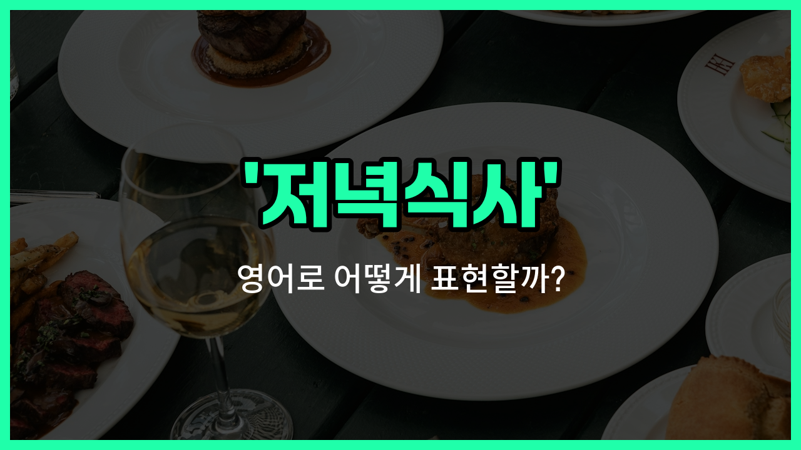

## 🌟 영어 표현 - dinner

안녕하세요 👋 오늘은 우리가 매일 사용하는 단어인 '**저녁식사**'의 영어 표현 '**dinner**'에 대해 알아보려고 해요.

'**dinner**'는 하루 중 저녁에 먹는 식사를 의미해요. 즉, **저녁에 가족이나 친구들과 함께 먹는 식사**를 말할 때 자연스럽게 쓸 수 있는 단어예요!

이 단어는 일상 대화뿐만 아니라, 식당 예약이나 초대 상황에서도 자주 사용돼요. 예를 들어, 친구에게 저녁을 같이 먹자고 할 때 "[Let](/blog/in-english/1112.let/)'s have dinner [together](/blog/in-english/374.together/)."라고 말할 수 있어요.

또한, 특별한 날에 열리는 '만찬'도 영어로 'dinner'라고 표현해요. 예를 들어, 회사에서 열리는 공식 저녁 모임은 '[company](/blog/in-english/1111.company/) dinner'라고 부를 수 있어요.

## 📖 예문

1. "오늘 저녁식사 뭐 먹을 거예요?"

   "What are you [going](/blog/in-english/1068.going/) to have for dinner [today](/blog/in-english/1132.today/)?"

2. "우리는 어제 가족과 함께 만찬을 즐겼어요."

   "We enjoyed a [family](/blog/in-english/1100.family/) dinner yesterday."

## 💬 연습해보기

<ul data-interactive-list>

  <li data-interactive-item>
    이번 주에 저녁 먹으러 언제 가면 좋을까? 다운타운에 맛있는 새 레스토랑이 생겼대!
    We should plan a dinner sometime this <a href="/blog/in-english/1129.week/">week</a>. I heard there's a <a href="/blog/in-english/1056.new/">new</a> <a href="/blog/in-english/1089.place/">place</a> downtown that's really good for dinner.
  </li>

  <li data-interactive-item>
    배고픈데, 영화 보고 나서 저녁 먹을래?
    I'm kind of <a href="/blog/in-english/437.hungry/">hungry</a>. Do you <a href="/blog/in-english/1060.want/">want</a> to grab dinner after the movie?
  </li>

  <li data-interactive-item>
    저녁은 7시까지 준비될 거니까, 늦지 않게 와줘!
    Dinner will be ready by 7 PM, so don't be <a href="/blog/in-english/391.late/">late</a>, please.
  </li>

  <li data-interactive-item>
    우리는 보통 6시쯤 저녁 먹는데, 오늘은 좀 더 늦게 먹을 수도 있어.
    We usually have dinner around 6 o'clock, but tonight we might eat <a href="/blog/in-english/1024.later/">later</a>.
  </li>

  <li data-interactive-item>
    친구 몇 명 초대해서 저녁 먹으려고 하는데, 가벼운 모임이 될 거야.
    I <a href="/blog/in-english/347.invite/">invited</a> <a href="/blog/in-english/911.a-few/">a few</a> <a href="/blog/in-english/1261.friend/">friends</a> over for dinner and it's going to be a <a href="/blog/in-english/150.casual/">casual</a> get-together.
  </li>

  <li data-interactive-item>
    엄마가 바쁘지 않을 때 저녁을 제일 잘 만드셔.
    My mom <a href="/blog/in-english/1209.makes/">makes</a> the <a href="/blog/in-english/1073.best/">best</a> dinner when she's not too <a href="/blog/in-english/372.busy/">busy</a> with <a href="/blog/in-english/1064.work/">work</a>.
  </li>

  <li data-interactive-item>
    힘든 하루 끝나고, 간단한 저녁과 여유로운 시간이 너무 좋다.
    After a <a href="/blog/in-english/1077.long/">long</a> <a href="/blog/in-english/1067.day/">day</a>, all I want is a simple dinner and some <a href="/blog/in-english/1055.time/">time</a> to relax.
  </li>

  <li data-interactive-item>
    이번 주말 저녁은 바비큐라고 말하는 거 잊었어!
    I <a href="/blog/in-english/023.forget/">forgot</a> to <a href="/blog/in-english/1270.tell/">tell</a> you that dinner is going to be a barbecue this weekend.
  </li>

  <li data-interactive-item>
    그 집의 저녁 대화는 항상 정말 신나고 재미있어.
    Dinner conversations at their <a href="/blog/in-english/1088.house/">house</a> are always very lively and fun.
  </li>

  <li data-interactive-item>
    금요일에 저녁 계획 있어? 새로 생긴 이탈리안 레스토랑 가볼까 생각 중이야.
    Do you have any dinner plans for Friday? I was <a href="/blog/in-english/1059.think/">thinking</a> we could <a href="/blog/in-english/1265.try/">try</a> that new Italian restaurant.
  </li>

</ul>

## 🤝 함께 알아두면 좋은 표현들

### supper

'supper'는 '저녁식사'와 비슷한 의미로, 특히 영국이나 일부 지역에서 저녁에 먹는 식사를 가리켜요. 'dinner'보다 조금 더 가벼운 식사나 늦은 저녁 식사를 의미할 때도 있어요.

- "We usually have supper around 7 PM after finishing our work."
- "우리는 보통 일을 마치고 오후 7시쯤에 저녁식사를 해요."

### breakfast

'breakfast'는 '아침식사'를 뜻해요. 'dinner'와는 반대되는 개념으로, 하루 중 첫 번째 식사를 의미해요. 보통 아침에 먹는 식사라서 시간대가 완전히 달라요.

- "I always eat a [healthy](/blog/in-english/1290.healthy/) breakfast before going to work."
- "저는 항상 출근하기 전에 건강한 아침식사를 해요."

### skip dinner

'[skip](/blog/in-english/369.skip/) dinner'는 '저녁식사를 거르다'라는 뜻이에요. 저녁을 먹지 않는 상황을 나타내며, 'dinner'를 하지 않는 반대 행동을 표현할 때 사용해요.

- "[Sometimes](/blog/in-english/270.sometimes/) I skip dinner if I'm not very hungry."
- "가끔 배가 별로 고프지 않으면 저녁식사를 거르기도 해요."

---

오늘은 '**저녁식사**', '**만찬**', '**저녁밥**'이라는 뜻을 가진 영어 표현 '**dinner**'에 대해 알아봤어요. 앞으로 저녁 약속이나 식사 이야기를 할 때 이 표현을 꼭 활용해 보세요 😊

오늘 배운 표현과 예문들을 꼭 최소 3번씩 소리 내서 읽어보세요. 다음에도 더 재미있고 유익한 영어 표현으로 찾아올게요! 감사합니다!

