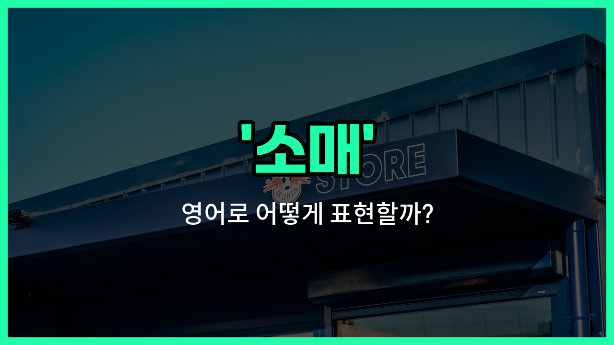

## 🌟 영어 표현 - retail

안녕하세요 👋 오늘은 '소매'라는 뜻을 가진 영어 표현 '**retail**'에 대해 알아보려고 해요. 'retail'은 상품을 소비자에게 직접 판매하는 것을 의미해요. 즉, 대량으로 판매하는 '도매(wholesale)'와는 반대로, 한 사람 한 사람에게 물건을 파는 걸 말해요!

'**retail**'은 우리가 마트, 편의점, 옷가게 등에서 물건을 살 때 자연스럽게 쓰이는 단어예요. 예를 들어, "이 제품은 소매가로 판매되고 있어요."라고 할 때 "This product is sold at retail [price](/blog/in-english/640.price/)."라고 표현할 수 있어요.

또한, 'retail'은 명사, 동사, 형용사로 다양하게 활용돼요. 명사로는 '소매', 동사로는 '소매로 팔다', 형용사로는 '소매의'라는 뜻이에요. 상황에 따라 적절하게 사용해 보세요!

## 📖 예문

1. "그 회사는 소매와 도매 둘 다 하고 있어요."

   "The [company](/blog/in-english/1111.company/) does both retail and wholesale."

2. "이 신발은 소매점에서만 구입할 수 있어요."

   "These shoes are only [available](/blog/in-english/188.available/) at retail [stores](/blog/in-english/1253.store/)."

## 💬 연습해보기

<ul data-interactive-list>

  <li data-interactive-item>
    나는 주로 대형 매장에서 쇼핑해요. 필요한 것을 한 곳에서 다 해결할 수 있거든요.
    I usually shop at a <a href="/blog/in-english/1095.big/">big</a> retail store because they have everything I need under one roof.
  </li>

  <li data-interactive-item>
    소매업계가 온라인 쇼핑의 인기로 빠르게 성장하고 있어요.
    The retail sector has been growing rapidly, especially with the rise of online shopping.
  </li>

  <li data-interactive-item>
    그는 의류와 액세서리를 판매하는 소매점에서 일하게 되었어요.
    He got a <a href="/blog/in-english/1101.job/">job</a> at a retail shop, selling clothes and accessories.
  </li>

  <li data-interactive-item>
    소매 가격은 추가 비용 때문에 도매 가격보다 보통 더 비쌉니다.
    Retail prices <a href="/blog/in-english/259.tend-to/">tend to</a> be higher than wholesale prices because of the added <a href="/blog/in-english/664.cost/">costs</a>.
  </li>

  <li data-interactive-item>
    우리는 독특한 수공예품을 찾기 위해 지역 소매 시장에 갔어요.
    We visited a <a href="/blog/in-english/1260.local/">local</a> retail <a href="/blog/in-english/641.market/">market</a> to <a href="/blog/in-english/1083.find/">find</a> some unique handmade items.
  </li>

  <li data-interactive-item>
    많은 사람들이 구매하기 전에 제품을 직접 보는 경험을 위해 소매점을 선호해요.
    Many <a href="/blog/in-english/1057.people/">people</a> <a href="/blog/in-english/191.prefer/">prefer</a> retail stores for the <a href="/blog/in-english/415.experience/">experience</a> of seeing products before <a href="/blog/in-english/1287.buy/">buying</a>.
  </li>

  <li data-interactive-item>
    소매업은 힘들지만 고객을 잘 이해하면 보람차요.
    The retail <a href="/blog/in-english/1125.business/">business</a> is <a href="/blog/in-english/183.tough/">tough</a> but rewarding if you understand your customers well.
  </li>

  <li data-interactive-item>
    그들은 친환경 제품에 초점을 맞춘 새로운 소매 체인을 도시에 열려고 해요.
    They're opening a <a href="/blog/in-english/1056.new/">new</a> retail chain in town that <a href="/blog/in-english/186.focus-on/">focuses on</a> eco-friendly products.
  </li>

  <li data-interactive-item>
    소매 직원들은 휴가철 세일 동안 많은 고객을 상대해야 해요.
    Retail workers <a href="/blog/in-english/326.often/">often</a> have to <a href="/blog/in-english/1137.deal/">deal</a> with a lot of customers during <a href="/blog/in-english/517.holiday/">holiday</a> <a href="/blog/in-english/1267.sale/">sales</a>.
  </li>

  <li data-interactive-item>
    회사는 올해 더 많은 매장을 열어 소매 존재감을 확장하기로 결정했어요.
    The company <a href="/blog/in-english/062.decide-to/">decided to</a> <a href="/blog/in-english/837.expand/">expand</a> its retail presence by opening more storefronts this <a href="/blog/in-english/1065.year/">year</a>.
  </li>

</ul>

## 🤝 함께 알아두면 좋은 표현들

### wholesale (도매)

'wholesale'은 '도매'를 의미하며, 주로 대량으로 상품을 구매하거나 판매하는 것을 말해요. 'retail'과는 반대 개념으로, 소매는 소비자에게 직접 판매하는 반면 도매는 주로 소매업자나 다른 사업자에게 판매할 때 사용해요.

- "The company sells products wholesale to various retailers across the [country](/blog/in-english/1218.country/)."
- "그 회사는 전국의 여러 소매업자들에게 도매로 제품을 판매해요."

### direct sales (직판)

'direct sales'는 '직판'을 의미하며, 중간 유통 과정을 거치지 않고 제조업체가 소비자에게 직접 판매하는 방식을 말해요. 소매와 비슷하지만 중간 상인이 없다는 점에서 차이가 있어요.

- "Many cosmetic companies [use](/blog/in-english/1079.use/) direct sales to reach customers more personally."
- "많은 화장품 회사들이 고객에게 더 직접적으로 다가가기 위해 직판 방식을 사용해요."

### consumer market (소비자 시장)

'[consumer](/blog/in-english/645.consumer/) market'은 '소비자 시장'을 뜻하며, 소매업이 주로 이 시장을 대상으로 한다는 점에서 관련된 표현이에요. 소비자들이 직접 상품을 구매하는 시장을 의미해요.

- "Retailers focus on the consumer market to tailor their products and [services](/blog/in-english/1225.service/)."
- "소매업자들은 제품과 서비스를 맞추기 위해 소비자 시장에 집중해요."

---

오늘은 '소매'라는 뜻의 영어 표현 '**retail**'에 대해 알아봤어요. 마트나 가게에서 물건을 살 때 이 단어를 떠올리면 좋겠어요 😊

오늘 배운 표현과 예문들을 꼭 최소 3번씩 소리 내서 읽어보세요. 다음에도 더 재미있고 유익한 영어 표현으로 찾아올게요! 감사합니다!

