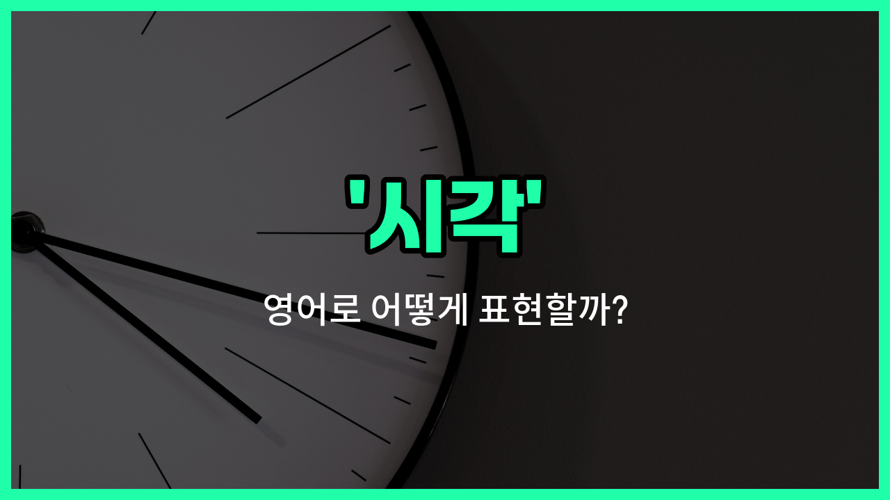

## 🌟 영어 표현 - clock time

안녕하세요 👋 오늘은 우리가 일상에서 자주 쓰는 '시각'이라는 표현의 영어 단어 '**clock [time](/blog/in-english/1055.time/)**'에 대해 알아보려고 해요.

'**clock time**'은 말 그대로 시계가 가리키는 정확한 시간을 의미해요. 즉, 우리가 흔히 말하는 '몇 시 몇 분'처럼 **정확한 시각**을 나타낼 때 사용하는 표현이에요!

이 단어는 약속 시간, 일정, 시험 시간 등 **정확한 시간**을 말해야 할 때 아주 유용하게 쓰여요. 예를 들어, "회의가 정확히 3시에 시작해요."라고 말하고 싶을 때 "The meeting [starts](/blog/in-english/1127.start/) at [exactly](/blog/in-english/419.exactly/) 3 o'clock clock time."라고 할 수 있어요.

또한, 'clock time'은 '현재 시각'이나 '정해진 시간'을 강조할 때도 사용돼요. 예를 들어, "현재 시각을 알려주세요."는 "Please [tell](/blog/in-english/1270.tell/) me the current clock time."라고 표현할 수 있어요.

## 📖 예문

1. "정확한 시각에 도착해야 해요."

   "You need to [arrive](/blog/in-english/403.arrive/) at the exact clock time."

2. "현재 시각이 몇 시인가요?"

   "What is the current clock time?"

## 💬 연습해보기

<ul data-interactive-list>

  <li data-interactive-item>
    공항 가기 전에 시계를 확인해야 해요. 비행기 늦고 싶지 않거든요.
    We need to check the clock time before we <a href="/blog/in-english/402.leave/">leave</a> for the <a href="/blog/in-english/549.airport/">airport</a>. I don't <a href="/blog/in-english/1060.want/">want</a> to be <a href="/blog/in-english/391.late/">late</a> for our flight.
  </li>

  <li data-interactive-item>
    회의 시간은 몇 시로 잡았어요? 제때 참여하고 싶어요.
    What clock time did you <a href="/blog/in-english/1117.set/">set</a> for the meeting? I want to <a href="/blog/in-english/232.make-sure/">make sure</a> I join <a href="/blog/vocab-1/043.on-time/">on time</a>.
  </li>

  <li data-interactive-item>
    내 핸드폰 시계가 한 시간 느려서, 이벤트가 언제 시작하는지 헷갈렸어요.
    The clock time on my phone is an hour behind, so I was confused about when the event <a href="/blog/in-english/1242.actually/">actually</a> started.
  </li>

  <li data-interactive-item>
    현재 뉴욕 시각이 몇 시인지 알려줄 수 있어요? 거기서 한 분과 전화 통화가 예정되어 있어요.
    Can you tell me the clock time in <a href="/blog/in-english/1056.new/">New</a> York <a href="/blog/in-english/525.right-now/">right now</a>? I have a call scheduled with someone there.
  </li>

  <li data-interactive-item>
    운동 시작할 때 항상 시각을 기록해요. 얼마나 운동했는지 확인하려고요.
    I always record the clock time when I start my workout to track how <a href="/blog/in-english/1077.long/">long</a> I <a href="/blog/in-english/1155.exercise/">exercise</a>.
  </li>

  <li data-interactive-item>
    파티에서 집에 돌아올 때 시계가 이미 자정이었어요.
    The clock time showed it was already midnight when we <a href="/blog/in-english/182.finally/">finally</a> got <a href="/blog/in-english/1076.home/">home</a> from the <a href="/blog/in-english/1212.party/">party</a>.
  </li>

  <li data-interactive-item>
    다른 시간대에 여행할 때 시계 설정하는 거 잊지 마세요.
    Don't <a href="/blog/in-english/023.forget/">forget</a> to set the clock time on your watch when you travel to a <a href="/blog/in-english/1115.different/">different</a> time zone.
  </li>

  <li data-interactive-item>
    기차 출발 시간이 오후 3시 45분이니까, 일찍 도착해야 해요.
    The clock time for the <a href="/blog/in-english/1147.train/">train</a> departure is 3:45 PM, so we should get there <a href="/blog/in-english/1283.early/">early</a>.
  </li>

  <li data-interactive-item>
    시험 보는 동안 모든 문제를 다 풀었는지 확인하려고 시계 계속 체크했어요.
    During the exam, I <a href="/blog/in-english/225.keep-an-eye-on/">kept an eye on</a> the clock time to make <a href="/blog/in-english/1098.sure/">sure</a> I finished all the questions.
  </li>

  <li data-interactive-item>
    전자레인지 시계가 깜박거려서 요리하기 전에 타이머를 재설정해야 했어요.
    The clock time on the microwave was flashing, so I had to reset the timer before <a href="/blog/in-english/461.cook/">cooking</a>.
  </li>

</ul>

## 🤝 함께 알아두면 좋은 표현들

### set the clock

'set the clock'은 "시계를 맞추다"라는 뜻이에요. 정확한 시각을 맞추거나 조정할 때 사용하는 표현이에요. 보통 시계가 틀렸을 때 올바른 시간으로 맞출 때 많이 써요.

- "I need to set the clock because it's 10 minutes slow."
- "시계가 10분 늦어서 맞춰야 해요."

### lose track of time

'[lose track of time](/blog/in-english/053.lose-track-of-time/)'은 "시간 가는 줄 모르다"라는 뜻이에요. 어떤 일에 몰두해서 시간이 얼마나 지났는지 모르는 상태를 나타내요. 시각을 잊거나 신경 쓰지 않는 상황에서 주로 사용해요.

- "She was so [focused on](/blog/in-english/186.focus-on/) her [book](/blog/in-english/447.book/) that she [lost](/blog/in-english/457.lose/) track of time."
- "그녀는 책에 너무 몰두해서 시간 가는 줄 몰랐어요."

### on the dot

'on the dot'은 "정각에"라는 뜻이에요. 정확한 시각에 맞춰서 어떤 일이 일어날 때 쓰는 표현이에요. 약속 시간이나 시작 시간을 정확히 지킬 때 많이 사용해요.

- "The meeting will start at 3 PM on the dot."
- "회의는 오후 3시에 정각에 시작할 거예요."

---

오늘은 '시각', '시간', '현재 시각'이라는 뜻을 가진 영어 표현 '**clock time**'에 대해 알아봤어요. 앞으로 정확한 시간을 말할 때 이 표현을 활용해 보세요! 😊

오늘 배운 표현과 예문들을 꼭 최소 3번씩 소리 내서 읽어보세요. 다음에도 더 재미있고 유익한 영어 표현으로 찾아올게요! 감사합니다!

