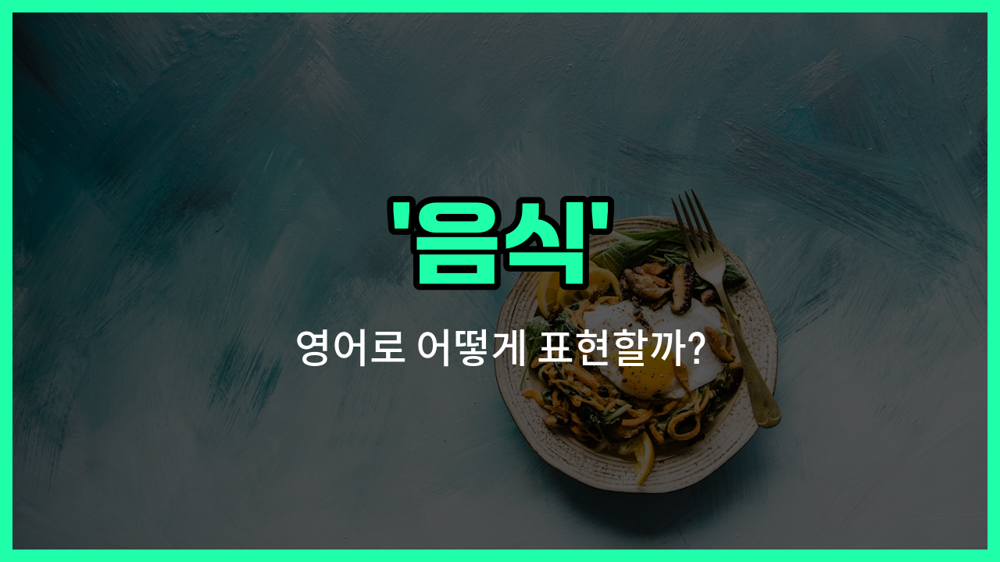

## 🌟 영어 표현 - food

안녕하세요 👋 오늘은 우리가 매일 사용하는 단어, 바로 '**음식**'의 영어 표현 '**food**'에 대해 알아보려고 해요.

'**food**'는 우리가 먹고 마시는 모든 것을 통틀어 말할 때 쓰는 단어예요. 즉, 밥, 반찬, 과일, 간식 등 **먹을 수 있는 모든 것**을 포함하는 아주 기본적이고 중요한 단어예요!

이 단어는 식사 시간, 요리, 장보기, 건강 등 다양한 상황에서 자연스럽게 사용돼요. 예를 들어, "맛있는 음식이 먹고 싶어요."라고 할 때 "I [want](/blog/in-english/1060.want/) to eat delicious food."라고 표현할 수 있어요.

또는, "음식이 부족해요."라고 말하고 싶다면 "There is not enough food."라고 할 수 있어요.

'**food**'는 명사로만 사용되며, '식사', '먹을 것'이라는 의미로도 자주 쓰이니 상황에 맞게 활용해 보세요.

## 📖 예문

1. "이 식당 음식이 정말 맛있어요."

   "The food at this restaurant is really delicious."

2. "건강한 음식을 먹는 것이 중요해요."

   "It's [important](/blog/in-english/318.important/) to eat [healthy](/blog/in-english/1290.healthy/) food."

## 💬 연습해보기

<ul data-interactive-list>

  <li data-interactive-item>
    너무 배고파요. 영화 시작하기 전에 뭔가 먹으러 가요.
    I'm <a href="/blog/in-english/503.starving/">starving</a>. <a href="/blog/in-english/1112.let/">Let</a>'s grab some food before the movie <a href="/blog/in-english/1127.start/">starts</a>.
  </li>

  <li data-interactive-item>
    그녀가 만든 음식을 소풍에 가져왔는데 정말 맛있었어요.
    She <a href="/blog/in-english/1139.bring/">brought</a> homemade food to the picnic, and it was delicious.
  </li>

  <li data-interactive-item>
    오늘 저녁은 배달 시킬까요, 아니면 요리할까요?
    Do you want to <a href="/blog/in-english/1263.order/">order</a> food or <a href="/blog/in-english/461.cook/">cook</a> tonight?
  </li>

  <li data-interactive-item>
    축제에는 다양한 나라의 음식들이 있었어요.
    The festival had all kinds of food from <a href="/blog/in-english/1115.different/">different</a> <a href="/blog/in-english/1218.country/">countries</a>.
  </li>

  <li data-interactive-item>
    저는 매운 음식을 먹지 않아요. 배가 아프거든요.
    I don't eat spicy food because it <a href="/blog/in-english/395.upset/">upsets</a> my stomach.
  </li>

  <li data-interactive-item>
    이번 주말 캠핑 가는 데 필요한 음식 좀 사야 해요.
    We need to <a href="/blog/in-english/1287.buy/">buy</a> some food for the camping <a href="/blog/in-english/1150.trip/">trip</a> this weekend.
  </li>

  <li data-interactive-item>
    그는 건강식에 관심이 많고, 정크푸드를 피해요.
    He's really into healthy food and <a href="/blog/in-english/924.avoid/">avoids</a> junk stuff.
  </li>

  <li data-interactive-item>
    주방에서 요리하는 신선한 음식 냄새가 나를 배고프게 만들었어요.
    The smell of fresh food cooking in the kitchen made me <a href="/blog/in-english/437.hungry/">hungry</a>.
  </li>

  <li data-interactive-item>
    음식은 전 세계 모든 문화에서 중요한 부분이에요.
    Food is an important part of every culture around the <a href="/blog/in-english/1071.world/">world</a>.
  </li>

  <li data-interactive-item>
    집에 가는 길에 음식 좀 사다 줄 수 있어요?
    Can you <a href="/blog/in-english/178.pick-up/">pick up</a> some food on your <a href="/blog/in-english/1062.way/">way</a> <a href="/blog/in-english/1076.home/">home</a>?
  </li>

</ul>

## 🤝 함께 알아두면 좋은 표현들

### cuisine

'cuisine'은 특정 지역이나 문화권의 전통적인 요리 스타일이나 음식을 의미해요. '음식'보다 좀 더 전문적이고 문화적인 맥락에서 자주 사용돼요.

- "Italian cuisine is famous for its pasta and pizza dishes."
- "이탈리아 음식은 파스타와 피자 요리로 유명해요."

### beverage

'beverage'는 '음료'를 뜻하는 말로, 음식과는 반대되는 개념이에요. 주로 마실 수 있는 것들을 가리킬 때 사용해요.

- "Would you [like](/blog/in-english/1053.like/) a beverage with your [meal](/blog/in-english/528.meal/)?"
- "식사와 함께 음료를 드시겠어요?"

### snack

'snack'은 주로 식사 사이에 간단히 먹는 가벼운 음식을 의미해요. '음식'보다 양이 적고 간단한 경우에 많이 쓰여요.

- "She grabbed a [quick](/blog/in-english/439.quick/) snack before heading out."
- "그녀는 나가기 전에 간단한 간식을 먹었어요."

---

오늘은 '**음식**'이라는 뜻을 가진 영어 표현 '**food**'에 대해 알아봤어요. 앞으로 식사나 요리와 관련된 대화를 할 때 이 단어를 꼭 활용해 보세요 😊

오늘 배운 표현과 예문들을 꼭 최소 3번씩 소리 내서 읽어보세요. 다음에도 더 재미있고 유익한 영어 표현으로 찾아올게요! 감사합니다!

