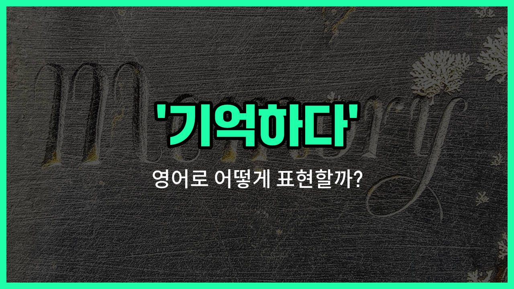

## 🌟 영어 표현 - remember

안녕하세요 👋 오늘은 우리가 자주 쓰는 표현인 '**기억하다**'의 영어 표현 '**remember**'에 대해 알아보려고 해요.

'**remember**'는 과거에 있었던 일이나 정보를 **잊지 않고 마음속에 간직하다**는 의미로 사용돼요. 즉, 어떤 사실이나 경험, 약속 등을 머릿속에 떠올릴 때 쓸 수 있는 단어예요!

이 단어는 일상 대화에서 정말 자주 등장해요. 예를 들어, 친구와의 약속을 잊지 않고 기억하고 있을 때 "I remember our meeting tomorrow."라고 말할 수 있어요.

또는, 누군가에게 과거의 일을 떠올려보라고 할 때 "Do you remember what happened yesterday?"라고 물어볼 수 있어요.

'**remember**'는 동사로만 쓰이며, '떠올리다', '상기하다'와 같은 의미로도 활용할 수 있으니 다양한 상황에서 자연스럽게 사용해 보세요!

## 📖 예문

1. "나는 그의 이름을 기억해요."

   "I remember his name."

2. "내일 해야 할 일을 꼭 기억하세요."

   "Please remember what you have to do tomorrow."

## 💬 연습해보기

<ul data-interactive-list>

  <li data-interactive-item>
    오늘 아침에 열쇠를 어디에 두었는지 기억이 안 나. 집에 혹시 본 사람 있어?
    I can't remember where I <a href="/blog/in-english/1106.left/">left</a> my keys this morning. Have you <a href="/blog/in-english/1231.seen/">seen</a> them anywhere around the <a href="/blog/in-english/1088.house/">house</a>?
  </li>

  <li data-interactive-item>
    우리가 등산 갔다가 길을 잃었던 때 기억나? 정말 멋진 모험이었지!
    Do you remember that <a href="/blog/in-english/1055.time/">time</a> we <a href="/blog/in-english/1245.went/">went</a> hiking and got <a href="/blog/in-english/457.lose/">lost</a>? That was quite an adventure!
  </li>

  <li data-interactive-item>
    나는 매주 일요일에 부모님께 꼭 전화하려고 해. 연락하는 게 중요하잖아.
    I always <a href="/blog/in-english/117.try-to/">try to</a> remember to call my parents every Sunday. It's <a href="/blog/in-english/318.important/">important</a> to stay in touch.
  </li>

  <li data-interactive-item>
    그녀는 그의 이름을 기억하지 못해서 그냥 '친구'라고 불렀어.
    She couldn't remember his name, so she just <a href="/blog/in-english/1114.called/">called</a> him 'buddy'.
  </li>

  <li data-interactive-item>
    방을 나가기 전에 불 끄는 거 잊지 마. 에너지를 절약할 수 있어.
    Remember to <a href="/blog/in-english/312.turn-off/">turn off</a> the lights before you <a href="/blog/in-english/402.leave/">leave</a> the room. It <a href="/blog/in-english/1084.help/">helps</a> <a href="/blog/in-english/293.save/">save</a> energy.
  </li>

  <li data-interactive-item>
    그는 갑자기 약속이 생각나서 문 밖으로 급히 나갔어.
    He suddenly remembered he had an appointment and rushed out the door.
  </li>

  <li data-interactive-item>
    어제 회의에 대한 세부사항을 기억하는 게 힘들어.
    It's <a href="/blog/in-english/1219.hard/">hard</a> for me to remember all the details from the meeting yesterday.
  </li>

  <li data-interactive-item>
    새로운 걸 배울 때 연습이 완벽을 만든다는 걸 기억해봐.
    <a href="/blog/in-english/1265.try/">Try</a> to remember that <a href="/blog/in-english/247.practice/">practice</a> <a href="/blog/in-english/1209.makes/">makes</a> <a href="/blog/in-english/413.perfect/">perfect</a> when you're <a href="/blog/in-english/245.learn/">learning</a> something <a href="/blog/in-english/1056.new/">new</a>.
  </li>

  <li data-interactive-item>
    나는 처음 스시를 먹어봤던 때를 선명하게 기억해. 맛이 괜찮은지 안 괜찮은지 잘 모르겠더라.
    I distinctly remember the first time I tried sushi. I wasn't <a href="/blog/in-english/1098.sure/">sure</a> if I <a href="/blog/in-english/1053.like/">liked</a> it or not.
  </li>

  <li data-interactive-item>
    작년 이맘때 뭘 하고 있었는지 기억할 수 있어?
    Can you remember what you were doing this time last <a href="/blog/in-english/1065.year/">year</a>?
  </li>

</ul>

## 🤝 함께 알아두면 좋은 표현들

### recall

'recall'은 '기억해내다' 또는 '상기하다'라는 뜻이에요. 'remember'와 비슷하지만, 보통 어떤 정보를 의식적으로 떠올릴 때 더 자주 사용돼요.

- "I can recall the [day](/blog/in-english/1067.day/) we first met clearly."
- "우리가 처음 만난 날을 나는 뚜렷이 기억할 수 있어요."

### forget

'[forget](/blog/in-english/023.forget/)'은 '잊다'라는 뜻으로, 'remember'의 반대말이에요. 어떤 정보를 기억하지 못하거나 잊어버리는 상황을 나타낼 때 사용해요.

- "I forgot to [bring](/blog/in-english/1139.bring/) my keys this morning."
- "나는 오늘 아침에 열쇠를 가져오는 것을 잊었어요."

### keep in mind

'[keep in mind](/blog/in-english/222.keep-in-mind/)'는 '명심하다' 또는 '잊지 않다'라는 뜻이에요. 어떤 사실이나 정보를 계속 기억하고 주의하는 것을 의미해요.

- "Please keep in mind the [deadline](/blog/in-english/830.deadline/) for the project is next Friday."
- "프로젝트 마감일이 다음 주 금요일이라는 것을 명심해 주세요."

---

오늘은 '**기억하다**'라는 뜻을 가진 영어 표현 '**remember**'에 대해 알아봤어요. 앞으로 무언가를 잊지 않고 떠올릴 때 이 표현을 활용해 보세요 😊

오늘 배운 표현과 예문들을 꼭 최소 3번씩 소리 내서 읽어보세요. 다음에도 더 재미있고 유익한 영어 표현으로 찾아올게요! 감사합니다!

