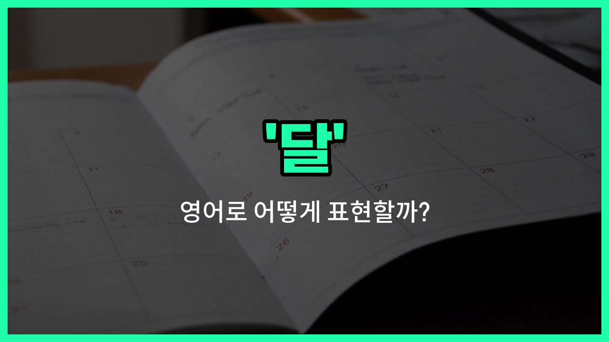

## 🌟 영어 표현 - month

안녕하세요 👋 오늘은 우리가 자주 쓰는 단어인 '**달**'을 영어로 어떻게 표현하는지 알아보려고 해요. 바로 '**month**'라는 단어를 사용해요. 'month'는 한 해를 12등분한 기간, 즉 1월부터 12월까지의 각각을 의미해요.

또한, 'month'는 '월'이나 '개월'처럼 **기간**을 나타낼 때도 자주 쓰여요. 예를 들어, '3개월'은 'three months'라고 표현해요. 일상 대화, 일정 잡기, 계획 세우기 등 다양한 상황에서 꼭 필요한 단어예요!

## 📖 예문

1. "나는 다음 달에 여행을 갈 거예요."

   "I will travel next month."

2. "이 프로젝트는 두 달이 걸릴 거예요."

   "This project will take two months."

## 💬 연습해보기

<ul data-interactive-list>

  <li data-interactive-item>
    다음 달에 치과 예약이 있어요. 마지막 검사한 지 좀 됐거든요.
    I have a dentist appointment scheduled next month. It's been a while since my last checkup.
  </li>

  <li data-interactive-item>
    프로젝트 기한이 월말이라서 진짜 빨리 진행해야 해요.
    The project <a href="/blog/in-english/830.deadline/">deadline</a> is at the <a href="/blog/in-english/1093.end/">end</a> of the month, so we really need to get moving on it.
  </li>

  <li data-interactive-item>
    사촌이 지난달에 아기를 낳았는데, 벌써 너무 귀엽더라고요!
    My cousin just had a baby last month, and they're already so cute!
  </li>

  <li data-interactive-item>
    우리 보통 한 달에 한 번씩 휴가 가서 일에서 좀 쉬어요.
    We usually go on <a href="/blog/in-english/516.vacation/">vacation</a> once a month to <a href="/blog/in-english/202.take-a-break/">take a break</a> from <a href="/blog/in-english/1064.work/">work</a>.
  </li>

  <li data-interactive-item>
    이 다이어트를 시작한 지 거의 한 달 됐는데, 벌써 기분이 좋아졌어요.
    It's been <a href="/blog/in-english/854.almost/">almost</a> a month since I <a href="/blog/in-english/1127.start/">started</a> this diet, and I'm already <a href="/blog/in-english/1096.feel/">feeling</a> <a href="/blog/in-english/1082.better/">better</a>.
  </li>

  <li data-interactive-item>
    콘서트가 다음 달에 열린다고 발표했으니, 곧 티켓 사야 해요.
    They <a href="/blog/in-english/816.announce/">announced</a> the concert will happen next month, so I need to <a href="/blog/in-english/1287.buy/">buy</a> tickets soon.
  </li>

  <li data-interactive-item>
    저는 한 달에 한 번 월급을 받아서, 잘 예산을 세워야 해요.
    I get <a href="/blog/in-english/1271.paid/">paid</a> once a month, so I have to <a href="/blog/in-english/661.budget/">budget</a> carefully.
  </li>

  <li data-interactive-item>
    그녀가 이번 달 중에 우리를 찾아온다고 했는데, 날짜는 아직 정하지 않았어요.
    She <a href="/blog/in-english/1061.said/">said</a> she'll visit us sometime this month, but she hasn't picked a date yet.
  </li>

  <li data-interactive-item>
    우리 헬스장 멤버십이 매달 갱신되니까, 제때 결제하는 거 잊지 마세요.
    Our <a href="/blog/in-english/431.gym/">gym</a> membership renews every month, so don't <a href="/blog/in-english/023.forget/">forget</a> to pay on <a href="/blog/in-english/1055.time/">time</a>.
  </li>

  <li data-interactive-item>
    그 영화 아직 못 봤는데, 지난달에 나왔다는 얘기를 들었어요.
    I haven't <a href="/blog/in-english/1231.seen/">seen</a> that movie yet, but I heard it came out last month.
  </li>

</ul>

## 🤝 함께 알아두면 좋은 표현들

### calendar month

'calendar month'는 "**달력상의 한 달**"을 의미해요. 보통 특정 날짜부터 시작해서 같은 날짜까지의 기간을 나타낼 때 사용해요. 예를 들어, 1월 15일부터 2월 15일까지가 한 calendar month가 될 수 있어요.

- "The rent is due on the first [day](/blog/in-english/1067.day/) of each calendar month."
- "월세는 매달 첫째 날에 내야 해요."

### fortnight

'fortnight'는 "**2주간, 14일**"을 뜻해요. 달(month)보다 기간이 짧은 단위로, 주로 영국식 영어에서 많이 쓰여요. 달과는 달리 2주 단위로 시간을 셀 때 사용해요.

- "She will stay with us for a fortnight during the [holidays](/blog/in-english/517.holiday/)."
- "그녀는 휴가 동안 2주간 우리 집에 머물 거예요."

### year

'[year](/blog/in-english/1065.year/)'는 "**1년**"을 의미해요. 달(month)의 상위 개념으로, 12달이 모여 1년이 돼요. 달과는 반대로 더 긴 기간을 나타낼 때 쓰여요.

- "The project is expected to be completed within a year."
- "그 프로젝트는 1년 안에 완료될 것으로 예상돼요."

---

오늘은 '**달**', '**월**', '**개월**'이라는 뜻을 가진 영어 표현 '**month**'에 대해 알아봤어요. 앞으로 날짜나 기간을 말할 때 이 단어를 꼭 활용해 보세요 😊

오늘 배운 표현과 예문들을 꼭 최소 3번씩 소리 내서 읽어보세요. 다음에도 더 재미있고 유익한 영어 표현으로 찾아올게요! 감사합니다!

