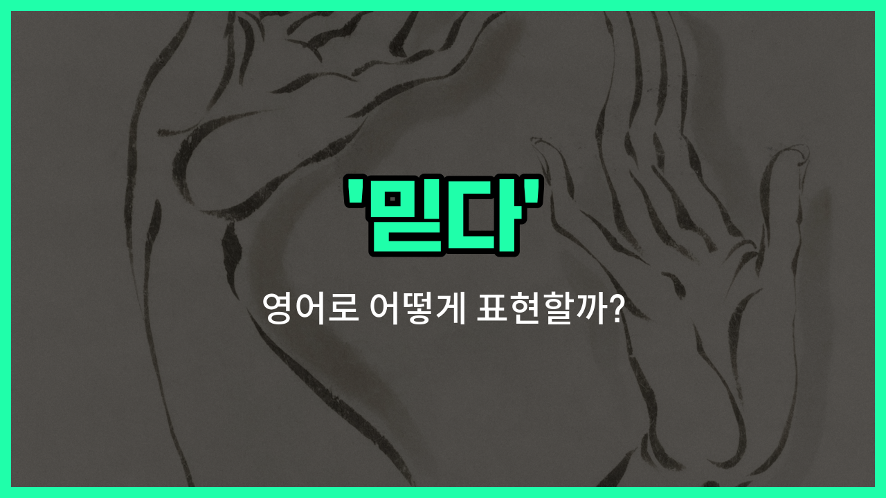

## 🌟 영어 표현 - believe

안녕하세요 👋 오늘은 우리가 자주 쓰는 단어 '**믿다**'의 영어 표현 '**believe**'에 대해 알아보려고 해요.

'**believe**'는 어떤 사실이나 사람, 혹은 상황을 **진심으로 신뢰하거나 확신하는 마음**을 나타낼 때 쓰는 단어예요. 즉, 누군가의 말이나 어떤 정보를 의심하지 않고 받아들일 때 자연스럽게 사용할 수 있어요!

이 단어는 일상 대화에서 정말 자주 등장해요. 예를 들어, 친구가 좋은 소식을 전해줬을 때 "I can't believe it!"이라고 말하면 "믿을 수가 없어!"라는 뜻이에요.

또는, 누군가를 신뢰한다는 의미로 "I believe you."라고 말할 수 있어요. 이때는 "난 너를 믿어."라는 따뜻한 의미가 담겨 있답니다.

## 📖 예문

1. "나는 네 말을 믿어요."

   "I believe you."

2. "그 이야기가 사실이라고 믿어요."

   "I believe that [story](/blog/in-english/537.story/) is true."

3. "스스로를 믿어야 해요."

   "You have to believe in yourself."

## 💬 연습해보기

<ul data-interactive-list>

  <li data-interactive-item>
    나는 너와 너의 성공 능력을 정말 믿어. 힘든 시기에도 일이 나아질 거라고 믿는 게 중요해.
    I really believe in you and your ability to succeed. It's <a href="/blog/in-english/318.important/">important</a> to believe that things will get <a href="/blog/in-english/1082.better/">better</a> even when <a href="/blog/in-english/1055.time/">times</a> are <a href="/blog/in-english/183.tough/">tough</a>.
  </li>

  <li data-interactive-item>
    그가 말한 잃어버린 열쇠에 대해 너는 믿어? 나는 잘 모르겠어. 가끔은 다른 사람들이 뭐라고 하든 자신을 믿어야 해.
    Do you believe what he <a href="/blog/in-english/1061.said/">said</a> about the <a href="/blog/in-english/339.miss/">missing</a> keys? I'm not so <a href="/blog/in-english/1098.sure/">sure</a> myself. <a href="/blog/in-english/270.sometimes/">Sometimes</a> you just have to believe in yourself, <a href="/blog/in-english/229.no-matter-what/">no matter what</a> others <a href="/blog/in-english/1059.think/">think</a>.
  </li>

  <li data-interactive-item>
    그녀는 처음에 그 소식을 믿지 않았는데, 사진을 보고나서야 믿게 되었어. 올해가 이렇게 빠르게 지나간 건 믿을 수가 없어.
    She didn't believe the <a href="/blog/in-english/536.news/">news</a> <a href="/blog/in-english/184.at-first/">at first</a>, but then she saw the photos. I just can't believe how fast this <a href="/blog/in-english/1065.year/">year</a> has gone by.
  </li>

  <li data-interactive-item>
    나는 예전에는 모든 일이 이유가 있어서 일어난다고 믿었어. 부모님은 항상 정직함을 믿으라고 하셨어.
    I <a href="/blog/in-english/143.used-to/">used to</a> believe that everything happens for a reason. My parents always <a href="/blog/in-english/1270.tell/">told</a> me to believe in honesty above everything else.
  </li>

  <li data-interactive-item>
    어떤 사람들은 유령을 믿기 힘들어하지만, 나는 이상한 경험을 한 적이 있어. 믿거나 말거나, 어젯밤 유성목을 보고 소원을 빌었어.
    Some <a href="/blog/in-english/1057.people/">people</a> <a href="/blog/in-english/1083.find/">find</a> it <a href="/blog/in-english/1219.hard/">hard</a> to believe in ghosts, but I've had some <a href="/blog/in-english/983.strange/">strange</a> <a href="/blog/in-english/415.experience/">experiences</a>. Believe it or not, I saw a shooting star last <a href="/blog/in-english/1110.night/">night</a> and made a wish.
  </li>

  <li data-interactive-item>
    그가 정말로 일을 그만두겠다고 믿지 않아. 그건 나한테 소문처럼 들려. 네가 전에 이걸 시도해보지 않았다는 게 믿기 힘들어; 꽤 인기 있어.
    I don't believe he's really quitting his <a href="/blog/in-english/1101.job/">job</a>. That <a href="/blog/in-english/1278.sound/">sounds</a> <a href="/blog/in-english/1053.like/">like</a> a <a href="/blog/in-english/798.rumor/">rumor</a> to me. <a href="/blog/in-english/111.hard-to/">It's hard to</a> believe you haven't <a href="/blog/in-english/1265.try/">tried</a> this before; it's pretty popular.
  </li>

  <li data-interactive-item>
    다른 사람들이 너를 진지하게 대해주길 원한다면 네 아이디어를 믿어야 해. 나는 부지런히 일하는 사람에게 좋은 일이 생긴다고 믿어.
    You need to believe in your ideas if you <a href="/blog/in-english/1060.want/">want</a> others to take you seriously. I believe that good things come to those who <a href="/blog/in-english/1064.work/">work</a> hard.
  </li>

  <li data-interactive-item>
    요즘 기름값이 이렇게 비싸다는 걸 믿을 수 있어? 이렇게 오랜 시간이 지났는데도 그녀가 내 생일을 기억했다는 게 믿기지 않아.
    Can you believe how <a href="/blog/in-english/317.expensive/">expensive</a> gas is nowadays? I just can't believe she <a href="/blog/in-english/1311.remember/">remembered</a> my birthday after all these <a href="/blog/in-english/1066.years/">years</a>.
  </li>

  <li data-interactive-item>
    그가 나에게 정말 미친 이야기를 해줬는데, 그를 믿어야 할지 농담으로 넘겨야 할지 모르겠어. 그녀가 고등학교 때와 얼마나 달라졌는지 믿기 힘들어.
    He <a href="/blog/in-english/1246.told/">told</a> me a crazy story, and I didn't <a href="/blog/in-english/1058.know/">know</a> whether to believe him or joke along. It's hard to believe how much she's <a href="/blog/in-english/1133.change/">changed</a> since <a href="/blog/in-english/1069.high/">high</a> <a href="/blog/in-english/1090.school/">school</a>.
  </li>

</ul>

## 🤝 함께 알아두면 좋은 표현들

### trust

'[trust](/blog/in-english/880.trust/)'는 '믿다'와 비슷한 의미로, 누군가나 무언가가 신뢰할 만하다고 생각할 때 사용하는 표현이에요. 보통 사람이나 시스템, 정보 등에 대해 신뢰감을 나타낼 때 많이 써요.

- "I trust my [best](/blog/in-english/1073.best/) [friend](/blog/in-english/1261.friend/) to keep my secrets."
- "나는 내 가장 친한 친구가 내 비밀을 지켜줄 거라고 믿어요."

### doubt

'[doubt](/blog/in-english/307.doubt/)'는 '의심하다'라는 뜻으로, 'believe'의 반대 의미예요. 어떤 사실이나 사람의 말이 진실인지 확신하지 못할 때 사용해요.

- "She doubted the accuracy of the news report."
- "그녀는 그 뉴스 보도의 정확성을 의심했어요."

### have faith in

'have faith in'은 '믿음을 가지다'라는 뜻으로, 특히 종교적이거나 깊은 신뢰를 표현할 때 쓰여요. 단순한 믿음보다 더 강한 신뢰나 희망을 내포해요.

- "He has faith in the [team](/blog/in-english/1099.team/)'s ability to [win](/blog/in-english/456.win/) the championship."
- "그는 팀이 챔피언십에서 이길 수 있다고 믿고 있어요."

---

오늘은 '**믿다**'라는 뜻을 가진 영어 표현 '**believe**'에 대해 알아봤어요. 누군가를 신뢰하거나 어떤 사실을 받아들일 때 이 표현을 꼭 떠올려 보세요 😊

오늘 배운 표현과 예문들을 소리 내서 여러 번 읽어보면 더 자연스럽게 쓸 수 있을 거예요. 다음에도 더 유익한 영어 표현으로 찾아올게요! 감사합니다!

