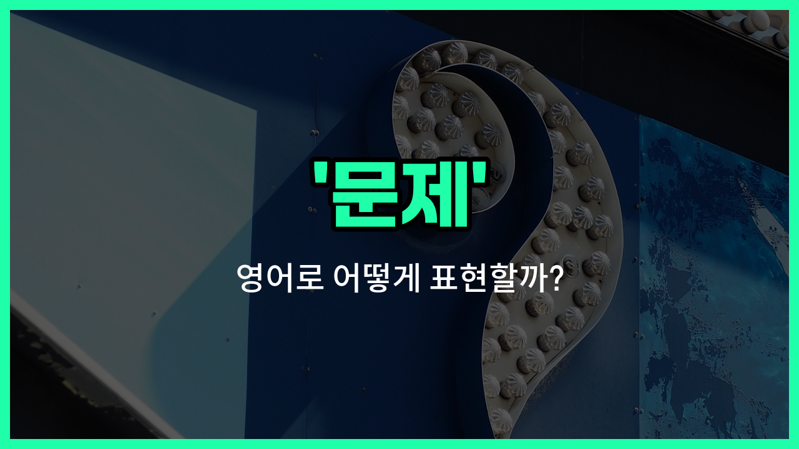

## 🌟 영어 표현 - matter

안녕하세요 👋 오늘은 영어에서 자주 쓰이는 단어 '**matter**'에 대해 알아보려고 해요. '**matter**'는 '문제', '사안', '중요한 일'과 같은 의미로 자주 사용돼요.

이 단어는 어떤 상황에서 중요한 이슈나 논의해야 할 주제를 말할 때 쓰여요. 예를 들어, "이건 중요한 문제야"라고 말하고 싶을 때 "This is an [important](/blog/in-english/318.important/) matter."라고 표현할 수 있어요.

또한, 일상 대화에서 "무슨 일이야?"라고 물을 때도 "What's the matter?"라고 자연스럽게 사용할 수 있어요. 이처럼 '**matter**'는 공식적인 상황뿐만 아니라 일상적인 대화에서도 정말 많이 쓰이는 단어예요!

## 📖 예문

1. "이건 회사에 중요한 문제예요."

   "This is a matter of importance for the [company](/blog/in-english/1111.company/)."

2. "무슨 일이에요?"

   "What's the matter?"

## 💬 연습해보기

<ul data-interactive-list>

  <li data-interactive-item>
    조금 늦어도 괜찮으니까, 빨리 와 줘요.
    It's no <a href="/blog/in-english/1095.big/">big</a> matter if you're a <a href="/blog/in-english/1085.little/">little</a> <a href="/blog/in-english/391.late/">late</a>, just <a href="/blog/in-english/117.try-to/">try to</a> get here soon.
  </li>

  <li data-interactive-item>
    우리가 논의해야 할 핵심은 이번 분기 판매 향상 방법이에요.
    The main matter we need to discuss is how to <a href="/blog/in-english/394.improve/">improve</a> <a href="/blog/in-english/1267.sale/">sales</a> this quarter.
  </li>

  <li data-interactive-item>
    걱정하지 마세요, 싱크대 아래 누수는 간단하게 고칠 수 있어요.
    Don't worry, it's a simple matter to <a href="/blog/in-english/524.fix/">fix</a> the leak under the sink.
  </li>

  <li data-interactive-item>
    사무실에서는 없어졌던 열쇠 때문에 다들 머리가 아프고 있어요.
    The matter of the <a href="/blog/in-english/339.miss/">missing</a> keys has everyone puzzled at the office.
  </li>

  <li data-interactive-item>
    안전 문제에서는 사소한 것도 중요하니까, 항상 주의해야 해요.
    <a href="/blog/in-english/269.when-it-comes-to/">When it comes to</a> <a href="/blog/in-english/1275.safety/">safety</a>, every little matter <a href="/blog/in-english/459.count/">counts</a>, so stay alert.
  </li>

  <li data-interactive-item>
    이건 개인적인 문제니까, 다른 사람들에게 얘기하지 말아 주세요.
    This is a private matter, so please don't <a href="/blog/in-english/248.share/">share</a> it with anyone else.
  </li>

  <li data-interactive-item>
    눈앞의 문제는 우리가 프로젝트 마감일을 제때 맞출 수 있을지예요.
    The matter at <a href="/blog/in-english/1239.hand/">hand</a> is whether we can meet the project <a href="/blog/in-english/830.deadline/">deadline</a> on <a href="/blog/in-english/1055.time/">time</a>.
  </li>

  <li data-interactive-item>
    우리가 시작해야 할 때는 언제일지가 문제지, 해야 할지의 문제는 아니에요.
    It's not a matter of if we should, but when we should <a href="/blog/in-english/1127.start/">start</a> the <a href="/blog/in-english/1056.new/">new</a> <a href="/blog/in-english/617.campaign/">campaign</a>.
  </li>

  <li data-interactive-item>
    새로운 규정이 생기면서 일이 복잡해졌어요.
    The matter got complicated after they <a href="/blog/in-english/262.introduce/">introduced</a> new regulations.
  </li>

  <li data-interactive-item>
    고객 불만 처리는 항상 조심스럽게 다뤄야 하는 세심한 문제예요.
    <a href="/blog/in-english/1152.handle/">Handling</a> customer complaints is always a delicate matter that needs <a href="/blog/in-english/1126.care/">care</a>.
  </li>

</ul>

## 🤝 함께 알아두면 좋은 표현들

### issue

'issue'는 '문제' 또는 '쟁점'을 의미해요. 주로 토론이나 논의가 필요한 중요한 문제를 가리킬 때 사용해요. 'matter'보다 좀 더 공식적이고 심각한 상황에서 자주 쓰여요.

- "The company is [facing](/blog/in-english/1252.face/) a [serious](/blog/in-english/146.serious/) issue with its new product."
- "그 회사는 신제품과 관련해 심각한 문제에 직면해 있어요."

### concern

'concern'은 '걱정거리'나 '관심사'를 뜻해요. 문제가 될 수 있는 상황이나 사람들의 관심을 끄는 사안을 나타낼 때 사용해요. 'matter'와 비슷하지만 좀 더 개인적이고 감정적인 뉘앙스가 있어요.

- "Environmental pollution is a major concern for many [people](/blog/in-english/1057.people/)."
- "환경 오염은 많은 사람들에게 큰 걱정거리예요."

### solution

'solution'은 '해결책'이라는 뜻으로, 'matter'와는 반대되는 개념이에요. 문제가 있을 때 그 문제를 해결하는 방법이나 답을 의미해요.

- "We need to [find](/blog/in-english/1083.find/) a solution to this matter quickly."
- "우리는 이 문제에 대한 해결책을 빨리 찾아야 해요."

---

오늘은 '문제', '사안', '중요한 일'이라는 뜻을 가진 영어 표현 '**matter**'에 대해 알아봤어요. 앞으로 중요한 이슈나 상황을 영어로 말할 때 이 표현을 꼭 활용해 보세요 😊

오늘 배운 표현과 예문들을 꼭 최소 3번씩 소리 내서 읽어보세요. 다음에도 더 재미있고 유익한 영어 표현으로 찾아올게요! 감사합니다!

