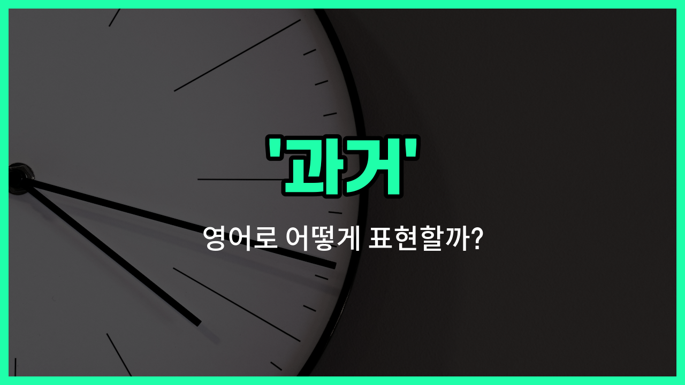

## 🌟 영어 표현 - past

안녕하세요 👋 오늘은 영어로 '**과거**'를 어떻게 표현하는지 알아보려고 해요. 우리가 흔히 쓰는 '과거', '지난날', '예전' 같은 단어를 영어로는 '**past**'라고 해요.

'**past**'는 이미 지나간 시간, 즉 **이전의 시간이나 사건**을 말할 때 사용해요. 예를 들어, 어릴 적 기억이나 예전에 있었던 일, 또는 역사적인 사건을 이야기할 때 자연스럽게 쓸 수 있어요.

또한, '과거'라는 의미 외에도 '지난', '예전의'라는 형용사로도 자주 쓰여요. 그래서 '지난 주', '지난 몇 년'처럼 기간을 표현할 때도 활용할 수 있어요.

## 📖 예문

1. "나는 과거를 잊고 싶어요."

   "I [want](/blog/in-english/1060.want/) to [forget](/blog/in-english/023.forget/) [the past](/blog/in-english/801.the-past/)."

2. "과거의 실수에서 배우는 것이 중요해요."

   "It's [important](/blog/in-english/318.important/) to [learn](/blog/in-english/245.learn/) from past mistakes."

3. "그는 지난날을 자주 떠올려요."

   "He [often](/blog/in-english/326.often/) [thinks](/blog/in-english/1059.think/) about the past."

## 💬 연습해보기

<ul data-interactive-list>

  <li data-interactive-item>
    내 과거를 생각하면, 어렸을 때 우리가 다녔던 재밌는 여행들이 떠오르네.
    When I think about my past, I <a href="/blog/in-english/1311.remember/">remember</a> all the fun <a href="/blog/in-english/1150.trip/">trips</a> we <a href="/blog/in-english/1237.took/">took</a> as kids.
  </li>

  <li data-interactive-item>
    그녀는 과거의 실수에서 많은 걸 배웠고, 이제는 다르게 처리해요.
    She learned a lot from her past mistakes and now <a href="/blog/in-english/1152.handle/">handles</a> things differently.
  </li>

  <li data-interactive-item>
    예전에는 지금처럼 스마트폰이 없었어요.
    In the past, <a href="/blog/in-english/1057.people/">people</a> didn't have smartphones <a href="/blog/in-english/1053.like/">like</a> we do <a href="/blog/in-english/1132.today/">today</a>.
  </li>

  <li data-interactive-item>
    내 과거의 결정을 돌이켜보면, 다른 길을 선택했어야 했던 것 같아요.
    <a href="/blog/in-english/1078.look/">Looking</a> back at my past decisions, I <a href="/blog/in-english/166.realize/">realize</a> I should have taken a <a href="/blog/in-english/1115.different/">different</a> path.
  </li>

  <li data-interactive-item>
    그는 해외 여행 중에 자신의 과거 경험에 대해 자주 이야기해요.
    He often <a href="/blog/in-english/1294.talk/">talks</a> about his past <a href="/blog/in-english/415.experience/">experiences</a> during his travels abroad.
  </li>

  <li data-interactive-item>
    내 과거의 직장들이 팀워크와 책임감에 대해 많은 걸 가르쳐 줬어요.
    My past <a href="/blog/in-english/1101.job/">jobs</a> taught me a lot about teamwork and <a href="/blog/in-english/932.responsibility/">responsibility</a>.
  </li>

  <li data-interactive-item>
    최근 몇 년 동안 기술이 정말 빠르게 변화했어요.
    During the past few <a href="/blog/in-english/1065.year/">years</a>, technology has <a href="/blog/in-english/1133.change/">changed</a> so rapidly.
  </li>

  <li data-interactive-item>
    나는 과거에 연연하지 않고 현재에 집중하려고 해요.
    I'm <a href="/blog/in-english/1265.try/">trying</a> not to dwell on the past and <a href="/blog/in-english/186.focus-on/">focus on</a> the present instead.
  </li>

  <li data-interactive-item>
    그녀의 이전 연애는 힘들었지만, 그녀를 더 강하게 만들어 줬어요.
    Her past relationship was difficult, but it <a href="/blog/in-english/1084.help/">helped</a> her grow stronger.
  </li>

  <li data-interactive-item>
    예전에는 주말이 친구들과 쉴 수 있는 제일 좋은 시간이었어요.
    Back in the past, weekends were my favorite <a href="/blog/in-english/1055.time/">time</a> to relax and <a href="/blog/in-english/021.catch-up-on/">catch up</a> with <a href="/blog/in-english/1261.friend/">friends</a>.
  </li>

</ul>

## 🤝 함께 알아두면 좋은 표현들

### history

'[history](/blog/in-english/532.history/)'는 '과거의 사건이나 경험'을 의미해요. 주로 인류나 개인의 과거 사실들을 기록하거나 연구할 때 사용해요. 'past'보다 좀 더 공식적이고 학문적인 느낌이 있어요.

- "She studied the history of ancient civilizations in college."
- "그녀는 대학에서 고대 문명의 역사를 공부했어요."

### present (현재)

'present'는 '현재'를 의미해요. 'past'의 반대말로, 지금 이 순간이나 현재 시점을 나타낼 때 사용해요. 시간의 흐름에서 과거와 미래 사이에 위치한 시점을 가리켜요.

- "We should focus on the present rather than [worrying about](/blog/in-english/209.worry-about/) the past."
- "우리는 과거에 대해 걱정하기보다는 현재에 집중해야 해요."

### future (미래)

'[future](/blog/in-english/1326.future/)'는 '미래'를 뜻해요. 'past'와는 반대되는 개념으로, 아직 오지 않은 시간이나 앞으로 일어날 일을 나타낼 때 사용해요.

- "Planning for the future is important to achieve your goals."
- "목표를 이루기 위해서는 미래를 계획하는 것이 중요해요."

---

오늘은 '과거', '지난날', '예전'이라는 뜻을 가진 영어 표현 '**past**'에 대해 알아봤어요. 예전 이야기를 할 때 이 단어를 떠올리면 좋겠어요 😊

오늘 배운 표현과 예문들을 꼭 소리 내서 여러 번 읽어보세요. 다음에도 더 유익한 영어 표현으로 찾아올게요! 감사합니다!

