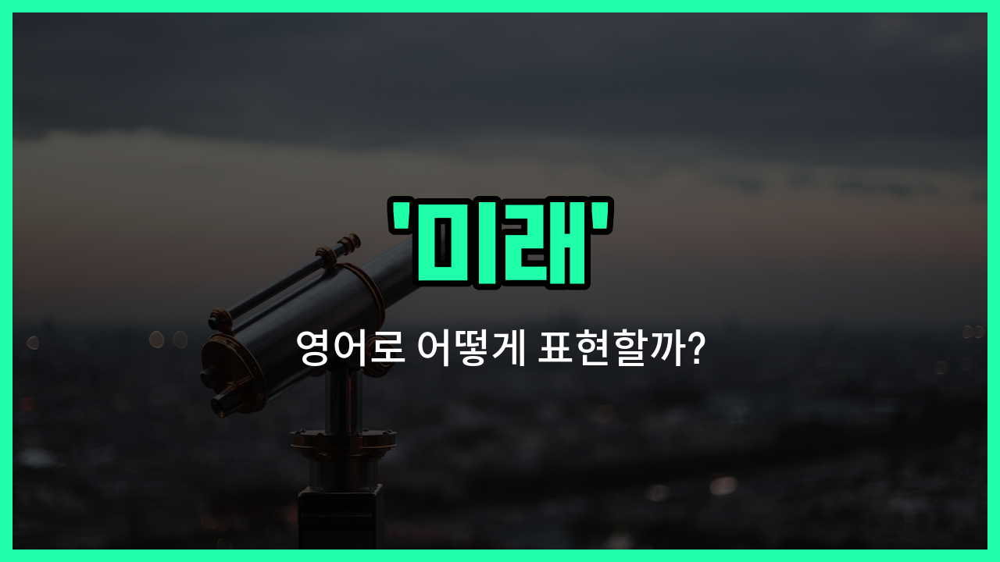

## 🌟 영어 표현 - future

안녕하세요 👋 오늘은 '미래'라는 뜻을 가진 영어 표현을 소개해드리려고 해요. 바로 '**future**'라는 단어인데요. 이 단어는 우리가 앞으로 겪게 될 시간, 즉 아직 오지 않은 '장래'나 '앞날'을 의미해요.

'future'는 일상 대화뿐만 아니라, 계획, 꿈, 목표 등 다양한 상황에서 자주 쓰이는 단어예요. 예를 들어, "나는 미래에 의사가 되고 싶어요."라고 말하고 싶을 때 "I [want](/blog/in-english/1060.want/) to be a [doctor](/blog/in-english/563.doctor/) in the future."라고 표현할 수 있어요.

또한, 'future'는 명사로 '미래', 형용사로는 '미래의'라는 뜻으로도 활용돼요. 예를 들어, '미래 계획'은 'future plans'라고 해요.

## 📖 예문

1. "나는 내 미래에 대해 생각하고 있어요."

   "I am [thinking](/blog/in-english/1059.think/) about my future."

2. "그녀는 미래에 해외에서 살고 싶어해요."

   "She wants to [live](/blog/in-english/1134.live/) abroad in the future."

## 💬 연습해보기

<ul data-interactive-list>

  <li data-interactive-item>
    미래와 그 가능성들에 대해 진짜 기대돼요. 미리 계획하는 것도 중요하지만, 변화에 맞춰 유연하게 대처하는 것도 필요해요.
    I'm really excited about the future and all the possibilities it <a href="/blog/in-english/388.hold/">holds</a>. It's <a href="/blog/in-english/318.important/">important</a> to plan ahead but also stay <a href="/blog/in-english/717.flexible/">flexible</a> for the future <a href="/blog/in-english/1133.change/">changes</a>.
  </li>

  <li data-interactive-item>
    상상해 본 적 있어요? 미래에 하고 싶은 일을? 자신을 위해 목표를 세우는 데는 결코 이르지 않아요.
    Have you <a href="/blog/in-english/1118.thought/">thought</a> about what you want to do in the future? It's never too <a href="/blog/in-english/1283.early/">early</a> to <a href="/blog/in-english/1127.start/">start</a> <a href="/blog/in-english/1117.set/">setting</a> goals for your future.
  </li>

  <li data-interactive-item>
    새로운 기술들이 나오니까 미래가 밝아 보여요. 앞으로 어떻게 달라질지 정말 기대돼요.
    The future <a href="/blog/in-english/1078.look/">looks</a> bright with all these <a href="/blog/in-english/1056.new/">new</a> technologies coming out. I can't <a href="/blog/in-english/1327.wait/">wait</a> to see how things will change in the future.
  </li>

  <li data-interactive-item>
    얼마나 빠르게 미래가 다가오는지 정말 신기해요; 작년엔 멀게 느껴졌던 게 벌써 오늘 앞에 있기도 하네요.
    It's crazy how fast the future <a href="/blog/in-english/403.arrive/">arrives</a>; what seemed far away last <a href="/blog/in-english/1065.year/">year</a> is already here <a href="/blog/in-english/1132.today/">today</a>.
  </li>

  <li data-interactive-item>
    그들은 미래는 자신의 꿈의 아름다움을 믿는 이들에게 속한다고 해요. 그래서 큰 꿈을 꿔야 해요.
    They say the future belongs to those who <a href="/blog/in-english/1320.believe/">believe</a> in the beauty of their dreams, so keep dreaming <a href="/blog/in-english/1095.big/">big</a>.
  </li>

  <li data-interactive-item>
    지금 우리 지구를 더 잘 돌보지 않으면 미래 환경이 걱정돼요.
    I'm <a href="/blog/in-english/209.worry-about/">worried about</a> the future of the environment if we don't start taking <a href="/blog/in-english/1082.better/">better</a> <a href="/blog/in-english/1126.care/">care</a> of the planet now.
  </li>

  <li data-interactive-item>
    그녀는 항상 미래에 대해 생각하며 나중에 성공할 수 있도록 모든 걸 준비하고 있어요.
    She's always thinking about the future and <a href="/blog/in-english/232.make-sure/">making sure</a> she has everything <a href="/blog/in-english/635.set-up/">set up</a> for success <a href="/blog/in-english/1024.later/">later</a> on.
  </li>

  <li data-interactive-item>
    미래는 고정되어 있지 않으니, 원한다면 언제든지 자신의 길을 바꿀 수 있어요.
    The future isn't set in stone, so you can always change your path if you want to.
  </li>

  <li data-interactive-item>
    우리는 우리 자신뿐만 아니라 다음 세대를 위해서도 더 나은 미래를 만드는 데 집중해야 해요.
    We should <a href="/blog/in-english/186.focus-on/">focus on</a> building a better future, not just for ourselves but for the next generations too.
  </li>

  <li data-interactive-item>
    가끔은 미래를 상상하기 어렵지만, 한 걸음씩 나아가면 더 쉽게 이겨낼 수 있어요.
    <a href="/blog/in-english/270.sometimes/">Sometimes</a> <a href="/blog/in-english/111.hard-to/">it's hard to</a> imagine the future, but taking things <a href="/blog/in-english/092.one-step-at-a-time/">one step at a time</a> <a href="/blog/in-english/244.make-it/">makes it</a> easier to <a href="/blog/in-english/1152.handle/">handle</a>.
  </li>

</ul>

## 🤝 함께 알아두면 좋은 표현들

### upcoming (다가오는)

'[upcoming](/blog/in-english/250.upcoming/)'은 "다가오는" 또는 "곧 있을"이라는 뜻으로, 미래에 일어날 일이나 사건을 가리킬 때 사용해요. 'future'보다 좀 더 가까운 시점에 일어날 일을 말할 때 자주 쓰여요.

- "We are [preparing](/blog/in-english/371.prepare/) for the upcoming conference next [month](/blog/in-english/1315.month/)."
- "우리는 다음 달에 있을 다가오는 회의를 준비하고 있어요."

### past (과거)

'[past](/blog/in-english/1325.past/)'는 "과거"라는 뜻으로, 이미 지나간 시간이나 사건을 의미해요. 'future'의 반대말로, 미래가 아닌 이전의 시간을 가리킬 때 사용해요.

- "She [often](/blog/in-english/326.often/) thinks about her [past](/blog/in-english/1325.past/) [experiences](/blog/in-english/415.experience/)."
- "그녀는 종종 자신의 과거 경험들을 생각해요."

### destiny (운명)

'destiny'는 "운명"이라는 뜻으로, 미래에 일어날 일들이 이미 정해져 있다고 믿는 개념이에요. 'future'가 단순히 앞으로의 시간을 의미한다면, 'destiny'는 그 시간 속에 예정된 특별한 결과나 길을 강조해요.

- "Many [people](/blog/in-english/1057.people/) believe that their destiny is written in the stars."
- "많은 사람들이 자신의 운명이 별에 쓰여 있다고 믿어요."

---

오늘은 '미래', '장래', '앞날'이라는 뜻을 가진 영어 표현 'future'에 대해 알아봤어요. 앞으로의 계획이나 꿈을 이야기할 때 이 단어를 꼭 활용해보세요 😊

오늘 배운 표현과 예문들을 소리 내서 여러 번 읽어보면 더 쉽게 기억할 수 있어요. 다음에도 더 유익한 영어 표현으로 찾아올게요! 감사합니다!

