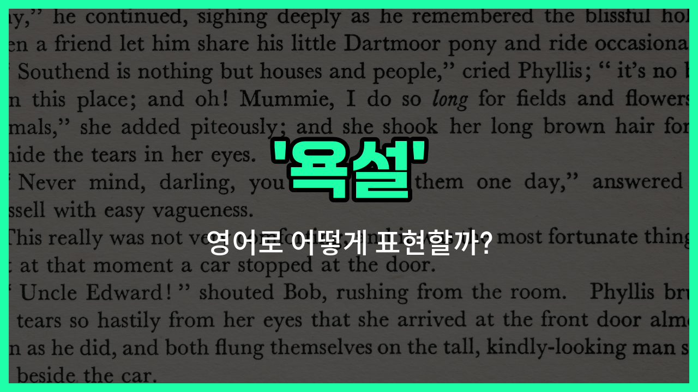

## 🌟 영어 표현 - fuck

안녕하세요 👋 오늘은 영어에서 자주 들을 수 있지만, 사용에 주의가 필요한 단어인 '**fuck**'에 대해 이야기해보려고 해요. 이 단어는 매우 강한 **욕설**로, 분노나 놀람, 실망 등 강한 감정을 표현할 때 사용돼요.

'fuck'는 영어권에서 비속어로 분류되며, 공식적인 자리나 예의가 필요한 상황에서는 절대 사용하지 않는 것이 좋아요. 친구들끼리 농담처럼 쓰기도 하지만, 듣는 사람에 따라 매우 불쾌하게 느껴질 수 있으니 조심해야 해요!

이 단어는 동사, 명사, 감탄사 등 다양한 품사로 쓰일 수 있어요. 예를 들어, 실수했을 때 "Fuck!"이라고 말하거나, 누군가에게 화가 났을 때 "Fuck you!"라고 할 수 있어요. 하지만 이런 표현은 정말 친한 사이가 아니면 삼가는 것이 좋아요.

## 📖 예문

1. "아, 젠장!"

   "Fuck!"

2. "그 사람한테 정말 화가 났어요."

   "I'm so fucking mad at him."

## 💬 연습해보기

<ul data-interactive-list>

  <li data-interactive-item>
    봐, 나 원래 욕 잘 안 하는데, 그 영화 진짜 대박이었어!
    <a href="/blog/in-english/1078.look/">Look</a>, I don't usually swear, but that movie was fucking amazing!
  </li>

  <li data-interactive-item>
    그는 정말 화가 나서 계속 욕을 하더라고.
    He was so <a href="/blog/in-english/137.pissed-off/">pissed off</a>, he just <a href="/blog/in-english/1127.start/">started</a> saying fuck all the <a href="/blog/in-english/1055.time/">time</a>.
  </li>

  <li data-interactive-item>
    이게 뭐야, 정말 말도 안 돼!
    I can't <a href="/blog/in-english/1320.believe/">believe</a> this <a href="/blog/in-english/1281.shit/">shit</a>, it's fucking ridiculous!
  </li>

  <li data-interactive-item>
    그녀가 그릇을 또 떨어뜨려서 이제 큰일났어.
    She <a href="/blog/in-english/361.drop/">dropped</a> the fucking plates again and now we have a <a href="/blog/in-english/1095.big/">big</a> mess.
  </li>

  <li data-interactive-item>
    왜 그런 짓을 했어? 전혀 이해가 안 가.
    Why the fuck did you do that? It <a href="/blog/in-english/1209.makes/">makes</a> no sense at all.
  </li>

  <li data-interactive-item>
    매일매일 이 따위로 지치기 짝이 없어.
    I'm so fucking tired of this nonsense every <a href="/blog/in-english/1331.single/">single</a> <a href="/blog/in-english/1067.day/">day</a>.
  </li>

  <li data-interactive-item>
    테이블에 발을 부딪히고는 "젠장!" 하고 소리쳤어.
    He yelled, "Fuck!" when he stubbed his toe on the table.
  </li>

  <li data-interactive-item>
    이건 진짜 대박이야, 이렇게 재밌었던 적이 없거든!
    This is fucking awesome, I've never had this much fun before!
  </li>

  <li data-interactive-item>
    그런 소리 그만해, 진짜 장난 치는 거 아니야.
    Don't give me that bullshit, I'm not fucking kidding here.
  </li>

  <li data-interactive-item>
    어제 네가 했던 그 아이디어, 진짜 대단했어.
    That was a fucking brilliant idea you had yesterday, seriously.
  </li>

</ul>

## 🤝 함께 알아두면 좋은 표현들

### damn

'damn'은 욕설로 자주 쓰이며, '젠장' 또는 '빌어먹을'이라는 뜻이에요. 감정이 격해졌을 때 불만이나 짜증을 표현할 때 많이 사용해요.

- "Damn, I [forgot](/blog/in-english/023.forget/) my keys at [home](/blog/in-english/1076.home/)!"
- "젠장, 집에 열쇠를 두고 왔어요!"

### heck

'heck'은 욕설의 완곡한 표현으로, '젠장'이나 '제기랄' 정도의 의미를 가지고 있어요. 좀 더 부드럽고 가벼운 느낌으로 불쾌함을 표현할 때 사용해요.

- "What the heck is [going](/blog/in-english/1068.going/) on here?"
- "여기서 도대체 무슨 일이 벌어지고 있는 거예요?"

### please

'please'는 욕설과는 반대되는 표현으로, 정중하게 부탁하거나 요청할 때 사용하는 단어예요. 상대방에게 예의를 갖추고 말할 때 쓰여요.

- "Please pass me the salt."
- "소금 좀 건네주세요."

---

오늘은 영어 욕설 중 가장 강한 표현 중 하나인 '**fuck**'에 대해 알아봤어요. 이 단어는 사용에 특히 주의해야 하니, 상황에 맞게 신중하게 사용해 주세요 😊

오늘 배운 표현과 예문들을 참고해서, 영어권 문화에서 욕설이 어떻게 쓰이는지 이해해보는 데 도움이 되었으면 해요. 다음에도 더 유익한 영어 표현으로 찾아올게요! 감사합니다!

