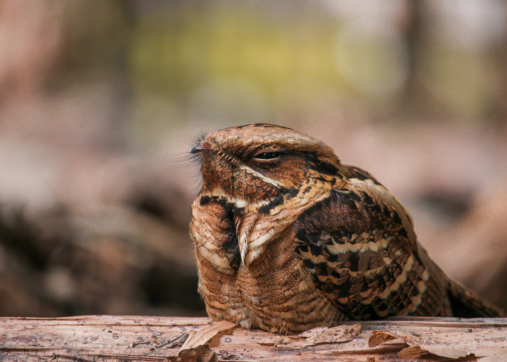

## 🌟 영어 표현 - pull an all-nighter

안녕하세요! 👋 오늘은 영어 표현 "pull an all-nighter"에 대해 알아볼게요. 이 표현은 한국어로 **"밤을 새우다"** 또는 **"철야하다"** 라는 의미를 가지고 있어요.

"Pull an all-nighter"는 주로 학생들이나 직장인들 사이에서 많이 사용되는 표현이에요. 🏫 **시험 준비나 중요한 프로젝트를 위해 밤을 새워 공부하거나 일할 때** 이 표현을 사용해요.

이 표현은 꼭 공부나 일과 관련된 상황에서만 쓰이는 건 아니에요. 예를 들어, 친구들과 함께 영화를 밤새도록 보거나 게임을 할 때도 사용할 수 있어요. 🎮

"Pull an all-nighter"는 조금 비격식적인 표현이에요. 친구나 동료와 대화할 때 자주 사용되지만, 공식적인 상황에서는 "work through the night" 같은 더 격식있는 표현을 사용하는 게 좋아요.

이 표현에는 **피곤함과 노력**의 뉘앙스가 담겨 있어요. 밤을 새우는 것이 쉽지 않은 일이라는 것을 암시하죠. 😴

<!-- engple-horizontal-ad -->

<ins class="adsbygoogle"
     style="display:block"
     data-ad-client="ca-pub-1465612013356152"
     data-ad-slot="2106896038"
     data-ad-format="auto"
     data-full-width-responsive="true"></ins>

## 📖 예문

"시험 때문에 밤을 새워야 해요."

"I have to pull an all-nighter for my exam."

"프로젝트 마감일 때문에 어제 밤을 샜어요."

"I pulled an all-nighter yesterday because of the project deadline."

자, 이제 "pull an all-nighter"를 사용한 예문들을 살펴봤어요. 꼭 소리내어 말하면서 연습해보세요! 🚀

## 💬 연습해보기

이 프로젝트를 끝내려면 밤을 새야 할 것 같아.

I'm gonna have to pull an all-nighter to finish this project.

그녀는 일주일 내내 밤을 새고 있어. 건강이 걱정돼.

She's been pulling all-nighters for <a href="/blog/in-english/050.n-days-straight/">a week straight</a>. I'm worried about her health.

내일 시험인데 공부를 전혀 안 했어. 밤을 새야 할 것 같아.

The exam's tomorrow, and I haven't studied at all. Looks like I'm pulling an all-nighter.

우리는 큰 회의 발표 준비하느라 밤을 새웠어.

We pulled an all-nighter to get the presentation <a href="/blog/in-english/325.ready/">ready</a> for the big meeting.

대학 이후로 밤을 새본 적이 없어.

I haven't pulled an all-nighter since college.

스타트업 팀은 출시 전에 큰 버그를 고치느라 밤을 새야 했어.

The startup team had to pull an all-nighter to fix a major bug before launch.

시험 전에 밤을 새는 건 나한테 잘 안 돼.

Pulling an all-nighter before a test never works out well for me.

새 시즌을 몰아보려고 밤을 새려고 생각 중이야.

I'm thinking about pulling an all-nighter to <a href="/blog/in-english/071.binge-watch/">binge-watch</a> the new season.

에너지 음료 좀 사자. 이 마감일을 맞추려면 밤을 새야 해.

Let's grab some energy drinks. We're gonna have to pull an all-nighter to meet this deadline.

밤을 새고 나면 다음 날 좀비처럼 느껴져.

After pulling an all-nighter, I feel like a zombie the next day.

## 🤝 함께 알아두면 좋은 표현들

### hit the books

'hit the books'는 **"공부를 시작하다" 또는 "열심히 공부하다"** 라는 뜻이에요. 주로 시험이나 과제를 준비할 때 공부에 집중하는 상황을 나타내며, **노력과 집중을 강조하는 표현**이에요.

- "I need to hit the books tonight if I want to pass my finals."
- "내가 기말고사를 통과하고 싶다면 오늘 밤 열심히 공부해야 해."

### catch up on sleep

'[catch up on](/blog/in-english/021.catch-up-on/) sleep'은 **"잠을 보충하다" 또는 "잠을 잘 자다"** 라는 의미예요. 부족했던 수면을 보충하기 위해 충분히 자는 상황을 나타내며, **휴식과 회복을 강조하는 표현**이에요.

- "After the busy week, I plan to catch up on sleep over the weekend."
- "바쁜 한 주가 지나고 주말 동안 잠을 보충할 계획이에요."

---

오늘은 **"밤을 새우다"** 를 의미하는 **"pull an all-nighter"** 표현에 대해 배워봤어요. 정말 유용한 표현이죠? 일상 대화에서 자주 사용해보세요. **밤을 새워 공부하거나 일할 때, 또는 밤새도록 무언가를 했을 때** 이 표현을 쓰면 여러분의 영어가 한층 더 자연스러워질 거예요! 😉

여러분도 오늘 배운 "pull an all-nighter"를 사용해서 경험을 표현해보는 건 어떨까요? 연습이 실력을 만든답니다! 화이팅! 💪
