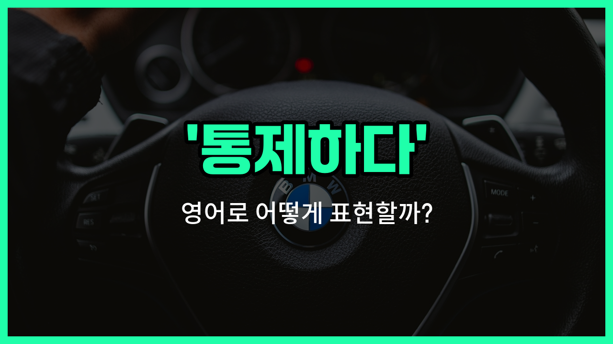

## 🌟 영어 표현 - control

안녕하세요 👋 오늘은 일상에서 자주 쓰이는 영어 표현 '**control**'에 대해 알아보려고 해요. '통제하다', '조절하다', '관리하다'와 같은 의미를 가진 단어예요.

'**control**'은 어떤 상황이나 대상을 내 뜻대로 움직이거나, 질서 있게 유지하는 것을 말해요. 예를 들어, 감정을 통제하거나, 기계를 조절하거나, 프로젝트를 관리하는 등 다양한 상황에서 쓸 수 있어요.

예를 들어, "나는 내 감정을 통제하려고 노력해요."라고 할 때 "I [try to](/blog/in-english/117.try-to/) control my emotions."이라고 표현할 수 있어요. 또, "온도를 조절하다"는 "control the temperature"라고 해요.

'**control**'은 동사로도, 명사로도 쓸 수 있어서 정말 유용한 단어예요! 동사로는 '통제하다', 명사로는 '통제', '조절'이라는 뜻이 있으니 상황에 맞게 활용해 보세요.

## 📖 예문

1. "그는 자신의 분노를 통제할 수 없었어요."

   "He couldn't control his anger."

2. "우리는 예산을 더 잘 관리해야 해요."

   "We need to control the [budget](/blog/in-english/661.budget/) [better](/blog/in-english/1082.better/)."

## 💬 연습해보기

<ul data-interactive-list>

  <li data-interactive-item>
    스트레스 받을 때 감정을 컨트롤하기 힘들지. 그냥 깊게 숨 쉬고 진정해봐.
    It's <a href="/blog/in-english/183.tough/">tough</a> to control your temper when you're under a lot of stress. Just take a <a href="/blog/in-english/428.deep/">deep</a> breath and <a href="/blog/in-english/1265.try/">try</a> to <a href="/blog/in-english/380.calm/">calm</a> down.
  </li>

  <li data-interactive-item>
    행사가 잘 진행되도록 모든 세세한 부분을 조율하려고 해.
    She tries to control every detail of the event to <a href="/blog/in-english/232.make-sure/">make sure</a> it goes smoothly.
  </li>

  <li data-interactive-item>
    선생님은 모임 중에 시끄러운 교실을 다스리느라 힘드셨대.
    The teacher struggled to control the <a href="/blog/in-english/957.noisy/">noisy</a> classroom during the assembly.
  </li>

  <li data-interactive-item>
    다른 사람들이 어떻게 느끼는지는 내가 조절할 수 없지만, 내 반응은 조절할 수 있어.
    I can't control how other <a href="/blog/in-english/1057.people/">people</a> <a href="/blog/in-english/1096.feel/">feel</a>, but I can control my reaction.
  </li>

  <li data-interactive-item>
    그는 드론이 공원에서 날아다닐 때 리모콘으로 조정해.
    He <a href="/blog/in-english/1079.use/">uses</a> a remote to control the drone as it flies around the <a href="/blog/in-english/463.park/">park</a>.
  </li>

  <li data-interactive-item>
    건강하게 먹으려고 할 때는 양을 조절하는 게 중요해.
    It's <a href="/blog/in-english/318.important/">important</a> to control portion sizes when you're <a href="/blog/in-english/1266.trying/">trying</a> to eat healthier.
  </li>

  <li data-interactive-item>
    이번 달에 돈을 아끼고 싶으면 지출을 조절해야 해.
    You need to control your <a href="/blog/in-english/258.spend/">spending</a> if you <a href="/blog/in-english/1060.want/">want</a> to <a href="/blog/in-english/293.save/">save</a> <a href="/blog/in-english/1103.money/">money</a> this <a href="/blog/in-english/1315.month/">month</a>.
  </li>

  <li data-interactive-item>
    정부는 도시의 오염을 통제하기 위해 규제를 시행했어.
    The <a href="/blog/in-english/608.government/">government</a> has imposed regulations to control pollution in the <a href="/blog/in-english/1108.city/">city</a>.
  </li>

  <li data-interactive-item>
    시험 결과를 보았을 때 흥분을 억누려야 했어.
    I had to control my excitement when I saw the results of the test.
  </li>

  <li data-interactive-item>
    건물 접근을 통제하기 위해 보안 카메라를 설치했어.
    They installed <a href="/blog/in-english/554.security/">security</a> cameras to control <a href="/blog/vocab-1/041.access/">access</a> to the building.
  </li>

</ul>

## 🤝 함께 알아두면 좋은 표현들

### manage

'manage'는 '어떤 상황이나 자원을 잘 다루다' 또는 '효과적으로 운영하다'라는 뜻이에요. 'control'과 비슷하게 무언가를 조절하거나 통제하는 의미를 가지지만, 좀 더 긍정적이고 능동적인 느낌을 줘요.

- "She [knows](/blog/in-english/1058.know/) how to manage her [time](/blog/in-english/1055.time/) efficiently to meet all [deadlines](/blog/in-english/830.deadline/)."
- "그녀는 모든 마감일을 맞추기 위해 시간을 효율적으로 관리하는 방법을 알고 있어요."

### lose control

'[lose](/blog/in-english/457.lose/) control'은 '통제력을 잃다'라는 뜻으로, 'control'의 반대 의미예요. 상황이나 감정을 제대로 다루지 못하고 혼란스러워지는 상태를 나타낼 때 사용해요.

- "He lost control of his emotions during the heated argument."
- "그는 격렬한 논쟁 중에 감정을 통제하지 못했어요."

### regulate

'regulate'는 '법이나 규칙을 통해 어떤 것을 조절하다'라는 뜻이에요. 'control'과 비슷하지만, 주로 공식적이고 체계적인 통제를 의미할 때 많이 쓰여요.

- "The government regulates the use of pesticides to protect the environment."
- "정부는 환경 보호를 위해 농약 사용을 규제하고 있어요."

---

오늘은 '통제하다', '조절하다', '관리하다'라는 뜻을 가진 영어 표현 '**control**'에 대해 알아봤어요. 앞으로 무언가를 조절하거나 관리할 때 이 표현을 떠올려 보세요 😊

오늘 배운 표현과 예문들을 꼭 최소 3번씩 소리 내서 읽어보세요. 다음에도 더 재미있고 유익한 영어 표현으로 찾아올게요! 감사합니다!

