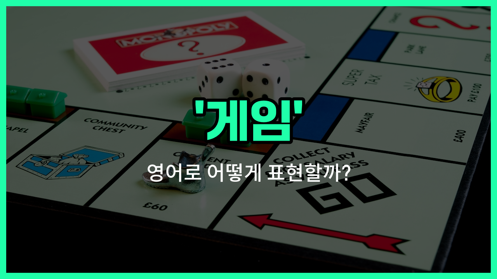

## 🌟 영어 표현 - games

안녕하세요 👋 오늘은 우리가 일상에서 자주 사용하는 단어인 '**게임**'의 영어 표현 '**[games](/blog/in-english/1087.game/)**'에 대해 알아보려고 해요.

'**games**'는 단순히 컴퓨터나 스마트폰으로 하는 게임뿐만 아니라, 다양한 **놀이**나 **경기**를 모두 포함하는 단어예요. 예를 들어, 보드게임, 운동경기, 어린이들이 하는 놀이 등도 모두 'games'라고 부를 수 있어요!

이 단어는 친구들과 재미있게 시간을 보낼 때, 또는 스포츠 경기와 관련된 상황에서 아주 자연스럽게 사용돼요. 예를 들어, "[Let](/blog/in-english/1112.let/)'s [play](/blog/in-english/1081.play/) some games!"라고 하면 "우리 게임 좀 하자!"라는 뜻이에요.

또한, 올림픽이나 운동회 같은 큰 행사에서도 'games'라는 단어가 자주 등장해요. 예를 들어, 'The Olympic Games'는 '올림픽 경기'를 의미해요.

## 📖 예문

1. "오늘 저녁에 친구들이랑 게임할 거예요."

   "I'm [going](/blog/in-english/1068.going/) to play games with my [friends](/blog/in-english/1261.friend/) tonight."

2. "올림픽 경기는 4년에 한 번 열려요."

   "The Olympic Games are [held](/blog/in-english/388.hold/) every four [years](/blog/in-english/1065.year/)."

## 💬 연습해보기

<ul data-interactive-list>

  <li data-interactive-item>
    어젯밤 파티에서 여러 게임을 했어. 모두가 경기를 기다리면서 편하게 이야기하고 노는 시간을 정말 즐겼어.
    We played a bunch of games at the <a href="/blog/in-english/1212.party/">party</a> last <a href="/blog/in-english/1110.night/">night</a>. Everyone had so much fun just relaxing and chatting between matches.
  </li>

  <li data-interactive-item>
    아이들이 오후 내내 바깥에서 Tag 게임이랑 숨바꼭질을 하면서 놀았어. 애들이 이렇게 활발하게 노는 모습을 보니 좋더라구.
    The kids <a href="/blog/in-english/258.spend/">spent</a> the afternoon <a href="/blog/in-english/974.outside/">outside</a> playing games <a href="/blog/in-english/1053.like/">like</a> tag and hide and seek. It was nice to see them so active.
  </li>

  <li data-interactive-item>
    나는 비디오 게임을 정말 좋아하지만, 가끔은 가족이랑 옛날 보드게임을 하고 싶어.
    I <a href="/blog/in-english/1074.love/">love</a> <a href="/blog/in-english/1244.video/">video</a> games, but <a href="/blog/in-english/270.sometimes/">sometimes</a> I just <a href="/blog/in-english/1060.want/">want</a> to play <a href="/blog/in-english/1086.old/">old</a> <a href="/blog/in-english/1090.school/">school</a> board games with my <a href="/blog/in-english/1100.family/">family</a>.
  </li>

  <li data-interactive-item>
    쉬는 시간에 팀원들이 다음 회의 전 분위기를 부드럽게 만들기 위해서 간단한 게임 몇 개를 준비했어.
    During the break, the <a href="/blog/in-english/1099.team/">team</a> <a href="/blog/in-english/355.organize/">organized</a> some <a href="/blog/in-english/439.quick/">quick</a> games to lighten the mood before the next meeting.
  </li>

  <li data-interactive-item>
    주말에 오락실에서 새로운 게임들을 해봤는데, 경주 게임이 내 최애였어.
    We <a href="/blog/in-english/1265.try/">tried</a> out some <a href="/blog/in-english/1056.new/">new</a> games at the arcade over the weekend. The racing ones were definitely my favorite.
  </li>

  <li data-interactive-item>
    우리 선생님이 시험 전에 복습할 수 있도록 교육용 게임을 몇 개 정해주셨어. 덕분에 공부가 훨씬 더 재미있었어.
    Our teacher <a href="/blog/in-english/826.assign/">assigned</a> some educational games to <a href="/blog/in-english/1084.help/">help</a> us <a href="/blog/in-english/251.review/">review</a> before the test. It made studying a lot more enjoyable.
  </li>

  <li data-interactive-item>
    축제에서는 다양한 게임과 상품들이 있었어. 반지 던지기 게임을 여러 번 시도해보는 게 너무 재밌었어.
    At the festival, there were tons of games and prizes. We couldn't resist <a href="/blog/in-english/1266.trying/">trying</a> the ring toss game several <a href="/blog/in-english/1055.time/">times</a>.
  </li>

  <li data-interactive-item>
    내 친구들이랑 바베큐를 위해서 뒷마당에 게임을 설치했어. 자이언트 젠가랑 콘홀 게임이 가장 인기 있었어.
    My <a href="/blog/in-english/1279.friends/">friends</a> and I <a href="/blog/in-english/635.set-up/">set up</a> games in the backyard for the barbecue. Giant Jenga and cornhole were the biggest hits.
  </li>

  <li data-interactive-item>
    어젯밤 그들은 트위치에서 좋아하는 게임을 생중계하고 있었어. 보는 것도 재밌고, 채팅에도 참여할 수 있어서 좋았어.
    They were streaming their favorite games <a href="/blog/in-english/1134.live/">live</a> on Twitch last night. It was fun to watch and join the <a href="/blog/in-english/1002.chat-with/">chat with</a> them.
  </li>

  <li data-interactive-item>
    나는 내 게임들을 선반에 잘 정리해놔. 그래서 내가 하고 싶은 게임을 딱 어디에 있는지 알 수 있어.
    I keep all my games organized on my shelf. That <a href="/blog/in-english/1062.way/">way</a>, I <a href="/blog/in-english/1058.know/">know</a> <a href="/blog/in-english/419.exactly/">exactly</a> where to <a href="/blog/in-english/1083.find/">find</a> the one I want to play.
  </li>

</ul>

## 🤝 함께 알아두면 좋은 표현들

### play sports

'play sports'는 '운동을 하다' 또는 '스포츠 경기를 하다'라는 뜻이에요. 게임과 비슷하게 신체 활동을 포함하지만, 보통 더 경쟁적이고 체육적인 활동을 의미해요.

- "[Children](/blog/in-english/1226.children/) love to play sports like soccer and basketball after school."
- "아이들은 방과 후에 축구나 농구 같은 스포츠를 하는 것을 좋아해요."

### work

'[work](/blog/in-english/1064.work/)'는 '일하다'라는 뜻으로, 게임과는 반대되는 개념이에요. 게임이 주로 여가 활동이라면, 일은 생산적이고 책임이 따르는 활동을 의미해요.

- "I have to work [late](/blog/in-english/391.late/) tonight, so I can't join the game."
- "나는 오늘 밤 늦게까지 일해야 해서 게임에 참여할 수 없어요."

### video games

'video games'는 '비디오 게임'이라는 뜻으로, 게임의 한 종류예요. 전자 기기를 사용해 즐기는 게임을 가리키며, 보통 컴퓨터나 콘솔에서 플레이해요.

- "He spends hours playing video games on the weekend."
- "그는 주말에 몇 시간씩 비디오 게임을 해요."

---

오늘은 '**게임**', '**놀이**', '**경기**'라는 뜻을 가진 영어 표현 '**games**'에 대해 알아봤어요. 앞으로 친구들과 놀거나 스포츠 경기를 이야기할 때 이 표현을 떠올려 보세요 😊

오늘 배운 표현과 예문들을 꼭 최소 3번씩 소리 내서 읽어보세요. 다음에도 더 재미있고 유익한 영어 표현으로 찾아올게요! 감사합니다!

