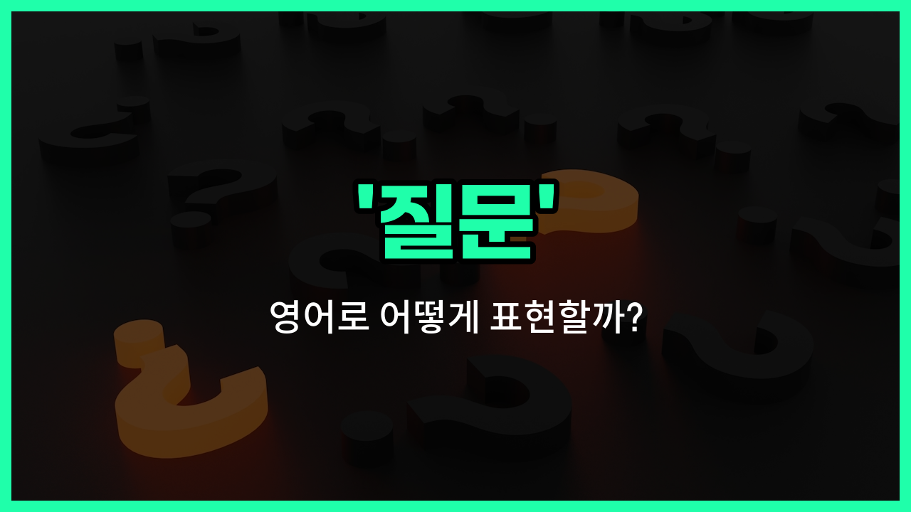

## 🌟 영어 표현 - question

안녕하세요 👋 오늘은 영어로 '질문'을 어떻게 표현하는지 알아보려고 해요. 바로 '**question**'이라는 단어를 사용해요. 이 단어는 우리가 궁금한 점을 물어볼 때, 또는 누군가에게 답을 요구할 때 쓰는 아주 기본적인 표현이에요.

'question'은 명사로 '질문', '의문', '물음'이라는 뜻을 가지고 있어요. 일상 대화, 학교, 회사 등 다양한 상황에서 정말 자주 쓰이는 단어예요!

예를 들어, 수업 시간에 선생님께 궁금한 점이 있을 때 "I have a question."이라고 말할 수 있어요. 또는 누군가가 질문을 했을 때 "That's a good question!"이라고 대답할 수도 있어요.

## 📖 예문

1. "질문이 있어요."

   "I have a question."

2. "질문을 해도 될까요?"

   "Can I [ask](/blog/in-english/1316.ask/) a question?"

## 💬 연습해보기

<ul data-interactive-list>

  <li data-interactive-item>
    숙제에 대해 궁금한 게 있어요. 좀 더 자세히 설명해 줄 수 있어요?
    I have a <a href="/blog/in-english/439.quick/">quick</a> question about the homework assignment. Can you <a href="/blog/in-english/1084.help/">help</a> me <a href="/blog/in-english/1312.understand/">understand</a> it <a href="/blog/in-english/1082.better/">better</a>?
  </li>

  <li data-interactive-item>
    회의 중에 그녀가 예산에 대해 중요한 질문을 했어요. 다들 그 대답이 궁금했죠.
    During the meeting, she asked an <a href="/blog/in-english/318.important/">important</a> question about the <a href="/blog/in-english/661.budget/">budget</a>. Everyone was <a href="/blog/in-english/327.curious/">curious</a> about the answer.
  </li>

  <li data-interactive-item>
    프로젝트에 대해 궁금한 점 있으면 언제든지 물어봐도 돼요.
    If you have any questions about the project, <a href="/blog/in-english/1096.feel/">feel</a> <a href="/blog/in-english/1104.free/">free</a> to ask me <a href="/blog/in-english/153.anytime/">anytime</a>.
  </li>

  <li data-interactive-item>
    그는 질문을 하려고 손을 들었지만, 발표가 끝날 때까지 기다리기로 했어요.
    He raised his <a href="/blog/in-english/1239.hand/">hand</a> with a question but then <a href="/blog/in-english/062.decide-to/">decided to</a> <a href="/blog/in-english/1327.wait/">wait</a> until the <a href="/blog/in-english/1093.end/">end</a> of the presentation.
  </li>

  <li data-interactive-item>
    선생님이 주제를 설명한 후에 질문할 수 있다고 하셨어요.
    The teacher <a href="/blog/in-english/1061.said/">said</a> we could ask questions after she finished <a href="/blog/in-english/909.explain/">explaining</a> the topic.
  </li>

  <li data-interactive-item>
    질문을 하려고 했는데, 다른 사람이 먼저 물어봐서 조금 아쉬웠어요.
    I was about to ask a question, but then someone else beat me to it.
  </li>

  <li data-interactive-item>
    개인적인 질문 해도 괜찮아요? 궁금한 게 있어서요.
    Do you <a href="/blog/in-english/1333.mind/">mind</a> if I ask a personal question? It's just something I'm curious about.
  </li>

  <li data-interactive-item>
    퀴즈 시간에 아무도 답을 못 한 질문이 있었어요. 모두 당황했죠.
    There was a question that nobody could answer during the quiz. It really stumped everyone.
  </li>

  <li data-interactive-item>
    그녀는 질문으로 끼어들면서 이벤트에 대한 자세한 정보를 얻으려고 했어요.
    She kept interrupting with questions, <a href="/blog/in-english/117.try-to/">trying to</a> get more details about the event.
  </li>

  <li data-interactive-item>
    마무리하기 전에 마지막으로 질문 있는 분 계세요? 모든 게 확실한지 확인하고 싶어요.
    Before we <a href="/blog/in-english/295.finish/">finish</a>, does anyone have any last questions? I <a href="/blog/in-english/1060.want/">want</a> to <a href="/blog/in-english/232.make-sure/">make sure</a> everything is clear.
  </li>

</ul>

## 🤝 함께 알아두면 좋은 표현들

### inquire (문의하다)

'inquire'는 "문의하다" 또는 "질문하다"라는 뜻으로, 정보를 얻기 위해 정중하게 묻는 상황에서 주로 사용돼요. 공식적이거나 격식을 차린 대화에서 자주 쓰여요.

- "She inquired about the opening [hours](/blog/in-english/1339.hour/) of the museum."
- "그녀는 박물관의 개장 시간에 대해 문의했어요."

### doubt (의심하다)

'[doubt](/blog/in-english/307.doubt/)'는 "의심하다"라는 뜻으로, 어떤 사실이나 정보가 맞는지 확신이 없을 때 사용하는 표현이에요. 질문과는 반대로, 확실하지 않은 상태를 나타내요.

- "I doubt that he will [arrive](/blog/in-english/403.arrive/) on [time](/blog/in-english/1055.time/)."
- "나는 그가 제시간에 도착할지 의심스러워요."

### interrogate (심문하다)

'interrogate'는 "심문하다"라는 뜻으로, 주로 경찰이나 수사관이 범죄 용의자에게 강도 높게 질문할 때 쓰이는 표현이에요. 일반적인 질문보다 훨씬 강한 느낌을 줘요.

- "The detective interrogated the suspect for several hours."
- "형사는 용의자를 몇 시간 동안 심문했어요."

---

오늘은 '질문', '의문', '물음'이라는 뜻을 가진 영어 표현 'question'에 대해 알아봤어요. 앞으로 궁금한 점이 있을 때 이 표현을 자연스럽게 사용해 보세요 😊

오늘 배운 표현과 예문들을 꼭 최소 3번씩 소리 내서 읽어보세요. 다음에도 더 재미있고 유익한 영어 표현으로 찾아올게요! 감사합니다!

