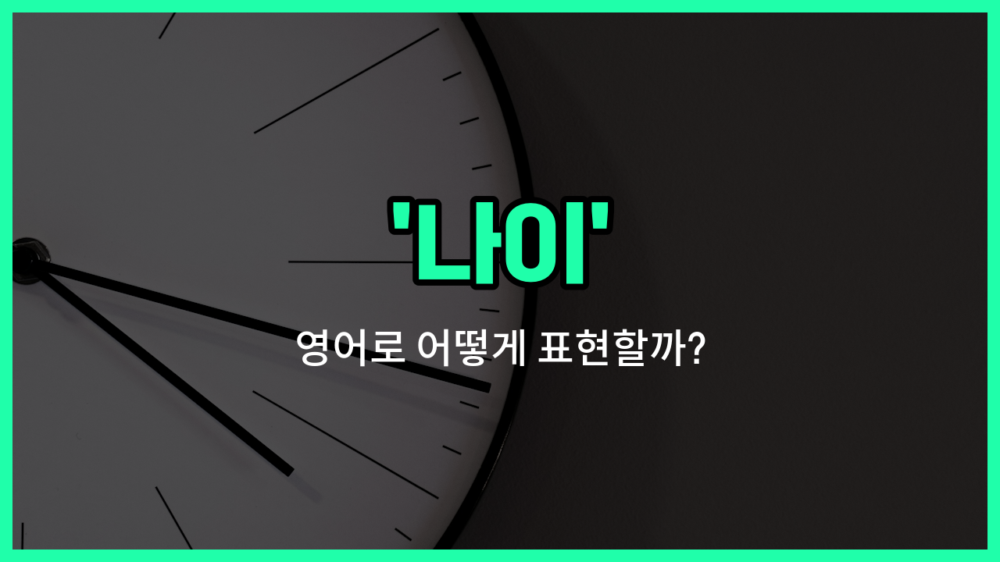

## 🌟 영어 표현 - age

안녕하세요 👋 오늘은 우리가 일상에서 자주 쓰는 단어인 '**나이**'의 영어 표현에 대해 알아보려고 해요. 바로 '**age**'라는 단어인데요~

'**age**'는 사람이나 동물, 사물 등이 살아온 시간, 즉 **연령**이나 **세**를 의미해요. 예를 들어, "몇 살이에요?"라고 물을 때 영어로는 "How [old](/blog/in-english/1086.old/) are you?"라고 하지만, 공식적인 문서나 대화에서는 '**age**'라는 단어를 많이 사용해요~

또한, 'age'는 단순히 숫자로만 쓰이는 게 아니라, '나이가 들다', '노화'와 같은 의미로도 활용돼요. 예를 들어, "He aged quickly."라고 하면 "그는 빨리 나이가 들었어요."라는 뜻이에요~

## 📖 예문

1. "당신의 나이는 어떻게 되세요?"

   "What is your age?"

2. "그녀는 25세예요."

   "She is 25 [years](/blog/in-english/1065.year/) of age."

3. "나이에 상관없이 지원할 수 있어요."

   "You can apply [regardless of](/blog/in-english/226.regardless-of/) your age."

## 💬 연습해보기

<ul data-interactive-list>

  <li data-interactive-item>
    그녀의 나이를 알고 깜짝 놀랐어; 실제 나이에 비해 훨씬 어려 보이거든요.
    I'm surprised to <a href="/blog/in-english/1083.find/">find</a> out her age; she <a href="/blog/in-english/1078.look/">looks</a> much younger than she really is.
  </li>

  <li data-interactive-item>
    그는 나이에 대해 이야기하는 걸 좋아하지 않아서, 보통 그 얘기는 피하는 편이에요.
    He doesn't <a href="/blog/in-english/1053.like/">like</a> <a href="/blog/in-english/1294.talk/">talking</a> about his age, so I usually <a href="/blog/in-english/924.avoid/">avoid</a> that topic.
  </li>

  <li data-interactive-item>
    제 나이에는 신나는 파티보다 여유로운 주말이 더 좋아요.
    At my age, I <a href="/blog/in-english/191.prefer/">prefer</a> relaxing weekends over wild <a href="/blog/in-english/1212.party/">parties</a>.
  </li>

  <li data-interactive-item>
    누군가의 능력을 나이로만 판단할 수는 없어요.
    You can't judge someone's abilities just by their age.
  </li>

  <li data-interactive-item>
    제 여동생이 드디어 30번째 생일을 맞아서, 이제 공식적으로 30대에 들어섰어요.
    My sister just celebrated her 30th birthday, so now she's officially in her thirties.
  </li>

  <li data-interactive-item>
    비록 그가 나이가 많지만, 그의 에너지는 동년배들에 비해 정말 인상적이에요.
    Even though he's older, his energy <a href="/blog/in-english/1124.level/">level</a> is impressive for his age.
  </li>

  <li data-interactive-item>
    나이는 그에게 지혜를 줬지만, 여전히 어린아이 같은 마음을 가지고 있어요.
    Age <a href="/blog/in-english/1139.bring/">brought</a> him wisdom, but he <a href="/blog/in-english/254.still/">still</a> has the spirit of a kid.
  </li>

  <li data-interactive-item>
    특정 나이 이상의 고객들에게 할인 혜택을 주니까, 신분증 꼭 챙기세요.
    They're offering discounts to customers over a certain age, so don't <a href="/blog/in-english/023.forget/">forget</a> your ID.
  </li>

  <li data-interactive-item>
    나이가 들면서 인생에 대한 관점이 변한다는 게 참 웃겨요.
    It's funny how age can <a href="/blog/in-english/1133.change/">change</a> your perspective on <a href="/blog/in-english/1070.life/">life</a>.
  </li>

  <li data-interactive-item>
    나이가 드니까 작은 것들의 소중함을 더 많이 느끼게 됐어요.
    With age, I've <a href="/blog/in-english/245.learn/">learned</a> to appreciate the <a href="/blog/in-english/1085.little/">little</a> things much more.
  </li>

</ul>

## 🤝 함께 알아두면 좋은 표현들

### youth (젊음)

'youth'는 "젊음" 또는 "청년기"를 의미해요. 나이와 관련된 표현 중에서 특히 젊은 시기를 강조할 때 사용해요. 보통 활기차고 에너지가 넘치는 시기를 나타낼 때 쓰여요.

- "Many [people](/blog/in-english/1057.people/) look back on their youth as the [best](/blog/in-english/1073.best/) [time](/blog/in-english/1055.time/) of their lives."
- "많은 사람들이 자신의 젊은 시절을 인생에서 가장 좋은 시기로 회상해요."

### senior citizen (노인)

'senior [citizen](/blog/in-english/762.citizen/)'은 "노인" 또는 "고령자"를 뜻해요. 나이가 많아 사회적으로 어른 대우를 받는 연령층을 가리킬 때 사용해요. 보통 60대 이상을 지칭하는 경우가 많아요.

- "Senior citizens [often](/blog/in-english/326.often/) receive discounts on [public](/blog/in-english/1122.public/) transportation."
- "노인들은 대중교통에서 할인을 받는 경우가 많아요."

### ageless (나이를 먹지 않는)

'ageless'는 "나이를 먹지 않는" 또는 "나이가 들어 보이지 않는" 뜻이에요. 나이와 반대되는 개념으로, 나이의 영향을 받지 않는 상태를 표현할 때 사용해요.

- "She has an ageless beauty that captivates everyone."
- "그녀는 모두를 매료시키는 나이를 먹지 않는 아름다움을 가지고 있어요."

---

오늘은 '**나이**', '**연령**', '**세**'라는 뜻을 가진 영어 표현 '**age**'에 대해 알아봤어요. 공식적인 상황이나 문서에서 'age'를 자연스럽게 활용해보면 좋겠어요~ 😊

오늘 배운 표현과 예문들을 꼭 소리 내서 여러 번 읽어보세요. 다음에도 더 유익한 영어 표현으로 찾아올게요! 감사합니다~

