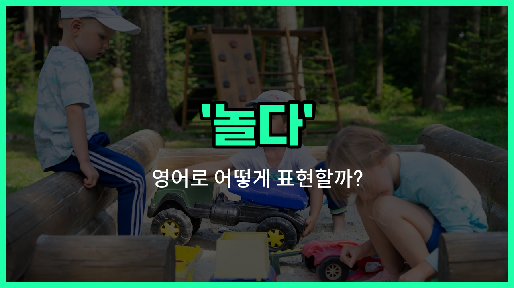

## 🌟 영어 표현 - playing

안녕하세요 👋 오늘은 영어로 '놀다'라는 뜻을 가진 표현 '**playing**'에 대해 알아보려고 해요. 'playing'은 우리가 친구들과 시간을 보내거나, 게임을 하거나, 악기를 연주할 때 등 다양한 상황에서 쓸 수 있는 아주 기본적인 단어예요.

'play'의 현재분사 형태인 'playing'은 **어떤 활동을 하며 즐겁게 시간을 보내는 것**을 의미해요. 예를 들어, 아이들이 공원에서 뛰어놀 때, 또는 강아지와 함께 시간을 보낼 때 모두 'playing'이라는 단어를 사용할 수 있어요.

또한, 'playing'은 단순히 노는 것뿐만 아니라, 스포츠를 하거나, 악기를 연주하는 상황에서도 자주 쓰여요. 예를 들어, 축구를 할 때는 'playing soccer', 피아노를 칠 때는 'playing the piano'라고 표현해요.

## 📖 예문

1. "아이들이 밖에서 놀고 있어요."

   "The children are playing outside."

2. "저는 친구들과 보드게임을 하고 있어요."

   "I am playing a board game with my [friends](/blog/in-english/1279.friends/)."

3. "그는 피아노를 연주하고 있어요."

   "He is playing the piano."

## 💬 연습해보기

<ul data-interactive-list>

  <li data-interactive-item>
    애들 외에서 지금 마당에서 놀고 있어요.
    The kids are outside playing in the yard right now.
  </li>

  <li data-interactive-item>
    주말에 가족이랑 보드게임 하는 거 너무 좋아해요.
    I <a href="/blog/in-english/1074.love/">love</a> playing board games with my family on weekends.
  </li>

  <li data-interactive-item>
    일 끝나고 보통 몇 시간 비디오게임 하면서 휴식 취해요.
    After work, I usually unwind by playing <a href="/blog/in-english/1244.video/">video</a> games for a couple of <a href="/blog/in-english/1339.hour/">hours</a>.
  </li>

  <li data-interactive-item>
    오늘 오후에 공원에서 축구하고 있어요.
    They're playing soccer at the park this afternoon.
  </li>

  <li data-interactive-item>
    우리는 그냥 놀고 있었지, 진지하게 하려고 한 건 아니에요.
    We were just playing around, not trying to be serious.
  </li>

  <li data-interactive-item>
    레슨 시작한 이후 피아노 치는데 시간을 많이 보내고 있어요.
    She spends a lot of time playing the piano since she started lessons.
  </li>

  <li data-interactive-item>
    강아지는 우리가 해변에 가면 항상 공놀이 하는 걸 좋아해요.
    The dog loves playing fetch whenever we go to the beach.
  </li>

  <li data-interactive-item>
    방과 후 친구들이랑 노는 게 하루 중 제일 좋은 순간이에요.
    Playing with friends after school is the <a href="/blog/in-english/1073.best/">best</a> part of the <a href="/blog/in-english/1067.day/">day</a>.
  </li>

  <li data-interactive-item>
    그는 하루 종일 우리에게 장난치면서 다들 웃게 했어요.
    He was playing tricks on us all day, making everyone laugh.
  </li>

  <li data-interactive-item>
    어젯밤에 그들이 카드 놀이하면서 재밌게 노는 거 봤어요.
    I caught them playing cards and having a good time last night.
  </li>

</ul>

## 🤝 함께 알아두면 좋은 표현들

### hanging out

'hanging out'은 친구들이나 사람들과 함께 시간을 보내며 편안하게 노는 것을 의미해요. 주로 특별한 활동 없이 그냥 같이 있는 상태를 나타내요.

- "We spent the afternoon hanging out at the park."
- "우리는 공원에서 오후 내내 같이 시간을 보냈어요."

### working

'working'은 '일하다'라는 뜻으로, 'playing'의 반대 개념이에요. 놀지 않고 집중해서 일을 하거나 공부하는 상태를 나타내요.

- "She is working [hard](/blog/in-english/1219.hard/) to finish her project on time."
- "그녀는 프로젝트를 제시간에 끝내기 위해 열심히 일하고 있어요."

### having fun

'having fun'은 즐거운 시간을 보내거나 재미있게 노는 것을 의미해요. 'playing'과 비슷하게 긍정적인 활동을 강조할 때 사용해요.

- "The kids are having fun at the birthday party."
- "아이들이 생일 파티에서 재미있게 놀고 있어요."

---

오늘은 '놀다', '놀이', '플레이'라는 뜻을 가진 영어 표현 '**playing**'에 대해 알아봤어요. 일상에서 자주 쓰이는 표현이니 꼭 기억해두면 좋겠어요 😊

오늘 배운 표현과 예문들을 소리 내서 여러 번 읽어보세요. 다음에도 더 유익한 영어 표현으로 찾아올게요! 감사합니다!

