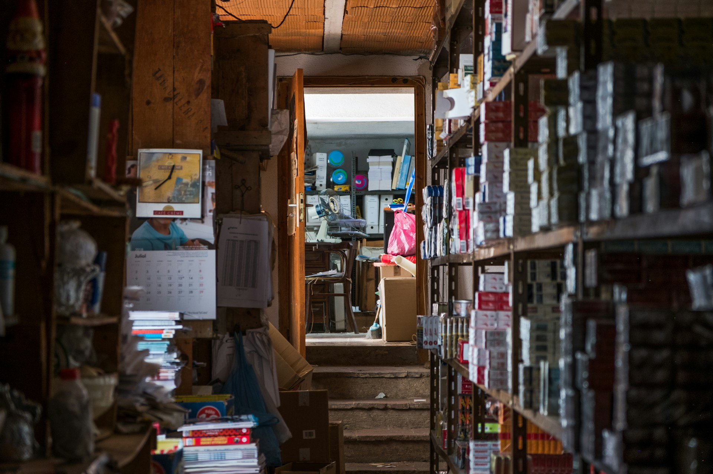

## 🌟 영어 표현 - cram

안녕하세요! 👋 오늘은 영어로 **'구겨넣다', '밀어넣다', '벼락치기하다'** 라는 의미를 나타내는 **"cram"** 표현에 대해 알아볼게요.

"cram"은 원래 **좁은 공간에 많은 것을 억지로 밀어 넣는다**는 뜻이에요. 🎒 예를 들면, "I crammed all my clothes into the suitcase." (모든 옷을 가방에 구겨넣었어요.) 이렇게 말하면 가방에 옷을 꽉 채워 넣었다는 뜻이 됩니다.

이 개념이 공부에도 적용되어, 학생들 사이에서 특히 자주 사용되는 표현이 되었어요. **마치 좁은 머리 속에 많은 정보를 억지로 밀어 넣듯이, 시험 직전에 짧은 시간 동안 많은 양의 정보를 빠르게 공부하는 상황**에서 사용하죠. 📚

예를 들어, 시험 전날 밤에 이렇게 말할 수 있어요. "I need to cram for tomorrow's exam." (내일 시험을 위해 벼락치기를 해야 해요.)

<!-- engple-horizontal-ad -->

<ins class="adsbygoogle"
     style="display:block"
     data-ad-client="ca-pub-1465612013356152"
     data-ad-slot="2106896038"
     data-ad-format="auto"
     data-full-width-responsive="true"></ins>

## 📖 예문

"시험 전에 벼락치기 중이에요."

"I'm cramming for the test."

"책가방에 책을 너무 많이 넣었어요."

"I crammed too many books into my backpack."

자, 이제 "cram"을 사용한 다양한 예문을 살펴볼까요? 꼭 소리내어 말하면서 연습해보세요! 🚀

## 💬 연습해보기

내일 역사 시험을 위해 벼락치기 해야돼.

I need to cram for my history exam tomorrow.

그렇게 입에 음식을 가득 넣지 마!

Don't cram your mouth full of food like that!

지하철이 너무 꽉 차서 몸을 구겨넣어야 했어.

The subway was so <a href="/blog/in-english/301.pack/">packed</a>, we had to cram ourselves in.

우리는 주말 내내 기말고사 벼락치기 했어.

We crammed for our finals all weekend.

내 작은 차에 여섯 명을 어떻게든 끼워 넣었어.

We <a href="/blog/in-english/175.manage-to/">managed to</a> cram six people into my tiny car.

옷장이 이미 가득 찼는데, 그녀는 스웨터를 몇 개 더 넣었어.

The closet was already full, but she crammed in a few more sweaters.

일정을 그렇게 꽉 채우지 마. 너도 쉴 시간이 필요해.

Don't cram your schedule so full. You need time to relax, too.

우리는 내일 파티를 위해 냉장고를 음식으로 가득 채웠어.

We crammed the fridge full of food for the party tomorrow.

사장님이 3개월 분의 일을 단 몇 주 안에 하려고 해.

The boss is <a href="/blog/in-english/117.try-to/">trying to</a> cram three months of work into just a few weeks.

## 🤝 함께 알아두면 좋은 표현들

### pull an all-nighter

['pull an all-nighter'](/blog/in-english/133.pull-all-nighter/)은 **"밤새도록 공부하거나 일하다"** 라는 뜻이에요. 주로 마감일이迫해서 잠을 자지 않고 계속해서 일을 하거나 공부하는 상황을 나타내요. 긴급한 필요에 의해 집중적으로 노력할 때 자주 사용돼요.

"I had to pull an all-nighter to finish my project before the deadline."

"마감일 전에 프로젝트를 끝내기 위해 밤을 샜어야 했어요."

### take it easy

['take it easy'](/blog/너무-긴장하지마-영어표현/)는 **"편안하게 하다" 또는 "무리하지 않다"** 라는 뜻이에요. 스트레스를 줄이고 여유를 가지며 행동하는 것을 강조해요. 주로 긴장을 풀거나 부담을 덜고 싶을 때 자주 사용해요.

"After weeks of studying, it's [important](/blog/in-english/318.important/) to take it easy for a while."

"몇 주간의 공부 후에는 잠시 편안하게 지내는 것이 중요해요."

---

오늘은 **'공부를 몰아서 하다', '벼락치기하다'** 의 의미를 전달하는 **'cram'** 에 대해 배워봤어요. 정말 유용한 표현이죠? 학교나 일상 대화에서 자주 사용해보세요. **시험 공부를 할 때나 물건을 꽉 채워 넣을 때** 이 표현을 쓰면 여러분의 영어가 한층 더 자연스러워질 거예요! 😉

여러분도 오늘 배운 "cram"을 사용해서 공부 계획을 세워보는 건 어떨까요? 하지만 벼락치기보다는 계획적인 공부가 더 좋다는 걸 잊지 마세요! 화이팅! 💪
