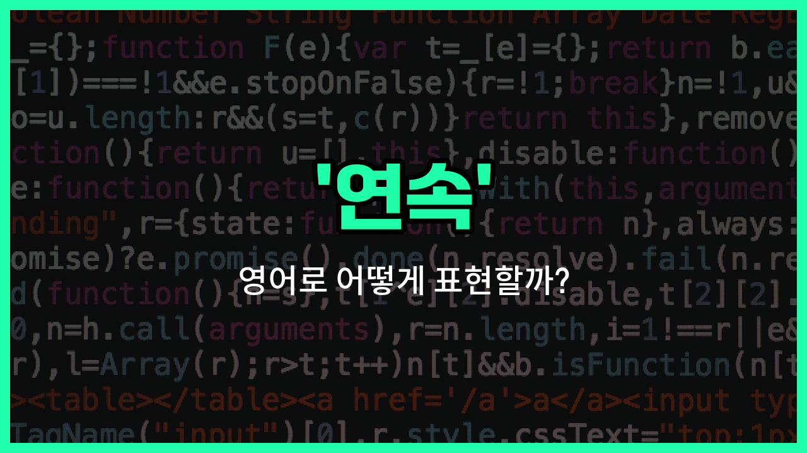

## 🌟 영어 표현 - series

안녕하세요 👋 오늘은 '연속'이라는 뜻을 가진 영어 표현 '**series**'에 대해 알아보려고 해요. 'series'는 어떤 일이 **끊이지 않고 이어지는 것**이나, **비슷한 성격의 것들이 순서대로 나열된 것**을 의미해요.

예를 들어, TV 프로그램에서 여러 편이 이어지는 드라마를 'TV series'라고 부르고, 연속적으로 일어나는 사건이나 숫자, 경기 등에도 'series'라는 단어를 사용할 수 있어요.

또한, 'series'는 '연쇄', '시리즈'라는 뜻으로도 자주 쓰여요. 예를 들어, 'a series of events'는 '일련의 사건들', '[book](/blog/in-english/447.book/) series'는 '책 시리즈'라는 뜻이에요.

## 📖 예문

1. "이 책은 3부작 시리즈의 첫 번째예요."

   "This book is the first in a trilogy series."

2. "우리는 연속으로 세 번 이겼어요."

   "We [won](/blog/in-english/456.win/) three games in a series."

## 💬 연습해보기

<ul data-interactive-list>

  <li data-interactive-item>
    주말에 그 시리즈를 폭풍처럼 다 봤어요. 진짜 중독성이 대박이에요!
    I binge-watched the entire series over the weekend. It was so addictive!
  </li>

  <li data-interactive-item>
    넷플릭스에 새 시리즈 봤어요? 다들 그 얘기 하고 있어요.
    Have you seen the new series on Netflix? Everyone's <a href="/blog/in-english/1294.talk/">talking</a> about it.
  </li>

  <li data-interactive-item>
    그녀는 역사 드라마 시리즈 보는 걸 진짜 좋아해요. 그게 그녀의 제일 좋아하는 장르예요.
    She <a href="/blog/in-english/1074.love/">loves</a> watching historical drama series. It's her favorite genre.
  </li>

  <li data-interactive-item>
    지난 밤의 사건들이 저를 완전 놀라게 했어요. 그 반전은 전혀 예상 못 했거든요.
    The series of events last night totally surprised me. I didn't expect that twist.
  </li>

  <li data-interactive-item>
    제 전화가 여러 번 울렸는데, 전 답을 안 했어요. 회의 중이었거든요.
    My phone rang a series of times, but I didn't answer. I was in a meeting.
  </li>

  <li data-interactive-item>
    하루 종일 회의가 많았어서 지금 완전 지쳐요.
    We had a series of meetings all <a href="/blog/in-english/1067.day/">day</a>, so I'm really exhausted now.
  </li>

  <li data-interactive-item>
    그 TV 시리즈는 다음 달에 새 시즌이 나와요. 진짜 기대되고 있어요.
    That TV series has a new season coming out next month. I'm excited to watch it.
  </li>

  <li data-interactive-item>
    그는 여행 중에 여러 나라의 우표를 모았어요.
    He collected a series of stamps from <a href="/blog/in-english/1115.different/">different</a> countries during his travels.
  </li>

  <li data-interactive-item>
    폭우 때문에 고속도로에서 사고가 여러 건 났어요.
    There was a series of accidents on the highway because of the heavy rain.
  </li>

  <li data-interactive-item>
    그 책은 두 캐릭터 간의 편지로 쓰여진 시리즈예요.
    The book is written as a series of letters between two characters.
  </li>

</ul>

## 🤝 함께 알아두면 좋은 표현들

### sequence (순서)

'sequence'는 어떤 사건이나 사물들이 일정한 순서대로 이어지는 것을 의미해요. 'series'와 비슷하게 연속성을 나타내지만, 특히 순서나 배열에 초점을 맞출 때 많이 사용해요.

- "The movie is divided into a sequence of exciting scenes."
- "그 영화는 흥미진진한 장면들의 순서로 나뉘어져 있어요."

### isolated event (단절된 사건)

'isolated event'는 다른 사건들과 연결되지 않고 독립적으로 발생하는 단일 사건을 의미해요. 'series'의 반대 개념으로, 연속적이지 않고 떨어져 있는 상황을 나타낼 때 사용해요.

- "The [power](/blog/in-english/1097.power/) outage was an isolated event and did not affect the whole city."
- "정전은 단절된 사건이었고 도시 전체에 영향을 미치지 않았어요."

### continuous (연속적인)

'continuous'는 끊어지지 않고 계속 이어지는 상태를 뜻해요. 'series'와 비슷하게 연속성을 강조하지만, 중단 없이 계속되는 상황에 더 초점을 둬요.

- "The continuous rain caused flooding in the area."
- "계속된 비로 인해 그 지역에 홍수가 났어요."

---

오늘은 '연속', '연쇄', '시리즈'라는 뜻을 가진 영어 표현 'series'에 대해 알아봤어요. 일상에서 비슷한 상황이 있을 때 이 표현을 떠올려 보세요 😊

오늘 배운 표현과 예문들을 꼭 최소 3번씩 소리 내서 읽어보세요. 다음에도 더 재미있고 유익한 영어 표현으로 찾아올게요! 감사합니다!

