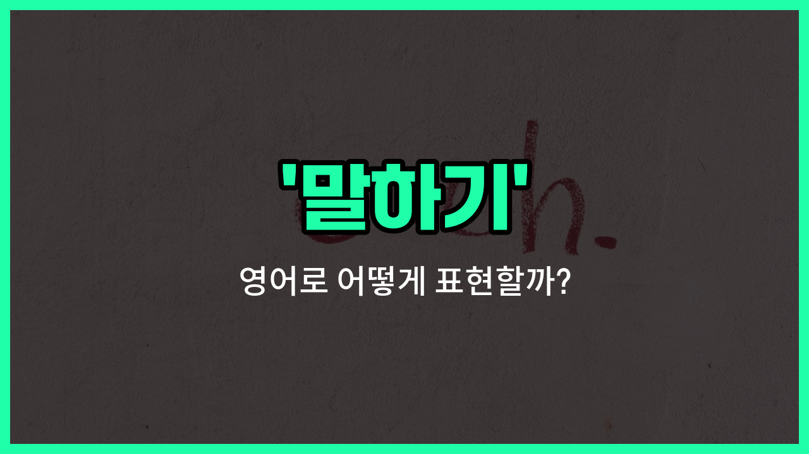

## 🌟 영어 표현 - saying

안녕하세요 👋 오늘은 영어에서 '말하기', '발언', '속담'과 관련된 표현인 '**saying**'에 대해 알아보려고 해요.

'saying'은 기본적으로 **누군가가 말한 것**이나 **널리 알려진 문장**을 의미해요. 특히, 오랜 시간 동안 전해 내려오는 짧은 문장이나 교훈적인 말을 가리킬 때 자주 사용돼요. 그래서 '속담'이나 '격언'을 영어로 표현할 때도 'saying'이라는 단어를 쓸 수 있어요!

예를 들어, "There's a saying that..."이라고 하면 "~라는 속담이 있어요"라는 뜻이 돼요. 또는, 누군가의 발언이나 말을 인용할 때도 자연스럽게 사용할 수 있답니다.

## 📖 예문

1. "옛날 속담에 이런 말이 있어요."

   "There is an [old](/blog/in-english/1086.old/) saying."

2. "그의 말에는 깊은 의미가 담겨 있어요."

   "His saying has a deep [meaning](/blog/in-english/1214.mean/)."

3. "영어에는 재미있는 속담이 많아요."

   "There are many interesting sayings in English."

## 💬 연습해보기

<ul data-interactive-list>

  <li data-interactive-item>
    너가 아까 회의에 대해 뭔가 이야기하고 있었던 거 들었는데, 정확히 뭐라고 했어?
    I heard you were saying something about the meeting earlier. What did you say exactly?
  </li>

  <li data-interactive-item>
    그녀가 오늘 밤 파티에 못 간다고 했어, 일 때문에 그렇대.
    She was saying that she couldn't make it to the party tonight because of <a href="/blog/in-english/1064.work/">work</a>.
  </li>

  <li data-interactive-item>
    너 또 열쇠를 잊어버렸다고 하는 거야?
    Are you saying that you forgot your keys again?
  </li>

  <li data-interactive-item>
    그가 작별 인사할 때 슬퍼 보였던 것 같아.
    When he was saying goodbye, I <a href="/blog/in-english/1118.thought/">thought</a> he looked sad.
  </li>

  <li data-interactive-item>
    그녀가 전화기로 뭐라고 하고 있어? 잘 들리지 않아.
    What's she saying on the phone? I can't hear clearly.
  </li>

  <li data-interactive-item>
    내가 너가 일부러 그렇게 한 거라고 한 게 아니야, 그냥 사고였다고 말한 거야.
    I wasn't saying you did it on purpose, just that it was an accident.
  </li>

  <li data-interactive-item>
    그들이 그 영화가 정말 좋다고 하더라, 너는 이미 봤어?
    They were saying the movie was really good, have you seen it yet?
  </li>

  <li data-interactive-item>
    내가 이번 주에 너가 괜찮으면 점심 한번 먹자고 했던 거야.
    I was saying we should grab lunch sometime this week if you're <a href="/blog/in-english/1104.free/">free</a>.
  </li>

  <li data-interactive-item>
    그는 논쟁 중에 같은 말을 계속 반복했어.
    He kept saying the same thing over and over during the argument.
  </li>

  <li data-interactive-item>
    너가 보고서가 어제까지였다고 하는 거야? 난 그 메모를 놓쳤나 봐.
    You're saying that the report was due yesterday? I must've missed that memo.
  </li>

</ul>

## 🤝 함께 알아두면 좋은 표현들

### speaking

'speaking'은 '말하기'와 거의 같은 의미로, 일반적으로 말을 하거나 의견을 표현하는 행위를 나타내요. 일상 대화나 공식적인 자리에서 모두 사용할 수 있는 표현이에요.

- "She is speaking at the conference about climate change."
- "그녀는 기후 변화에 대해 회의에서 말하고 있어요."

### remaining silent

'[remaining](/blog/in-english/1026.remain/) silent'는 '말하지 않고 침묵을 지키다'라는 뜻으로, 말을 하지 않는 상태를 나타내요. 말하기의 반대 개념으로, 의도적으로 말을 하지 않거나 조용히 있는 상황에서 사용해요.

- "During the meeting, he was remaining silent [despite](/blog/in-english/341.despite/) the heated discussion."
- "회의 중에 격렬한 토론이 있었지만 그는 침묵을 지키고 있었어요."

### uttering

'uttering'은 '말을 내뱉다'라는 뜻으로, 보통 짧거나 중요한 말을 소리 내어 표현할 때 사용해요. 말하기보다 좀 더 구체적으로 어떤 말을 실제로 발화하는 행위를 강조해요.

- "She was barely uttering a word after hearing the shocking news."
- "충격적인 소식을 듣고 그녀는 거의 말을 하지 않고 있었어요."

---

오늘은 '말하기', '발언', '속담'이라는 뜻을 가진 영어 표현 '**saying**'에 대해 알아봤어요. 일상 대화나 글에서 속담이나 누군가의 말을 인용할 때 이 표현을 떠올려 보세요 😊

오늘 배운 표현과 예문들을 꼭 최소 3번씩 소리 내서 읽어보세요. 다음에도 더 재미있고 유익한 영어 표현으로 찾아올게요! 감사합니다!

