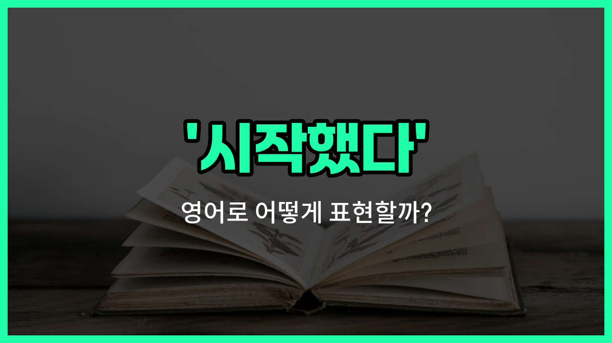

## 🌟 영어 표현 - started

안녕하세요 👋 오늘은 영어로 '시작했다'라는 표현을 어떻게 하는지 알아보려고 해요. 바로 '**started**'라는 단어를 사용하면 돼요. 이 단어는 어떤 일이 처음으로 시작되었을 때, 또는 무언가를 출발하거나 개시할 때 자주 쓰여요.

예를 들어, 새로운 프로젝트를 시작할 때, "We started a new project."라고 말할 수 있어요. 또는, 버스가 출발했다는 의미로 "The bus started."라고도 할 수 있어요.

'**started**'는 동사 'start'의 과거형이에요. 그래서 이미 어떤 일이 시작된 상태를 말할 때 사용해요. 일상 대화, 업무, 학교 등 다양한 상황에서 아주 자주 쓰이는 표현이에요!

## 📖 예문

1. "나는 오늘 아침에 운동을 시작했어요."

   "I started exercising this morning."

2. "회의가 10시에 시작했어요."

   "The meeting started at 10 o'clock."

## 💬 연습해보기

<ul data-interactive-list>

  <li data-interactive-item>
    어제 저녁에 새로운 책을 시작했는데, 놓을 수가 없어요.
    I started a new <a href="/blog/in-english/447.book/">book</a> last night, and I can't put it down.
  </li>

  <li data-interactive-item>
    그녀는 지난주에 그 회사에서 일하기 시작했어요.
    She started working at the company just last week.
  </li>

  <li data-interactive-item>
    우리는 한 시간 전에 영화를 시작했지만 결국 다른 걸 보고 말았어요.
    We started the movie an <a href="/blog/in-english/1339.hour/">hour</a> <a href="/blog/in-english/1215.ago/">ago</a> but ended up watching something else.
  </li>

  <li data-interactive-item>
    그는 여름 전에 몸매를 가꾸려고 운동을 시작했어요.
    He started exercising to get in better shape before summer.
  </li>

  <li data-interactive-item>
    그들은 몇 달 전에 휴가 계획을 세우기 시작했어요.
    They started planning their vacation months in advance.
  </li>

  <li data-interactive-item>
    나는 락다운 동안 기타를 배우기 시작했어요.
    I started <a href="/blog/in-english/245.learn/">learning</a> guitar during the lockdown.
  </li>

  <li data-interactive-item>
    그녀는 약을 먹고 나서 좀 괜찮아졌어요.
    She started <a href="/blog/in-english/1096.feel/">feeling</a> better after taking some medicine.
  </li>

  <li data-interactive-item>
    우리는 관계를 시작하기 전에 친구로 지냈어요.
    We started out as <a href="/blog/in-english/1279.friends/">friends</a> before getting into a relationship.
  </li>

  <li data-interactive-item>
    그는 조금 긴장하면서 새 직장을 시작했지만 금방 적응했어요.
    He started his new job with a bit of nervousness but quickly adjusted.
  </li>

  <li data-interactive-item>
    아이들은 비가 그치자마자 밖에서 놀기 시작했어요.
    The kids started <a href="/blog/in-english/1081.play/">playing</a> outside as soon as it stopped raining.
  </li>

</ul>

## 🤝 함께 알아두면 좋은 표현들

### began

'began'은 '시작했다'와 같은 의미로, 어떤 행동이나 일이 처음으로 일어났음을 나타내요. 'started'보다 조금 더 격식 있는 느낌을 줄 때도 있어요.

- "She began her new job last Monday."
- "그녀는 지난 월요일에 새 일을 시작했어요."

### commenced

'commenced'는 '시작했다'의 공식적이고 격식 있는 표현이에요. 주로 공식 행사나 프로젝트, 수업 등이 시작될 때 사용해요.

- "The conference commenced at 9 a.m. sharp."
- "회의는 오전 9시에 정확히 시작되었어요."

### ended

'ended'는 '끝났다'라는 뜻으로, 'started'의 반대말이에요. 어떤 일이 마무리되거나 종료되었음을 나타낼 때 사용해요.

- "The movie ended after two hours."
- "영화는 두 시간 후에 끝났어요."

---

오늘은 '시작했다'라는 뜻을 가진 영어 표현 '**started**'에 대해 알아봤어요. 앞으로 무언가를 새롭게 시작할 때 이 표현을 떠올려 보세요 😊

오늘 배운 표현과 예문들을 꼭 소리 내서 여러 번 읽어보세요. 다음에도 더 유익한 영어 표현으로 찾아올게요! 감사합니다!

