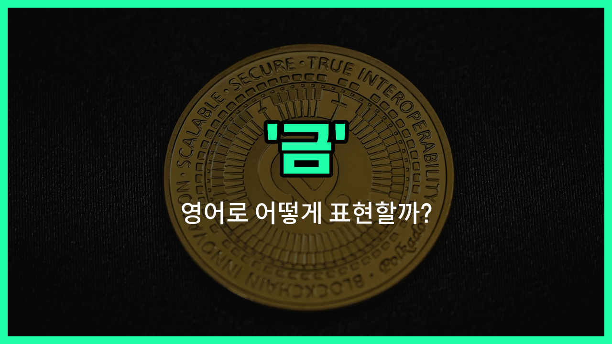

## 🌟 영어 표현 - gold

안녕하세요 👋 오늘은 우리가 일상에서 자주 듣는 단어, 바로 '**금**'의 영어 표현 '**gold**'에 대해 알아보려고 해요.

'**gold**'는 말 그대로 금속 원소인 '금'을 의미해요. 반짝이고 귀한 금속이라서 예로부터 부와 가치의 상징으로 여겨졌죠. 그래서 '**gold**'는 실제 금뿐만 아니라, 황금색, 금화, 또는 아주 소중하고 귀한 것을 비유적으로 표현할 때도 자주 사용돼요!

예를 들어, 금메달을 영어로 '**gold medal**'이라고 하고, 금화는 '**gold coin**'이라고 해요. 또, 누군가의 마음이 아주 착하고 순수할 때 '**a [heart](/blog/in-english/1345.heart/) of gold**'라는 표현도 쓰여요.

## 📖 예문

1. "그녀는 금 목걸이를 하고 있어요."

   "She is wearing a gold necklace."

2. "올림픽에서 그는 금메달을 땄어요."

   "He won a gold medal at the Olympics."

3. "이 박물관에는 오래된 금화가 전시되어 있어요."

   "There are ancient gold coins on display in this museum."

## 💬 연습해보기

<ul data-interactive-list>

  <li data-interactive-item>
    그 빈티지 자켓을 중고 가게에서 발견했을 때 완전 행운이었어. 얼마나 운이 좋았는지 믿을 수 없을 거야!
    I struck gold when I found that vintage jacket at the thrift store. You won't <a href="/blog/in-english/1320.believe/">believe</a> how lucky I got!
  </li>

  <li data-interactive-item>
    그녀는 열심히 일해서 드디어 새 앱이 대박이 나서 벌써 다운로드 수가 수천 개야.
    She worked <a href="/blog/in-english/1219.hard/">hard</a> and finally hit gold with her new app, which has thousands of downloads already.
  </li>

  <li data-interactive-item>
    그 영화는 지루할 줄 알았는데 순금 같은 명작이었어 — 모두가 정말 좋아했어.
    The movie was supposed to be boring, but it <a href="/blog/in-english/1348.turn/">turned</a> out to be pure gold — everyone loved it.
  </li>

  <li data-interactive-item>
    그가 나한테 해준 조언은 정말 금 같은 말이었어; 덕분에 상황을 잘 이해할 수 있었어.
    When he gave me that advice, it was like he was speaking gold; it really helped me understand the situation.
  </li>

  <li data-interactive-item>
    이 레시피는 금이야; 벌써 세 번 만들었는데 매번 완벽하게 나와.
    This recipe is gold; I've made it three times already and it always turns out <a href="/blog/in-english/413.perfect/">perfect</a>.
  </li>

  <li data-interactive-item>
    명절에 도심에서 주차 공간을 찾는 건 금을 찾는 것 같아, 진짜로.
    Finding a parking spot downtown during the holidays is like finding gold, seriously.
  </li>

  <li data-interactive-item>
    그들의 우정은 나에게 금 같은 존재야; 없었으면 어쩔 뻔 했는지 모르겠어.
    Their friendship is gold to me; I don't know what I'd do without them.
  </li>

  <li data-interactive-item>
    그 코미디언의 새로운 공연은 정말 금이야, 시작부터 끝까지 너무 웃겼어.
    The comedian's new special is pure gold, so funny from start to finish.
  </li>

  <li data-interactive-item>
    네가 가진 그 오래된 만화책은 금가치를 할지도 몰라, 감정해보는 게 좋겠어.
    That <a href="/blog/in-english/1086.old/">old</a> comic book you have might be worth gold, you should get it appraised.
  </li>

  <li data-interactive-item>
    그녀는 금 같은 마음을 가진 사람이야, 항상 자원봉사하고 누군가를 돕는데 무엇을 바라고 하는 게 없거든.
    She's got a gold heart, always volunteering and helping others without expecting anything in return.
  </li>

</ul>

## 🤝 함께 알아두면 좋은 표현들

### precious metal

'precious metal'은 "귀금속"을 의미하며, 금과 같이 가치가 높고 희귀한 금속을 가리켜요. 금뿐만 아니라 은, 백금 등도 포함되며, 보통 보석이나 투자 목적으로 많이 사용돼요.

- "Gold is one of the most well-known precious metals used in jewelry and investment."
- "금은 보석과 투자에 많이 사용되는 가장 잘 알려진 귀금속 중 하나예요."

### base metal

'base metal'은 "비귀금속"을 뜻해요. 금과 반대되는 개념으로, 구리, 철, 아연처럼 상대적으로 가치가 낮고 흔한 금속을 말해요. 주로 산업용으로 많이 사용돼요.

- "Unlike gold, base metals like copper and iron are more common and less valuable."
- "금과 달리 구리와 철 같은 비귀금속은 더 흔하고 가치가 낮아요."

### karat

'karat'은 금의 순도를 나타내는 단위예요. 24카트가 순금을 의미하며, 숫자가 낮을수록 다른 금속이 섞여 있어 순도가 낮다는 뜻이에요. 금의 품질을 평가할 때 중요한 기준이에요.

- "This ring is made of 18 karat gold, which [means](/blog/in-english/1214.mean/) it contains 75% pure gold."
- "이 반지는 18캐럿 금으로 만들어졌는데, 순금이 75% 들어있다는 뜻이에요."

---

오늘은 '금', '황금', '금화'라는 뜻을 가진 영어 표현 '**gold**'에 대해 알아봤어요. 일상에서 금이나 황금색, 또는 소중한 것을 표현할 때 이 단어를 떠올려 보세요 😊

오늘 배운 표현과 예문들을 꼭 최소 3번씩 소리 내서 읽어보세요. 다음에도 더 재미있고 유익한 영어 표현으로 찾아올게요! 감사합니다!

